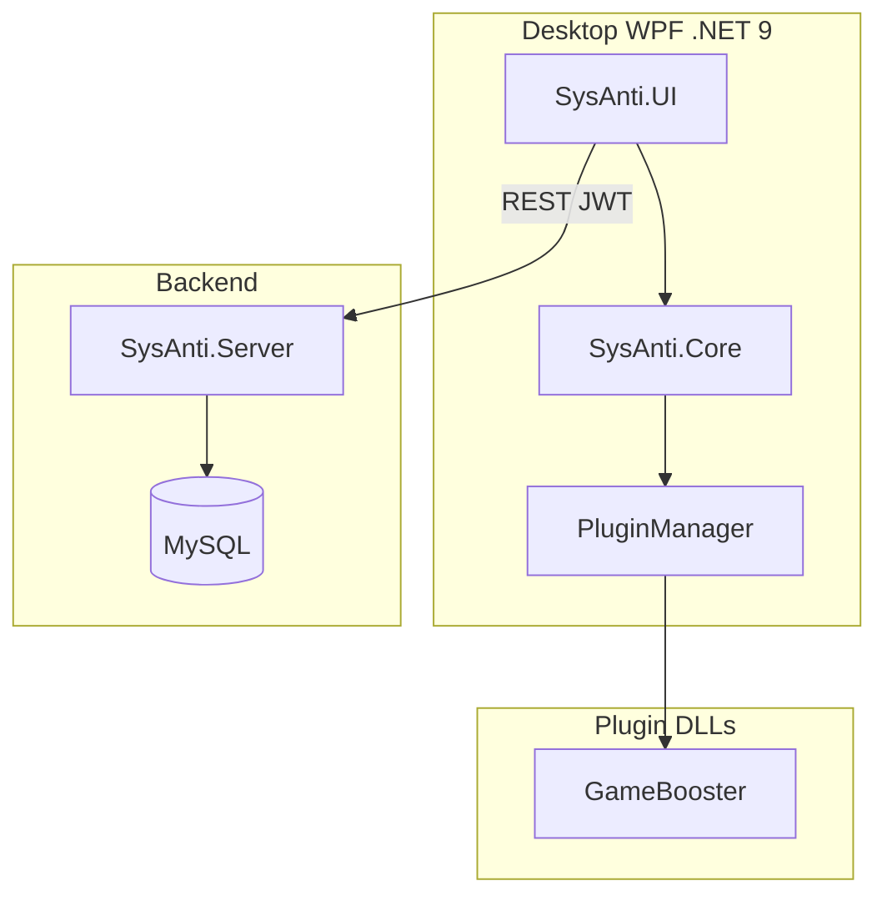
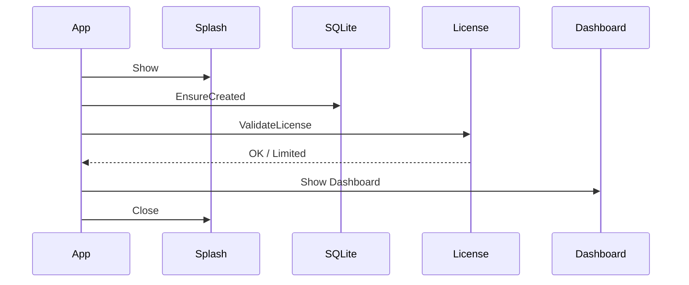
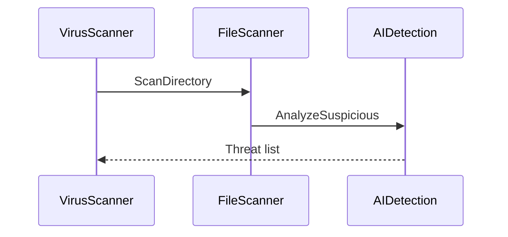
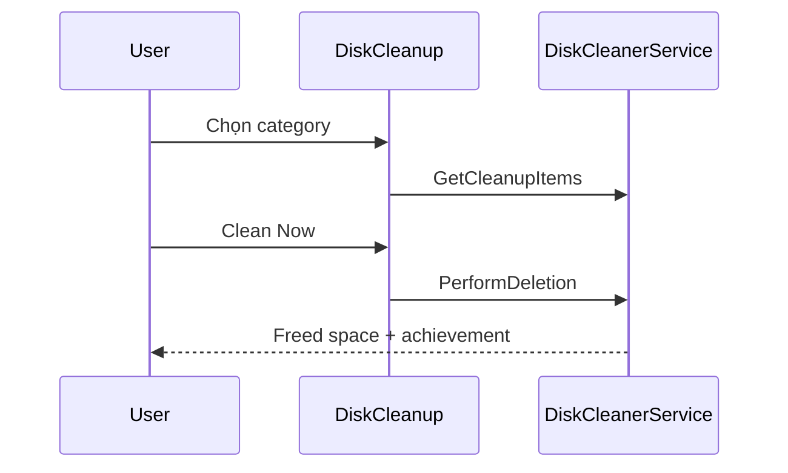
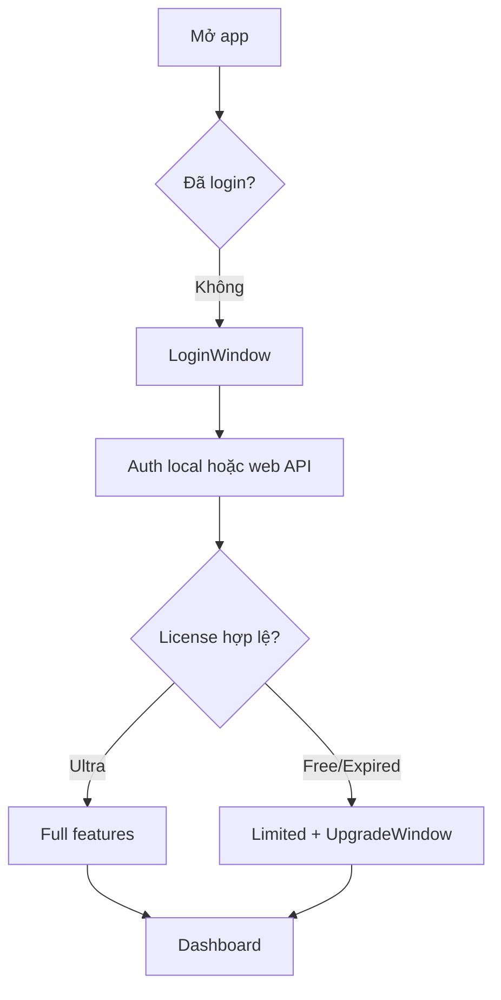
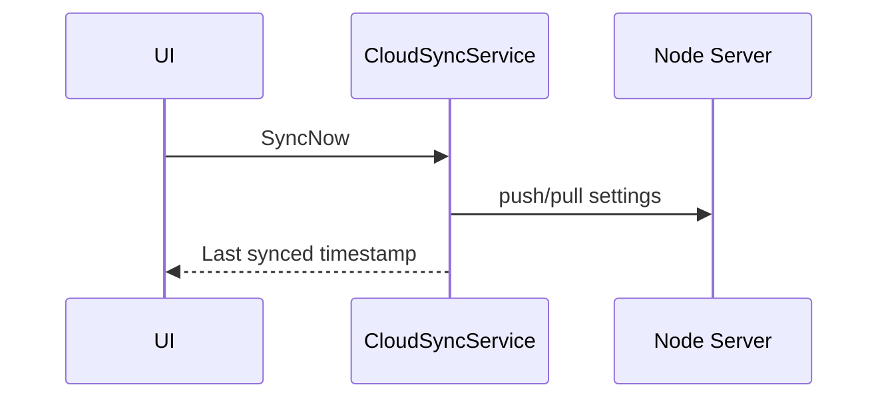
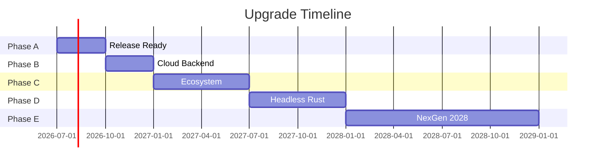

# Sơ Đồ Luồng Nghiệp Vụ / Workflow Diagrams

**Ngày:** 2026-06-16 | **Dự án:** AVASecurity

---

## 1. Kiến Trúc Tổng Thể

---

## 2. Luồng Khởi Động App

---

## 3. Luồng Quét Virus

---

## 4. Luồng Disk Cleanup

---

## 5. Luồng Auth & License

---

## 6. Cloud Sync (Planned)

---

## 7. Lộ Trình Nâng Cấp

Xem thêm: [02_UPGRADE_PLAN_2026_2028.md](./02_UPGRADE_PLAN_2026_2028.md)