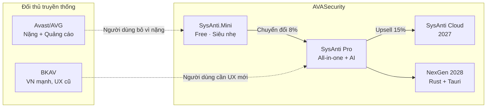
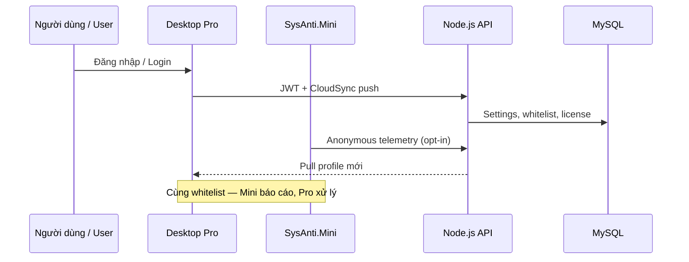
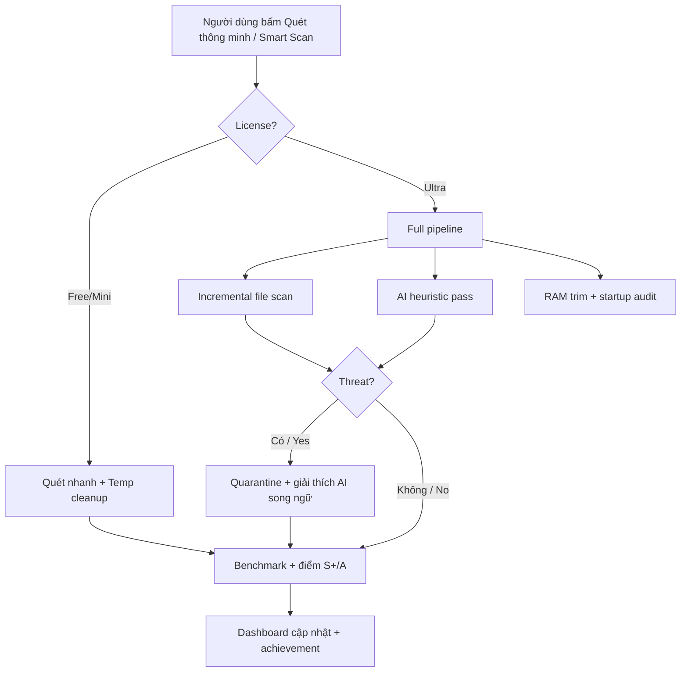
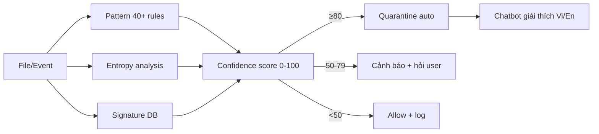
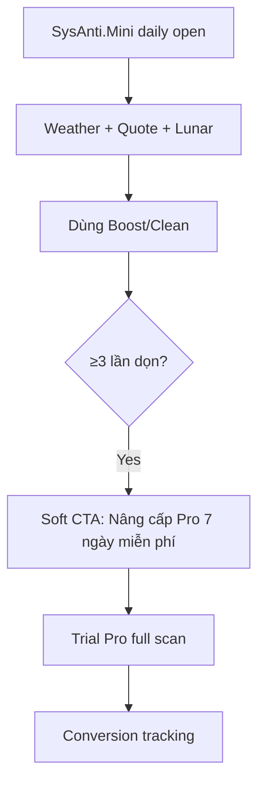

# Kế Hoạch Phát Triển Vượt Trội — AVASecurity vs Avast / AVG / BKAV

**Ngày:** 2026-06-16  
**Phạm vi:** Chiến lược sản phẩm + lộ trình kỹ thuật 2026–2028  
**Đối tượng:** Ban lãnh đạo, PM, kỹ thuật, marketing  
**Baseline:** [01_PROJECT_ANALYSIS](./01_PROJECT_ANALYSIS_2026_06_16.md) · [02_UPGRADE_PLAN](./02_UPGRADE_PLAN_2026_2028.md) · [03_BUSINESS_STRATEGY](./03_BUSINESS_STRATEGY.md)

---

## 1. Tóm tắt điều hành / Executive Summary

**Mục tiêu:** Biến AVASecurity thành bộ **tối ưu + bảo mật + AI** vượt trội so với Avast, AVG và BKAV — không bằng cách sao chép antivirus truyền thống, mà bằng **trải nghiệm nhẹ hơn, thông minh hơn, Việt hóa sâu hơn, và tích hợp tối ưu hệ thống + bảo mật trong một nền tảng**.

| Trụ cột vượt trội | Ý nghĩa |
|-------------------|---------|
| **AI-native** | Phát hiện heuristic + entropy + chatbot → on-device LLM (2028) |
| **All-in-one thật sự** | Dọn dẹp + RAM + quét + Game Mode + benchmark — một app, không 5 tab quảng cáo |
| **Siêu nhẹ** | SysAnti.Mini ~5–15 MB; Pro mục tiêu <80 MB cài đặt (Avast ~600 MB+) |
| **Song ngữ & văn hóa VN** | Lịch âm, danh ngôn sức khỏe, UI Việt/Anh — BKAV có lợi thế nội địa, ta mở rộng hơn |
| **Minh bạch & riêng tư** | Không bán dữ liệu duyệt web; privacy-first messaging vs Avast/AVG (Gen Digital) |

**Khẩu hiệu chiến lược:** *"Máy nhanh hơn. An toàn hơn. Thông minh hơn — không làm phiền bạn."*

---

## 2. Phân tích đối thủ / Competitive Landscape

### 2.1 Ma trận so sánh nhanh

| Tiêu chí | Avast Free/ Premium | AVG Ultimate | BKAV Pro | **AVASecurity (mục tiêu)** |
|----------|---------------------|--------------|----------|------------------------------|
| Kích thước cài đặt | ~500–700 MB | ~500 MB | ~200–400 MB | **<80 MB Pro, ~15 MB Mini** |
| RAM idle | 150–400 MB | 150–350 MB | 80–200 MB | **<60 MB Pro, <25 MB Mini** |
| Quảng cáo / upsell Free | Nhiều, gây khó chịu | Trung bình | Ít hơn (VN) | **Mini free sạch; Pro trial 7 ngày** |
| Tối ưu hệ thống | Phụ, tách app | Phụ | Có (BKAV Tool) | **Core — benchmark, cleanup, RAM** |
| AI / chatbot | Avast Assistant (EN) | Hạn chế | Hạn chế | **Song ngữ Vi/En, tích hợp sâu** |
| Game Mode | Có (Premium) | Có | Cơ bản | **Game Mode Ultra + plugin** |
| Cloud dashboard | Có (Avast Account) | Có | BKAV Cloud (DN) | **2027: Cloud + Mobile beta** |
| Việt hóa UI | Trung bình | Trung bình | **Tốt** | **Xuất sắc (chuẩn dự án)** |
| Giá VN/tháng | ~150–250k (quốc tế) | ~200k+ | ~80–150k/năm | **Free / 99k / 299k / Ecosystem** |
| Uy tín engine AV | Cao (AV-TEST top) | Cao (cùng hãng Avast) | Tốt tại VN | **Đang xây — hybrid + AI** |

### 2.2 Điểm yếu có thể khai thác

**Avast / AVG (Gen Digital):**
- Gói nặng, nhiều thành phần nền (Smart Scan, Browser Cleanup, VPN upsell…)
- Free tier gắn quảng cáo và nhắc nâng cấp liên tục
- UX phức tạp — người dùng phổ thông khó hiểu "Web Shield" vs "CyberCapture"
- Lo ngại quyền riêng tư (lịch sử Jumpshot 2020 — cần nhấn mạnh privacy-first)

**BKAV:**
- Mạnh thị trường VN, yếu quốc tế hóa và ecosystem cloud cá nhân
- UI ít gamification, ít tích hợp tối ưu + gaming + AI chat
- Mobile/desktop chưa "một trải nghiệm" liền mạch như kỳ vọng Gen Z

**Cơ hội AVASecurity:** Làm **"BKAV thân thiện + CCleaner thông minh + AI assistant"** với footprint nhỏ hơn Avast, giá linh hoạt hơn, và lộ trình NexGen (Rust/Tauri 2028).

---

## 3. Chiến lược vị thế / Positioning Strategy

### 3.1 Phân tầng sản phẩm

| Sản phẩm | Đối đầu trực tiếp | Lợi thế cạnh tranh |
|----------|-------------------|---------------------|
| **SysAnti.Mini** | Avast Free, Windows Defender + CCleaner | 1 file nhỏ, không login, lịch âm + thời tiết + danh ngôn |
| **AVA Security (Pro)** | BKAV Pro, Avast Premium | AI scan + cleanup + Game Mode + benchmark trong 1 UI Win11 |
| **SysAnti Cloud** (2027) | Avast Account, BKAV Cloud | Đồng bộ whitelist, scan profile, license; dashboard gia đình |
| **SysAnti Mobile** (2027) | BKAV Mobile, Avast Mobile | Quét APK sideload, remote alert từ desktop |
| **NexGen** (2028) | Toàn bộ desktop AV | <10 MB binary, cross-platform, on-device LLM |

---

## 4. Năm trụ cột kỹ thuật vượt trội / Technical Superiority Pillars

### Trụ 1: Hiệu năng — "Nhanh hơn cả OS overhead"

| KPI | Avast/AVG (ước lượng) | BKAV | **Mục tiêu SysAnti** |
|-----|------------------------|------|----------------------|
| Thời gian khởi động app | 8–15 s | 5–10 s | **<3 s (Pro), <1 s (Mini)** |
| CPU khi idle | 2–8% | 1–5% | **<1%** |
| Quét nhanh 100k file | 3–8 phút | 2–5 phút | **<2 phút (SSD, incremental)** |
| Dọn Temp 1-click | Không tích hợp sâu | Tool riêng | **<30 s, preview trước xóa** |

**Hành động:**
- Q3 2026: Rust pilot cho disk cleaner (`PROJECT_2028_PLAN`)
- Q4 2026: Incremental scan index (SQLite/DuckDB)
- 2027: Background scan priority thấp hơn game/apps (QoS Windows)

### Trụ 2: Bảo mật thông minh — "AI + signature hybrid"

**Hiện có:** `AIDetectionService` — pattern, entropy, confidence 0–100%.

**Nâng cấp vượt đối thủ:**

| Giai đoạn | Tính năng | Vượt trội so với |
|-----------|-----------|------------------|
| Q3 2026 | Cloud signature sync 15 phút/lần | BKAV update thủ công hơn |
| Q4 2026 | Behavioral sandbox (file mới, network spike) | Avast CyberCapture nhưng nhẹ hơn |
| Q1 2027 | Phishing URL blocklist VN (.vn, banking) | BKAV có — ta tích hợp + AI URL |
| Q3 2027 | On-device model nhỏ (Phi-3 mini) phân loại file | Avast chưa có LLM local |
| 2028 | Lệnh tự nhiên: "Quét USB vừa cắm" | Unique differentiator |

### Trụ 3: Trải nghiệm — "Win11 Fluent + văn hóa Việt"

- **100% UI song ngữ** `Tiếng Việt / English` (đã chuẩn hóa Mini)
- Dashboard gamified (điểm S+ → F) — Avast/BKAV không có benchmark tích hợp
- Onboarding 3 bước: Quét nhanh → Dọn rác → Bật bảo vệ
- **Wellness UX (Mini đã pilot):** thời tiết, danh ngôn sức khỏe, lịch âm — tạo thói quen mở app hàng ngày (retention > AV thuần)

### Trụ 4: Ecosystem & Cloud

- Q4 2026: `CloudSyncService` — theme, scan profiles, license grace 7 ngày offline
- Q2 2027: Mobile beta — push alert khi Pro phát hiện threat
- Q4 2027: Gia đình 3 PC / 1 license Ultra

### Trụ 5: Mô hình kinh doanh công bằng

| Gói | Giá đề xuất VN | So với BKAV/Avast |
|-----|----------------|-------------------|
| **Free (Mini)** | 0đ | Sạch hơn Avast Free |
| **Ultra** | 99.000đ/tháng hoặc 799k/năm | Rẻ hơn Avast Premium ~40% |
| **Ecosystem** | 299.000đ/tháng (3 PC + Cloud) | Doanh nghiệp nhỏ / gia đình |
| **Lifetime** | 1.999.000đ (giới hạn 2026 launch) | Cạnh tranh BKAV lifetime |

**Cam kết marketing:** Không bán dữ liệu duyệt web · Không cài toolbar · Gỡ cài đặt 1-click sạch.

---

## 5. Lộ trình phát triển 2026–2028 / Development Roadmap

### Phase 0 — Nền tảng (Q2 2026) ✅ đang có

- [x] SysAnti.Mini free, UI sáng, Việt hóa, lịch âm, thời tiết, danh ngôn
- [x] Pro: WPF, plugins, AIDetection, chatbot, benchmark
- [ ] Fix 101 nullable warnings, plugins vào solution

### Phase 1 — Release Ready (Q3 2026)

**Mục tiêu:** Installer production, vượt BKAV trên UX desktop VN.

| Sprint | Deliverable | Metric thành công |
|--------|-------------|-------------------|
| A1 UX | Adaptive layout, onboarding, a11y | NPS beta ≥ 40 |
| A2 Quality | Test coverage ≥40%, 5 plugins wired | 0 build error |
| A3 Release | Inno/WiX, auto-update, CI/CD | 20–50 beta user, 0 crash P0 |

**Tính năng bắt buộc vượt đối thủ Q3:**
1. **Smart Scan 1 nút** — quét + dọn + tối ưu RAM (Avast cần 3 bước)
2. **Threat Timeline** — lịch sử mối đe dọa trực quan (BKAV dạng list)
3. **So sánh Before/After benchmark** — share ảnh mạng xã hội

### Phase 2 — Cloud & AI nâng cao (Q4 2026)

| Hạng mục | Mô tả |
|----------|-------|
| CloudSync | Settings, whitelist, license online |
| Signature CDN | Update nhanh, differential |
| AI Scan v2 | Multi-engine score + giải thích song ngữ "vì sao file nguy hiểm" |
| Mini → Pro funnel | CTA trong Mini sau lần dọn thứ 3 |

### Phase 3 — Mở rộng hệ sinh thái (2027)

| Quý | Sản phẩm | Cạnh tranh |
|-----|----------|------------|
| Q1 | SysAnti Mobile (Android) beta | BKAV Mobile |
| Q2 | Cloud Dashboard web | Avast Account |
| Q3 | Headless API + Rust disk engine | Performance lead |
| Q4 | VPN lite optional (WireGuard) | Avast VPN bundle — **opt-in, không ép** |

### Phase 4 — NexGen (2028)

Theo [`doc/PROJECT_2028_PLAN.md`](../doc/PROJECT_2028_PLAN.md):
- Rust core + Tauri UI, <10 MB deploy
- On-device LLM maintenance
- Windows + macOS + Linux (SteamOS)

---

## 6. Workflow vận hành sản phẩm / Product Workflows

### 6.1 Smart Scan — luồng vượt Avast Quick Scan

### 6.2 Phát hiện mối đe dọa AI

### 6.3 Chuyển đổi Mini → Pro

---

## 7. Go-to-Market Việt Nam / Vietnam GTM

### 7.1 Phân khúc ưu tiên

| Phân khúc | Pain point | Thông điệp |
|-----------|------------|------------|
| Học sinh / SV | Máy chậm, không tiền AV | "Mini free — nhẹ hơn Avast 10 lần" |
| Gamer | FPS drop khi AV quét | "Game Mode Ultra — quét khi không chơi" |
| SMB 5–50 PC | BKAV bulk, IT yếu | "Ecosystem 3 PC — cloud quản lý" |
| Người cao tuổi | Sợ virus, UI phức tạp | "1 nút Quét thông minh + chatbot tiếng Việt" |

### 7.2 Kênh

1. **TikTok / YouTube Shorts** — benchmark before/after 30 giây
2. **Cộng đồng Facebook (tin học, game)** — so sánh RAM idle vs Avast
3. **Affiliate 30%** — YouTuber công nghệ VN
4. **Microsoft Store** — trust + auto-update (2027)
5. **Trường học / quán net** — Mini free hàng loạt

### 7.3 PR & trust

- Công bố **Privacy Policy** rõ ràng (không bán data)
- Đăng ký **Bộ TT&TT** (nếu phân phối AV chính thức tại VN) — học BKAV
- Gửi sample **AV-TEST / Virus Bulletin** 2027 (mục tiêu dài hạn)

---

## 8. KPI & đo lường thành công / Success Metrics

### 8.1 Sản phẩm (2026 cuối năm)

| KPI | Mục tiêu |
|-----|----------|
| MAU Mini | 50.000 |
| Trial Pro → Paid | 8% |
| Crash-free sessions | 99.5% |
| Thời gian khởi động Pro | <3 s |
| Rating Cửa hàng / review | ≥4.5/5 |

### 8.2 Kỹ thuật

| KPI | Mục tiêu |
|-----|----------|
| Test coverage | ≥40% (2026), ≥60% (2027) |
| False positive AI | <2% |
| Signature lag | <1 giờ cho threat hot |
| Mini publish size | <15 MB |

### 8.3 Kinh doanh (2027)

| KPI | Mục tiêu |
|-----|----------|
| ARR | 2 tỷ VNĐ |
| Churn Ultra monthly | <5% |
| CAC payback | <4 tháng |
| NPS | ≥45 |

---

## 9. Rủi ro & giảm thiểu / Risks

| Rủi ro | Mức | Giảm thiểu |
|--------|-----|------------|
| Engine AV chưa đạt AV-TEST | Cao | Hybrid ClamAV/signatures + AI; roadmap 2027 lab test |
| Avast/ BKAV giảm giá | Trung bình | Lifetime launch + Mini free mạnh |
| Pháp lý phần mềm diệt virus VN | Trung bình | Tư vấn pháp lý, đăng ký Bộ TT&TT |
| Rust migration trễ | Trung bình | WPF vẫn maintain đến 2028 |
| False positive gây mất tin | Cao | Sandbox + user confirm 50–79 score |

---

## 10. Ưu tiên 90 ngày tới / Next 90 Days (Action Plan)

### Tháng 1 (Tuần 1–4)
- [ ] Hoàn thiện Smart Scan 1 nút trên Pro
- [ ] Mini: thêm CTA trial Pro sau 3 lần dọn
- [ ] Sửa nullable warnings + đưa plugins vào solution
- [ ] Landing page song ngữ + Privacy Policy

### Tháng 2 (Tuần 5–8)
- [ ] Inno Setup installer + code signing (nếu có cert)
- [ ] Beta 20 user (Facebook group, Discord)
- [ ] Threat Timeline UI
- [ ] CloudSyncService skeleton

### Tháng 3 (Tuần 9–12)
- [ ] Auto-update production
- [ ] Video marketing: SysAnti vs Avast RAM test
- [ ] Đạt coverage 40%
- [ ] Release v2.0 public

---

## 11. Tầm nhìn 2028 — "Vượt trội rõ rệt"

Khi NexGen ra mắt, AVASecurity không còn so sánh "AV nào quét nhiều virus hơn" mà so sánh:

> **"Ứng dụng duy nhất giữ máy nhanh, an toàn, và vui vẻ mỗi ngày — trên mọi nền tảng, dưới 10 MB, với AI hiểu tiếng Việt."**

Đó là vị thế mà Avast, AVG và BKAV **chưa chiếm** — và AVASecurity đã có nền (Mini wellness UX, Pro all-in-one, lộ trình Rust/LLM) để đi đến đó.

---

## 12. Tài liệu liên quan

| File | Nội dung |
|------|----------|
| [02_UPGRADE_PLAN_2026_2028.md](./02_UPGRADE_PLAN_2026_2028.md) | Phase kỹ thuật chi tiết |
| [03_BUSINESS_STRATEGY.md](./03_BUSINESS_STRATEGY.md) | Pricing, GTM, KPI tài chính |
| [04_WORKFLOW_DIAGRAMS.md](./04_WORKFLOW_DIAGRAMS.md) | Sơ đồ kiến trúc hiện tại |
| [../doc/PROJECT_2028_PLAN.md](../doc/PROJECT_2028_PLAN.md) | NexGen Rust/Tauri |
| [../README.md](../README.md) | Tổng quan dự án |

---

**Prepared by:** AVASecurity Strategy Team · **Status:** Living document — cập nhật mỗi quý