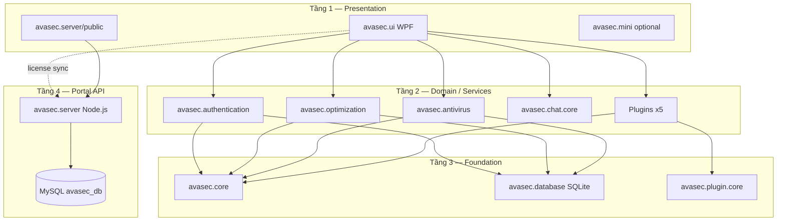

# Kế Hoạch Codebase Theo Module — AVA Security (avasec)

**Ngày:** 2026-06-17  
**Mục tiêu:** Chia codebase thành **module độc lập**, hoàn thiện từng module theo thứ tự phụ thuộc → ship **v1.0**  
**Liên kết:** [README](../README.md) · [10_NO_CODE_MASTER_PLAN](./10_NO_CODE_MASTER_PLAN_FROM_DOC.md) · [01_PROJECT_ANALYSIS](./01_PROJECT_ANALYSIS_2026_06_16.md)

---

## 1. Kiến trúc tổng thể (3 tầng)



**Nguyên tắc v1.0 (README):**
- Tầng 2–3 chạy **100% offline** (quét, dọn, AI local)
- Tầng 4 chỉ lo **tài khoản + license key** (~$5/tháng)
- `src/Backend/MonitoringAPI` — **không** trong lộ trình v1

---

## 2. Bản đồ module (18 module)

| ID | Module | Đường dẫn | Trong `avasec.sln` | Tiến độ | Ưu tiên v1 |
|----|--------|-----------|-------------------|---------|------------|
| **M00** | DevOps & Scripts | `scripts/`, `.github/`, `install/` | ✅ | 60% | P0 |
| **M01** | Core Kernel | `avasec.core/` | ✅ | 80% | P0 |
| **M02** | Database Local | `avasec.database/` | ✅ | 75% | P0 |
| **M03** | Authentication | `avasec.authentication/` | ✅ | 70% | P0 |
| **M04** | Optimization | `avasec.optimization/` | ✅ | 75% | P1 |
| **M05** | Antivirus | `avasec.antivirus/` | ✅ | 70% | P1 |
| **M06** | Chat (local) | `avasec.chat.core/` | ✅ | 65% | P2 |
| **M07** | Plugin System | `avasec.plugin.core/` + `Plugins/` | ⚠️ plugins ref UI, chưa trong sln | 70% | P1 |
| **M08** | Desktop UI | `avasec.ui/` (28 Views) | ✅ | 65% | P0 |
| **M09** | Mini App | `avasec.mini/` | ✅ | 50% | P3 (sau v1) |
| **M10** | Tests | `avasec.tests/` | ✅ | 15% | P1 |
| **M11** | Portal Server | `avasec.server/server.js` | N/A | 75% | P0 |
| **M12** | Portal Auth API | `routes/auth.js` | N/A | 85% | P0 |
| **M13** | Portal License API | `routes/license.js` | N/A | 80% | P0 |
| **M14** | Portal Chat API | `routes/chat.js` | N/A | 40% | P2 |
| **M15** | Portal Web UI | `public/*.html` | N/A | 70% | P0 |
| **M16** | MySQL Schema | `database.sql` | N/A | 70% | P0 |
| **M17** | Monitoring API | `src/Backend/` | ❌ ngoài sln | 20% | **Hoãn 2027** |

---

## 3. Sơ đồ phụ thuộc — Thứ tự hoàn thiện

```
Tuần 1–2:  M16 → M11 → M12 → M13 → M15  (portal + license end-to-end)
Tuần 2–3:  M01 → M02 → M03 → M08        (desktop shell + auth + license cache)
Tuần 3–4:  M04 → M05 → M07              (tính năng offline core)
Tuần 4–5:  M08 polish + M06 + M14       (UX, chat)
Tuần 5–6:  M10 + M00                    (test + CI + installer)
```

**Quy tắc:** Không polish M08 (UI) trước khi M12–M13 (license API) pass journey J1–J4.

---

## 4. Chi tiết từng module

### M00 — DevOps & Scripts · P0

| Thành phần | File | Trạng thái | Việc còn lại |
|------------|------|------------|--------------|
| Chạy portal | `scripts/start-portal.ps1` | ✅ | — |
| Chạy app | `scripts/run.ps1` | ✅ | — |
| Publish | `scripts/publish.ps1` | ✅ | Test Release output |
| Start all | `scripts/start-all.ps1` | ❌ | MySQL check + 4 URL |
| CI | `.github/workflows/build.yml` | ✅ | Thêm test step |
| Installer | `install/avasec-setup.iss` | 🟡 | Test VM Win10/11 |

**Done module:** `start-all` + CI green + installer cài VM sạch.

---

### M01 — avasec.core · P0

**Vai trò:** Interfaces, models, services dùng chung (license cache, settings, benchmark, game mode, privacy, notifications).

| Service | File | % | Việc còn lại |
|---------|------|---|--------------|
| LicenseCacheService | `Services/LicenseCacheService.cs` | 80% | Grace 7 ngày + banner sync |
| FeatureGateService | `Services/FeatureGateService.cs` | 70% | Gắn Trial vs Ultra gates |
| SettingsService | `Services/SettingsService.cs` | 85% | — |
| NotificationService | `Services/NotificationService.cs` | 75% | Wire scan/cleanup events |
| BenchmarkService | `Services/BenchmarkService.cs` | 90% | — |
| GameModeUltraService | `Services/GameModeUltraService.cs` | 85% | Dashboard indicator |
| PrivacyGuardianService | `Services/PrivacyGuardianService.cs` | 85% | — |
| UpdateCheckService | `Services/UpdateCheckService.cs` | 50% | URL production |
| BrandConstants | `Models/BrandConstants.cs` | ✅ | — |

**Phụ thuộc:** M02 (settings persist)  
**Done module:** `FeatureGateService` khóa/mở đúng theo license; `LicenseCacheService` offline 7 ngày.

---

### M02 — avasec.database · P0

**Vai trò:** SQLite + EF Core — Users, Licenses, ScanHistory, Quarantine (local).

| Việc | Trạng thái |
|------|------------|
| AVASecContext | ✅ |
| Migrations auto first-run | 🟡 kiểm tra |
| Align model với portal license fields | 🟡 |

**Done module:** App offline đọc/ghi license cache không lỗi.

---

### M03 — avasec.authentication · P0

**Vai trò:** Login local SQLite + sync license từ portal.

| Service | % | Việc còn lại |
|---------|---|--------------|
| AuthenticationService | 80% | Bỏ plain admin release |
| LicenseService | 75% | Sync `WebLicenseService` / portal |
| Portal sync | `avasec.ui/Services/WebLicenseService.cs` | 70% | Redeem key `AVA-...` |

**Phụ thuộc:** M12, M13 (portal API)  
**Done module:** Login portal → app hiện Trial/Ultra; nhập key → đổi plan.

---

### M04 — avasec.optimization · P1

**Vai trò:** Disk, RAM, startup, registry, system monitor.

| Service | View/Window | % | Việc |
|---------|-------------|---|------|
| DiskCleanerService | DiskCleanupWindow | 80% | Wire từ dashboard |
| RamOptimizerService | SpeedBoosterWindow | 75% | Progress UI |
| StartupManagerService | StartupManagerWindow | 70% | Enable/disable |
| ProcessService | ProcessManagerWindow | 70% | — |
| SystemMonitorService | Dashboard metrics | 80% | Live 5s refresh |
| RegistryTweaksService | RegistryTweaksWindow | 65% | — |

**Done module:** 3 journey — scan disk → clean → thấy GB recovered.

---

### M05 — avasec.antivirus · P1

**Vai trò:** Scan, quarantine, AI heuristic (local).

| Service | % | Việc |
|---------|---|------|
| FileScannerService | 80% | Quick scan từ dashboard |
| QuarantineService | 75% | QuarantineWindow list/restore |
| AIDetectionService | 85% | — |
| VirusDatabaseUpdateService | 50% | Local signatures only v1 |

**Done module:** Scan → kết quả → quarantine 1 file test.

---

### M06 — avasec.chat.core · P2

**Vai trò:** Chat local + AI bot (không bắt buộc v1).

| Thành phần | % | Việc |
|------------|---|------|
| LocalChatService | 70% | — |
| AIBotService | 65% | FAQ 5 câu AVA |
| ChatWindow UI | 60% | Mở từ dashboard |

**Done module (v1 tối thiểu):** Chat local mở được, không crash.

---

### M07 — Plugin System · P1

**Vai trò:** 5 plugin DLL load runtime.

| Plugin | Folder | Trong sln | % |
|--------|--------|-----------|---|
| Game Booster | `plugins.gamebooster` | Ref UI, ❌ sln | 75% |
| Network Fortress | `plugins.networkfortress` | Ref UI | 70% |
| Privacy Shredder | `plugins.privacyshredder` | Ref UI | 65% |
| Registry Doctor | `plugins.registrydoctor` | Ref UI | 65% |
| System Sweeper | `plugins.systemsweeper` | Ref UI | 70% |
| PluginManager | `avasec.core` | ✅ | 80% |

**Việc bắt buộc:**
1. Thêm 5 project vào `avasec.sln`
2. `ToolboxWindow` / CyberToolbox load plugin
3. Copy DLL → `Plugins/` post-build (đã có target)

**Done module:** Mở toolbox → chạy 1 plugin không lỗi.

---

### M08 — avasec.ui · P0 (module lớn nhất)

**Vai trò:** Shell WPF — 28 views, navigation, onboarding, settings.

#### Nhóm view theo chức năng

| Nhóm | Views | Wire nav | % |
|------|-------|----------|---|
| **Shell** | DashboardView, SplashScreen, SettingsView | ✅ | 70% |
| **Auth** | LoginWindow, LoginOverlay, OnboardingWindow, UpgradeWindow | 🟡 | 75% |
| **Security** | VirusScannerWindow, QuarantineWindow, PrivacyGuardianView | 🟡 | 70% |
| **Optimize** | DiskCleanupWindow, SpeedBoosterWindow, StartupManagerWindow, ProcessManagerWindow | 🟡 | 65% |
| **Gaming** | GameModeView, BenchmarkView, SystemBoosterWindow | ✅ panel | 80% |
| **Tools** | ToolboxWindow, CyberToolboxView, RegistryTweaks, Windows11Tweaks | 🟡 | 60% |
| **Support** | ChatWindow, NotificationWindow, AboutWindow | 🟡 | 65% |
| **Debug only** | TestLoginWindow, QuickRegisterWindow | ⚠️ | Ẩn Release |

#### Navigation đã có (DashboardView)

- ✅ GameMode, Benchmark, Privacy (embedded panels)
- 🟡 Disk / Virus / RAM — mở window riêng từ cards
- ❌ Adaptive layout Compact/Normal/Large (Task 1.4)

#### Việc ưu tiên M08

1. First-run: `OnboardingWindow` → portal login
2. `UpgradeWindow` redeem key
3. Sidebar/cards → mở đúng window (không crash)
4. `AccessibilityService` — font scale + high contrast
5. Ẩn `TestLoginWindow` / DEBUG credentials ở Release
6. Giảm code-behind `DashboardView.xaml.cs` (tách partial services)

**Done module:** 10 journey desktop (T5–T8, T10) pass.

---

### M09 — avasec.mini · P3 (sau v1.0)

**Vai trò:** App siêu nhẹ ~15MB — funnel Free → Pro.

| Việc | Ghi chú |
|------|---------|
| Mini clean + boost | 50% |
| Lunar/weather widgets | Nice-to-have |
| License gate | Chưa |

**Hoãn** sau khi M08 + M11–M15 ship.

---

### M10 — avasec.tests · P1

| File test | Trạng thái |
|-----------|------------|
| LicenseCacheServiceTests | ✅ |
| AuthenticationServiceTests | ✅ |
| UnitTest1 (placeholder) | 🟡 |

**Mục tiêu:** coverage ≥ 40% — thêm test cho:
- `LicenseService`
- `DiskCleanerService` (mock FS)
- `FeatureGateService`
- Portal auth (integration optional)

**Done module:** `dotnet test` green trong CI.

---

### M11–M16 — Portal (Node + MySQL + Web)

#### M11 — Server core

| File | % | Việc |
|------|---|------|
| `server.js` | 85% | no-cache admin |
| `config/db.config.js` | ✅ | — |
| `.env.example` | ✅ | — |
| Health `/api/health` | ✅ | — |

#### M12 — Auth API (`routes/auth.js`)

| Endpoint | % |
|----------|---|
| POST `/register` + Trial | ✅ |
| POST `/login` | ✅ |
| GET `/user/:id` | ✅ |
| GET/PATCH `/admin/users` | ✅ |
| POST `/admin/users/:id/grant-trial` | ✅ |

#### M13 — License API (`routes/license.js`)

| Endpoint | % | Việc |
|----------|---|------|
| POST `/admin/create-keys` | ✅ | — |
| GET `/admin/pool` | ✅ | — |
| POST redeem | 🟡 | Test store flow |
| Revoke | ✅ | — |

#### M14 — Chat API

| Việc | Trạng thái |
|------|------------|
| Bảng `ChatMessages` trong schema | ❌ |
| `routes/chat.js` | 🟡 500 nếu thiếu table |
| `chat-widget.js` | 🟡 |

#### M15 — Web UI

| Page | % | Việc |
|------|---|------|
| `index.html` | 85% | — |
| `dashboard.html` | 75% | License display |
| `store.html` + `store.js` | 70% | 3 gói + redeem |
| `admin.html` + `admin.js` | 85% | Tab Người dùng |
| `donate.html` | 60% | Fix duplicate UI |

#### M16 — MySQL Schema

| Bảng | Trạng thái |
|------|------------|
| Users, Licenses, ApiKeys | ✅ |
| ChatMessages | ❌ thêm migration |
| Notifications | 🟡 tùy test guide |
| LicensePool (keys) | 🟡 kiểm tra `license.js` |

**Seed cần:**
- `admin` + bcrypt + **License Trial**
- `deploy/mysql-init/*.sql` đồng bộ với `database.sql`

**Done portal:** Journey J1–J4 pass (đăng ký → admin key → redeem).

---

### M17 — Monitoring API · HOÃN

`src/Backend/SysAnti.MonitoringAPI` — không build v1. Chỉ giữ folder, không thêm vào `avasec.sln`.

---

## 5. Ma trận module × gói license (Feature Gate)

| Tính năng | Module | Free | Trial | Ultra | Lifetime |
|-----------|--------|------|-------|-------|----------|
| Disk cleanup ≤500MB/ngày | M04 | ✅ | ✅ | ✅ | ✅ |
| Full cleanup | M04 | ❌ | ✅ | ✅ | ✅ |
| Virus scan basic | M05 | ✅ | ✅ | ✅ | ✅ |
| AI scan + Privacy | M05,M01 | ❌ | ✅ | ✅ | ✅ |
| Game Mode Ultra | M01 | ❌ | ✅ | ✅ | ✅ |
| Benchmark | M01 | ❌ | ✅ | ✅ | ✅ |
| Plugins toolbox | M07 | ❌ | 🟡 2 plugin | ✅ | ✅ |
| Offline grace | M01,M03 | — | 7 ngày | 7 ngày | 7 ngày |

**Module:** `FeatureGateService` — hoàn thiện trong M01 + gọi từ M08.

---

## 6. Lộ trình hoàn thiện theo module (8 tuần)

| Tuần | Module focus | Deliverable |
|------|--------------|-------------|
| **1** | M16, M11, M12, M15 | Portal login + admin users |
| **2** | M13, M15 store | Redeem key end-to-end |
| **3** | M01, M02, M03, M08 auth | App license sync + offline cache |
| **4** | M04, M05, M08 nav | Scan + cleanup + windows |
| **5** | M07, M08 polish | Plugins + onboarding + a11y |
| **6** | M14, M06, M15 | Chat fix + web polish |
| **7** | M10, M00 | Tests 40% + publish + installer |
| **8** | M11 deploy, M00 CI | VPS HTTPS + beta v1.0.0 tag |

---

## 7. Checklist “module xong” (Definition of Done)

| Module | Done khi |
|--------|----------|
| M00 | `start-all` + CI + installer VM |
| M01 | Offline 7 ngày + feature gates |
| M02 | SQLite license cache ổn định |
| M03 | Portal login + key redeem trong app |
| M04 | Disk + RAM journey pass |
| M05 | Scan + quarantine journey pass |
| M06 | ChatWindow mở, không crash |
| M07 | 5 plugins trong sln + 1 chạy được |
| M08 | 28 views: 0 crash nav; Release no DEBUG login |
| M10 | `dotnet test` ≥40% coverage |
| M11–16 | J1–J4 web journey pass |
| **v1.0** | Tất cả P0 + P1 module Done |

---

## 8. Technical debt — xử lý theo module

| Vấn đề | Module xử lý | Tuần |
|--------|--------------|------|
| Plugins ngoài sln | M07 | 5 |
| Dual backend Node + MonitoringAPI | M17 hoãn; xóa ref | — |
| DashboardView code-behind nặng | M08 refactor partial | 5–6 |
| 101 nullable warnings | M01,M04,M05,M08 | 6 |
| admin plain password seed | M16,M12 | 1 |
| ChatMessages missing | M14,M16 | 6 |
| SysAnti strings còn sót | M15,M08 | 2,5 |

---

## 9. Cấu trúc thư mục chuẩn (mục tiêu)

```
avasec/
├── avasec.sln                 # 10 projects + 5 plugins (mục tiêu)
├── avasec.core/               # M01
├── avasec.database/           # M02
├── avasec.authentication/     # M03
├── avasec.optimization/       # M04
├── avasec.antivirus/          # M05
├── avasec.chat.core/          # M06
├── avasec.plugin.core/        # M07
├── avasec.ui/                 # M08
├── avasec.mini/               # M09 (optional)
├── avasec.tests/              # M10
├── plugins/                   # M07 (5 DLL)
├── avasec.server/             # M11–M16
├── scripts/ install/          # M00
├── Business/                  # Kế hoạch
└── doc/                       # Tài liệu kỹ thuật
```

**Không thêm** vào sln v1: `src/Backend/MonitoringAPI`, `SysUltraAnti.sln` (legacy).

---

## 10. Prompt AI theo module (vibe coding)

```text
Hoàn thiện module [M08 avasec.ui] theo Business/11_MODULAR_CODEBASE_PLAN.md.
Mục tiêu: [task trong bảng module]
Phụ thuộc: [M03 đã xong license sync]
Done module: [copy từ §7 checklist]
Không sửa: [module khác ngoài phụ thuộc]
```

**Session đề xuất tuần này:** `M16` seed admin license → `M12` verify → `M15` dashboard license.

---

## 11. Bảng theo dõi module

| Module | Owner | % | Done? | Ghi chú |
|--------|-------|---|-------|---------|
| M00 | | 60 | ☐ | |
| M01 | | 80 | ☐ | |
| M02 | | 75 | ☐ | |
| M03 | | 70 | ☐ | |
| M04 | | 75 | ☐ | |
| M05 | | 70 | ☐ | |
| M06 | | 65 | ☐ | |
| M07 | | 70 | ☐ | |
| M08 | | 65 | ☐ | |
| M09 | | 50 | ☐ | hoãn |
| M10 | | 15 | ☐ | |
| M11–M16 | | 72 | ☐ | |
| M17 | | — | — | hoãn |

---

**Cập nhật:** 2026-06-17
