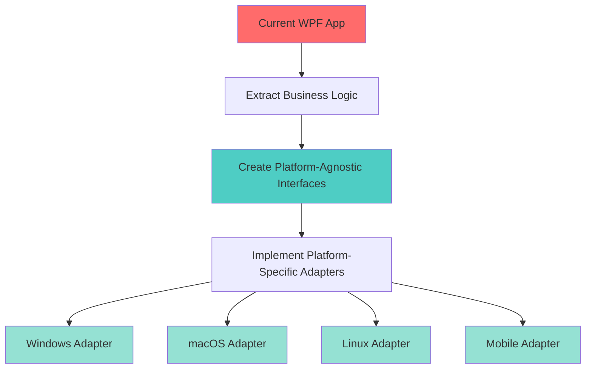
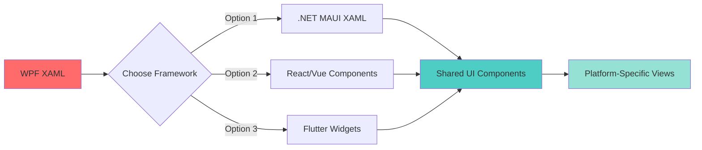
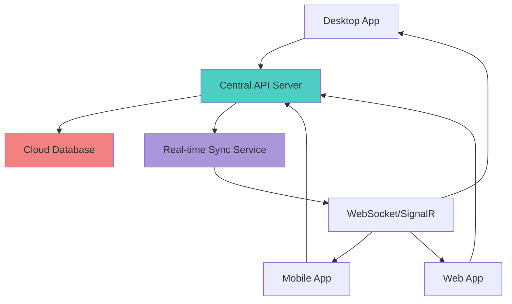

# 🌐 SysAnti - Cross-Platform Upgrade Analysis

# Phân Tích Nâng Cấp Đa Nền Tảng SysAnti

> **Document Created / Tài liệu tạo:** 2026-02-06 08:45:35  
> **Version / Phiên bản:** 1.0  
> **Status / Trạng thái:** Planning Phase (Giai đoạn Lập kế hoạch)

---

## 📋 Executive Summary / Tóm tắt Điều hành

SysAnti hiện tại là một ứng dụng **Windows-only** sử dụng WPF và .NET 9.0. Tài liệu này phân tích các chiến lược nâng cấp để mở rộng sang **đa nền tảng** (Windows, macOS, Linux, Web, Mobile) nhằm tăng khả năng tiếp cận người dùng và tính cạnh tranh trên thị trường.

**Current State / Trạng thái hiện tại:**

- ✅ Desktop: Windows (WPF)
- ✅ Backend: Node.js Server + .NET API
- ✅ Web: Basic HTML/CSS/JS Dashboard
- ❌ Mobile: Chưa có
- ❌ macOS/Linux: Chưa hỗ trợ

**Proposed Target / Mục tiêu đề xuất:**

- 🎯 Desktop: Windows, macOS, Linux
- 🎯 Mobile: Android, iOS
- 🎯 Web: Progressive Web App (PWA)
- 🎯 Cloud: Centralized management dashboard

---

## 🏗️ Current Architecture Analysis / Phân tích Kiến trúc Hiện tại

### Strengths / Điểm mạnh

1. **Modular Architecture / Kiến trúc Module hóa**
   - Tách biệt rõ ràng: Core, UI, API, Database, Services
   - Dễ dàng tái sử dụng logic nghiệp vụ

2. **Dual Backend / Backend kép**
   - Node.js Server: Xử lý web requests
   - .NET API: Business logic và database access

3. **Database Abstraction / Trừu tượng hóa Database**
   - Entity Framework Core cho phép chuyển đổi DB dễ dàng
   - SQLite hiện tại, có thể nâng cấp lên PostgreSQL/MySQL

### Limitations / Hạn chế

1. **Platform Lock-in / Bị khóa nền tảng**
   - WPF chỉ chạy trên Windows
   - Sử dụng Windows-specific APIs (RAM optimization, system calls)

2. **No Mobile Support / Không hỗ trợ Mobile**
   - Thiếu ứng dụng di động
   - Không có responsive design cho màn hình nhỏ

3. **Limited Web Features / Tính năng Web hạn chế**
   - Web dashboard cơ bản
   - Không có real-time sync với desktop app

---

## 🎯 Cross-Platform Strategy / Chiến lược Đa Nền Tảng

### Option 1: .NET MAUI Migration (Recommended / Khuyến nghị)

**Technology Stack:**

- .NET MAUI (Multi-platform App UI)
- Blazor Hybrid cho UI components
- Shared C# codebase: ~80-90%

**Pros / Ưu điểm:**

- ✅ Tái sử dụng 80% code hiện tại (.NET Core, Models, Services)
- ✅ Single codebase cho Windows, macOS, iOS, Android
- ✅ Native performance
- ✅ Dễ dàng cho team đã quen .NET

**Cons / Nhược điểm:**

- ⚠️ MAUI còn mới, ecosystem nhỏ hơn Flutter/React Native
- ⚠️ Cần viết platform-specific code cho tính năng hệ thống
- ⚠️ macOS/Linux support còn hạn chế cho system optimization features

**Effort Estimate / Ước lượng công sức:** 3-4 tháng

---

### Option 2: Electron + React/Vue (Web-First Approach)

**Technology Stack:**

- Electron cho Desktop (Windows, macOS, Linux)
- React/Vue.js cho UI
- Node.js backend (đã có sẵn)
- React Native cho Mobile

**Pros / Ưu điểm:**

- ✅ Cross-platform desktop ngay lập tức
- ✅ Tái sử dụng Node.js backend hiện tại
- ✅ Ecosystem lớn, nhiều thư viện
- ✅ Dễ tìm developer

**Cons / Nhược điểm:**

- ⚠️ Phải viết lại toàn bộ UI (từ WPF sang React/Vue)
- ⚠️ Performance kém hơn native
- ⚠️ Kích thước app lớn (>100MB)
- ⚠️ Cần học stack mới nếu team chỉ biết .NET

**Effort Estimate / Ước lượng công sức:** 5-6 tháng

---

### Option 3: Hybrid Approach (Balanced / Cân bằng)

**Technology Stack:**

- **Desktop:** .NET MAUI (Windows, macOS, Linux)
- **Mobile:** Flutter (iOS, Android)
- **Web:** Progressive Web App (React/Vue)
- **Backend:** Unified .NET API + Node.js

**Pros / Ưu điểm:**

- ✅ Best-of-breed cho từng platform
- ✅ Tối ưu performance và UX cho từng nền tảng
- ✅ Tái sử dụng backend logic

**Cons / Nhược điểm:**

- ⚠️ Phải maintain nhiều codebase
- ⚠️ Cần team đa kỹ năng (.NET, Flutter, Web)
- ⚠️ Chi phí phát triển cao nhất

**Effort Estimate / Ước lượng công sức:** 6-8 tháng

---

## 📊 Platform Comparison Matrix / Ma trận So sánh Nền tảng

| Feature / Tính năng | Windows (WPF) | .NET MAUI | Electron | Flutter | PWA |
|---------------------|---------------|-----------|----------|---------|-----|
| **Performance / Hiệu năng** | ⭐⭐⭐⭐⭐ | ⭐⭐⭐⭐ | ⭐⭐⭐ | ⭐⭐⭐⭐ | ⭐⭐⭐ |
| **Code Reuse / Tái sử dụng code** | N/A | ⭐⭐⭐⭐⭐ | ⭐⭐ | ⭐⭐⭐ | ⭐⭐⭐⭐ |
| **Development Speed / Tốc độ phát triển** | ⭐⭐⭐⭐ | ⭐⭐⭐⭐ | ⭐⭐⭐⭐⭐ | ⭐⭐⭐⭐ | ⭐⭐⭐⭐⭐ |
| **Native Features / Tính năng native** | ⭐⭐⭐⭐⭐ | ⭐⭐⭐⭐ | ⭐⭐⭐ | ⭐⭐⭐⭐ | ⭐⭐ |
| **Mobile Support / Hỗ trợ Mobile** | ❌ | ✅ | ❌ | ✅ | ✅ |
| **macOS/Linux Support** | ❌ | ⚠️ Limited | ✅ | ✅ | ✅ |
| **App Size / Kích thước** | ~50MB | ~60MB | ~150MB | ~30MB | ~5MB |
| **Learning Curve / Độ khó học** | Medium | Low | Medium | Medium | Low |
| **Community Support / Cộng đồng** | Large | Growing | Very Large | Very Large | Large |

**Legend / Chú thích:**

- ⭐⭐⭐⭐⭐ Excellent / Xuất sắc
- ⭐⭐⭐⭐ Good / Tốt
- ⭐⭐⭐ Average / Trung bình
- ⭐⭐ Below Average / Dưới trung bình
- ✅ Supported / Hỗ trợ
- ⚠️ Partial / Một phần
- ❌ Not Supported / Không hỗ trợ

---

## 🔄 Feature Migration Flow / Luồng Di chuyển Tính năng

### Phase 1: Core Services Abstraction / Trừu tượng hóa Dịch vụ Lõi



### Phase 2: UI Layer Migration / Di chuyển Lớp Giao diện



### Phase 3: Data Synchronization / Đồng bộ Dữ liệu



---

## 🛠️ Platform-Specific Implementation Details / Chi tiết Triển khai theo Nền tảng

### 1. Windows (Current + Enhanced / Hiện tại + Nâng cấp)

**Technology:** WPF → .NET MAUI  
**Key Features:**

- ✅ Full system optimization (Disk, RAM, Startup)
- ✅ Real-time virus scanning
- ✅ Registry access
- ✅ Windows Defender integration

**Migration Strategy:**

1. Keep existing WPF as legacy support
2. Build .NET MAUI version in parallel
3. Gradual feature migration
4. Offer both versions during transition

---

### 2. macOS

**Technology:** .NET MAUI / Electron  
**Key Features:**

- ⚠️ Limited system optimization (no Registry)
- ✅ Disk cleanup (~/Library/Caches, Trash)
- ✅ Memory optimization (purge command)
- ⚠️ Antivirus (signature-based only, no kernel access)

**Platform-Specific Challenges:**

- Sandboxing restrictions
- Gatekeeper and notarization requirements
- No direct system API access like Windows

**Implementation Approach:**

```csharp
// Platform abstraction example
public interface ISystemOptimizer
{
    Task<long> CleanDiskAsync();
    Task<long> OptimizeMemoryAsync();
}

// Windows implementation
public class WindowsOptimizer : ISystemOptimizer { }

// macOS implementation
public class MacOSOptimizer : ISystemOptimizer 
{
    public async Task<long> CleanDiskAsync()
    {
        // Use NSFileManager, ~/Library/Caches
    }
}
```

---

### 3. Linux

**Technology:** .NET MAUI / Electron  
**Key Features:**

- ✅ Disk cleanup (/tmp, ~/.cache, package cache)
- ✅ Memory optimization (drop_caches, swapoff/swapon)
- ⚠️ Antivirus (ClamAV integration)
- ✅ Startup manager (systemd services)

**Distribution Support:**

- Ubuntu/Debian (apt)
- Fedora/RHEL (dnf)
- Arch (pacman)

**Challenges:**

- Multiple package managers
- Different system paths per distro
- Permissions and sudo requirements

---

### 4. Mobile (iOS + Android)

**Technology:** .NET MAUI / Flutter / React Native  
**Key Features:**

- ✅ Remote monitoring (view desktop status)
- ✅ Scan scheduling
- ✅ Notifications
- ⚠️ Limited local optimization (sandboxed)

**Feature Scope:**

- **NOT included:** Direct system optimization (OS restrictions)
- **Included:**
  - Dashboard view
  - Remote control of desktop app
  - License management
  - Scan reports viewing

**Architecture:**

```
Mobile App → API Server → Desktop Agent
     ↓
  Push Notifications
  Real-time Status
  Remote Commands
```

---

### 5. Web (Progressive Web App)

**Technology:** React/Vue + PWA  
**Key Features:**

- ✅ Full dashboard access
- ✅ Multi-device management
- ✅ License portal
- ✅ Reports and analytics
- ✅ Offline support (Service Workers)

**Advantages:**

- No installation required
- Cross-platform by default
- Easy updates
- Accessible from any browser

---

## 📈 Recommended Migration Roadmap / Lộ trình Di chuyển Khuyến nghị

### 🎯 **Selected Strategy: Option 3 - Hybrid Approach** ✅

**Decision Date / Ngày quyết định:** 2026-02-06  
**Status / Trạng thái:** Approved for Implementation

**Rationale / Lý do:**

1. Best-of-breed technology cho từng platform
2. Tối ưu hóa UX và performance cho từng nền tảng
3. Linh hoạt trong việc chọn công nghệ phù hợp nhất
4. Giảm thiểu rủi ro bằng cách không phụ thuộc vào một framework duy nhất
5. Tái sử dụng backend logic và business rules

**Implementation Plan / Kế hoạch Triển khai:**  
📄 See detailed plan: [HYBRID_IMPLEMENTATION_PLAN_2026_02_06_0858.md](file:///f:/VStudio/SysAnti/doc/HYBRID_IMPLEMENTATION_PLAN_2026_02_06_0858.md)

---

### Timeline / Thời gian Triển khai

#### **Quarter 1 (Tháng 1-3): Foundation / Nền tảng**

- [ ] Refactor business logic thành platform-agnostic interfaces
- [ ] Tạo abstraction layer cho system APIs
- [ ] Setup .NET MAUI project structure
- [ ] Migrate Core models và services
- [ ] Implement dependency injection container

**Deliverables / Sản phẩm:**

- ✅ Shared library (.NET Standard 2.1)
- ✅ Platform interfaces defined
- ✅ Unit tests for core logic

---

#### **Quarter 2 (Tháng 4-6): Desktop Cross-Platform**

- [ ] Build .NET MAUI UI for Windows
- [ ] Implement macOS-specific optimizers
- [ ] Implement Linux-specific optimizers
- [ ] Create platform detection and routing
- [ ] Testing on all desktop platforms

**Deliverables / Sản phẩm:**

- ✅ Windows MAUI app (feature parity with WPF)
- ✅ macOS app (limited features)
- ✅ Linux app (limited features)

---

#### **Quarter 3 (Tháng 7-9): Mobile Apps**

- [ ] Design mobile-first UI/UX
- [ ] Implement remote monitoring features
- [ ] Build API endpoints for mobile
- [ ] Develop iOS app
- [ ] Develop Android app
- [ ] Push notification service

**Deliverables / Sản phẩm:**

- ✅ iOS app (TestFlight beta)
- ✅ Android app (Google Play beta)
- ✅ Real-time sync working

---

#### **Quarter 4 (Tháng 10-12): Web Platform + Polish**

- [ ] Build React/Vue PWA
- [ ] Implement admin dashboard
- [ ] Multi-device management
- [ ] Analytics and reporting
- [ ] Performance optimization
- [ ] Security audit
- [ ] Documentation

**Deliverables / Sản phẩm:**

- ✅ PWA deployed
- ✅ All platforms in production
- ✅ User documentation
- ✅ API documentation

---

## 💰 Cost-Benefit Analysis / Phân tích Chi phí - Lợi ích

### Development Costs / Chi phí Phát triển

| Item / Hạng mục | .NET MAUI | Electron | Hybrid |
|-----------------|-----------|----------|--------|
| **Developer Time / Thời gian lập trình** | 3-4 months | 5-6 months | 6-8 months |
| **Team Size / Quy mô team** | 2-3 devs | 3-4 devs | 4-6 devs |
| **Training Cost / Chi phí đào tạo** | Low | Medium | High |
| **Infrastructure / Hạ tầng** | $500/month | $500/month | $800/month |
| **Total Estimate / Tổng ước tính** | $50K-70K | $80K-100K | $120K-150K |

### Expected Benefits / Lợi ích Kỳ vọng

| Benefit / Lợi ích | Impact / Tác động |
|-------------------|-------------------|
| **Market Reach / Tiếp cận thị trường** | +300% (Windows → All platforms) |
| **User Base / Cơ sở người dùng** | +500% (estimate) |
| **Revenue Potential / Tiềm năng doanh thu** | +400% (multi-platform licensing) |
| **Competitive Advantage / Lợi thế cạnh tranh** | High (few competitors support all platforms) |
| **Brand Recognition / Nhận diện thương hiệu** | Significant increase |

### ROI Calculation / Tính toán Lợi nhuận Đầu tư

```
Investment: $70K (MAUI approach)
Expected additional revenue: $200K/year
ROI: 185% in first year
Break-even: 4-5 months after launch
```

---

## ⚠️ Risks and Mitigation / Rủi ro và Giảm thiểu

### Technical Risks / Rủi ro Kỹ thuật

| Risk / Rủi ro | Probability / Xác suất | Impact / Tác động | Mitigation / Giảm thiểu |
|---------------|------------------------|-------------------|-------------------------|
| .NET MAUI bugs/limitations | Medium | High | Maintain WPF fallback, contribute to MAUI community |
| Platform API differences | High | Medium | Extensive abstraction layer, feature flags |
| Performance issues on macOS/Linux | Medium | Medium | Optimize critical paths, native interop where needed |
| App store rejection (iOS/macOS) | Low | High | Follow guidelines strictly, security audit |
| Data sync conflicts | Medium | Medium | Implement CRDT or last-write-wins with conflict UI |

### Business Risks / Rủi ro Kinh doanh

| Risk / Rủi ro | Probability / Xác suất | Impact / Tác động | Mitigation / Giảm thiểu |
|---------------|------------------------|-------------------|-------------------------|
| Market not ready for cross-platform | Low | High | Phased rollout, gather feedback early |
| Competitor launches first | Medium | Medium | MVP approach, fast iteration |
| Development delays | Medium | Medium | Agile sprints, regular milestones |
| Budget overrun | Medium | High | Strict scope control, prioritize features |

---

## 🎯 Success Metrics / Chỉ số Thành công

### Technical KPIs / KPI Kỹ thuật

- ✅ Code reuse: >80%
- ✅ App size: <100MB per platform
- ✅ Startup time: <3 seconds
- ✅ Memory usage: <200MB idle
- ✅ Crash rate: <0.1%

### Business KPIs / KPI Kinh doanh

- ✅ User acquisition: +500% in 6 months
- ✅ Platform distribution: 60% Windows, 20% macOS, 10% Linux, 10% Mobile
- ✅ User retention: >70% after 30 days
- ✅ Revenue growth: +400% year-over-year
- ✅ App store rating: >4.5 stars

---

## 📚 Next Steps / Bước tiếp theo

### Immediate Actions / Hành động Ngay lập tức

1. **Stakeholder Approval / Phê duyệt Bên liên quan**
   - Present this analysis to decision makers
   - Get budget approval
   - Finalize technology choice

2. **Team Preparation / Chuẩn bị Đội ngũ**
   - Assess current team skills
   - Plan training for .NET MAUI
   - Hire additional developers if needed

3. **Proof of Concept / Chứng minh Khái niệm**
   - Build simple .NET MAUI prototype
   - Test on Windows, macOS, Android
   - Validate architecture decisions

4. **Project Setup / Thiết lập Dự án**
   - Create new solution structure
   - Setup CI/CD pipelines
   - Configure version control branching strategy

### Documentation Needed / Tài liệu Cần thiết

- [ ] Detailed technical specification
- [ ] API documentation
- [ ] Platform-specific implementation guides
- [ ] Testing strategy
- [ ] Deployment guides per platform

---

## 📞 Appendix / Phụ lục

### A. Technology Stack Details / Chi tiết Ngăn xếp Công nghệ

**Desktop (All Platforms):**

- .NET 9.0 / .NET MAUI
- XAML / Blazor Hybrid
- SQLite / PostgreSQL
- SignalR for real-time

**Mobile:**

- .NET MAUI
- Xamarin.Essentials
- Platform-specific APIs (iOS/Android)

**Web:**

- React 18 / Vue 3
- TypeScript
- Tailwind CSS
- PWA (Service Workers)

**Backend:**

- ASP.NET Core 9.0 Web API
- Node.js (existing, keep for web)
- PostgreSQL / MySQL
- Redis (caching)
- Docker containers

### B. Reference Projects / Dự án Tham khảo

- **CCleaner:** Cross-platform cleaning tool
- **Malwarebytes:** Multi-platform antivirus
- **BleachBit:** Open-source cleaner (Windows/Linux/macOS)

### C. Useful Resources / Tài nguyên Hữu ích

- [.NET MAUI Documentation](https://docs.microsoft.com/dotnet/maui/)
- [Cross-Platform Development Best Practices](https://docs.microsoft.com/xamarin/cross-platform/)
- [Platform-Specific Code in MAUI](https://docs.microsoft.com/dotnet/maui/platform-integration/)

---

**Document Status / Trạng thái Tài liệu:** ✅ Ready for Review  
**Next Review Date / Ngày Xem xét Tiếp theo:** 2026-02-13  
**Owner / Người sở hữu:** Development Team
