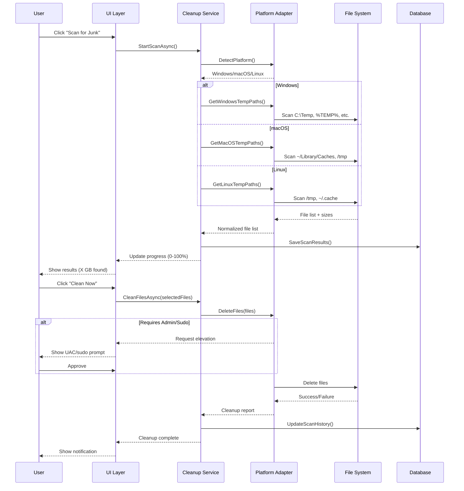
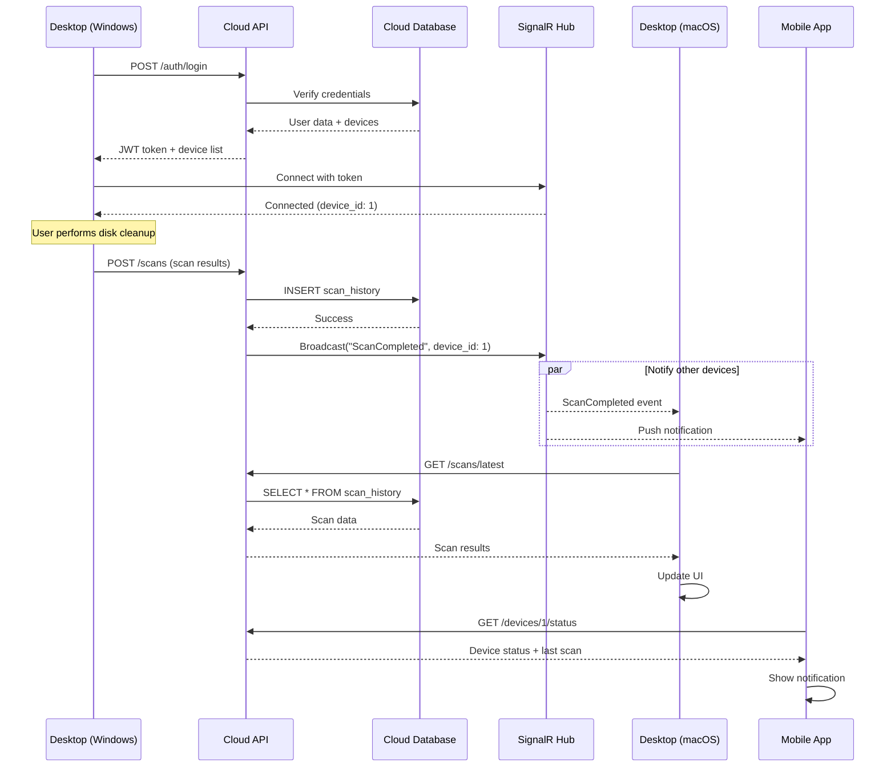
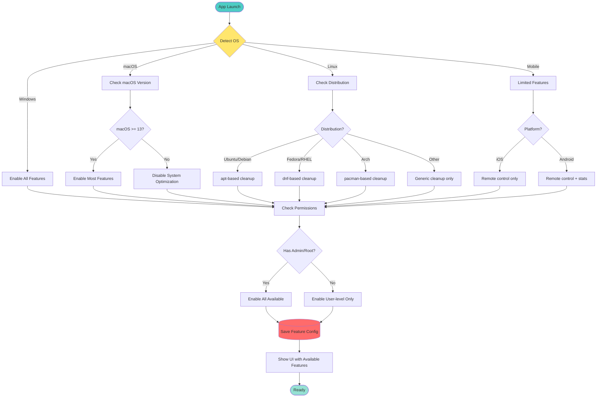

# 🔄 SysAnti - Detailed Flow Analysis & Architecture Diagrams

# Phân Tích Luồng Chi tiết & Sơ đồ Kiến trúc

> **Document Created / Tài liệu tạo:** 2026-02-06 08:45:35  
> **Related Document / Tài liệu liên quan:** [CROSS_PLATFORM_UPGRADE_ANALYSIS_2026_02_06_0845.md](file:///f:/VStudio/SysAnti/doc/CROSS_PLATFORM_UPGRADE_ANALYSIS_2026_02_06_0845.md)

---

## 📊 Table 1: Feature Flow Comparison Across Platforms

## Bảng 1: So sánh Luồng Tính năng trên các Nền tảng

| Feature / Tính năng | Windows (Current) | Windows (MAUI) | macOS | Linux | Mobile (iOS/Android) | Web (PWA) |
|---------------------|-------------------|----------------|-------|-------|----------------------|-----------|
| **🧹 Disk Cleanup / Dọn dẹp Đĩa** |
| Temp Files | ✅ Direct API | ✅ Direct API | ✅ ~/Library/Caches | ✅ /tmp, ~/.cache | ❌ Sandboxed | 🔄 Remote Control |
| Browser Cache | ✅ All browsers | ✅ All browsers | ✅ Safari, Chrome | ✅ Firefox, Chrome | ❌ N/A | 🔄 Remote Control |
| Recycle Bin | ✅ Shell API | ✅ Shell API | ✅ ~/.Trash | ✅ ~/.local/share/Trash | ❌ N/A | 🔄 Remote Control |
| Large Files Scan | ✅ Fast | ✅ Fast | ✅ Medium | ✅ Medium | ❌ N/A | 📊 View Only |
| **Implementation** | `System.IO` | `.NET MAUI Storage` | `NSFileManager` | `System.IO + bash` | N/A | API calls |
| **💾 RAM Optimization / Tối ưu RAM** |
| Memory Release | ✅ EmptyWorkingSet | ✅ EmptyWorkingSet | ⚠️ purge command | ⚠️ drop_caches | ❌ OS Managed | 📊 View Stats |
| Process Management | ✅ Kill processes | ✅ Kill processes | ✅ kill command | ✅ kill command | ❌ N/A | 🔄 Remote Control |
| Memory Stats | ✅ Real-time | ✅ Real-time | ✅ vm_stat | ✅ /proc/meminfo | ✅ Device Stats | ✅ Real-time |
| **Implementation** | `Windows API` | `Platform Services` | `Process.Start("purge")` | `sysctl, /proc` | Device APIs | API + Charts |
| **🔍 Virus Scanner / Quét Virus** |
| File Scanning | ✅ Full access | ✅ Full access | ⚠️ User files only | ⚠️ User files only | ❌ N/A | 🔄 Remote Scan |
| Real-time Protection | ✅ FileSystemWatcher | ✅ FileSystemWatcher | ⚠️ FSEvents | ⚠️ inotify | ❌ N/A | ❌ N/A |
| Quarantine | ✅ Isolated folder | ✅ Isolated folder | ✅ Isolated folder | ✅ Isolated folder | ❌ N/A | 📊 View List |
| Hash Database | ✅ SQLite | ✅ SQLite | ✅ SQLite | ✅ SQLite | 🔄 Cloud Sync | ✅ Cloud DB |
| **Implementation** | `SHA256 + Signatures` | `SHA256 + Signatures` | `SHA256 + Signatures` | `ClamAV integration` | N/A | API + Reports |
| **🚀 Startup Manager / Quản lý Khởi động** |
| List Programs | ✅ Registry + Folders | ✅ Registry + Folders | ✅ LaunchAgents | ✅ systemd, cron | ❌ N/A | 📊 View List |
| Enable/Disable | ✅ Full control | ✅ Full control | ⚠️ Requires sudo | ⚠️ Requires sudo | ❌ N/A | 🔄 Remote Control |
| Impact Analysis | ✅ Boot time tracking | ✅ Boot time tracking | ⚠️ Limited | ⚠️ Limited | ❌ N/A | 📊 Analytics |
| **Implementation** | `Registry + Task Scheduler` | `Platform Services` | `launchctl` | `systemctl` | N/A | API calls |
| **🔐 Authentication / Xác thực** |
| Local Login | ✅ SQLite | ✅ SQLite | ✅ SQLite | ✅ SQLite | ✅ API + Token | ✅ JWT + OAuth |
| Cloud Sync | ⚠️ Planned | ✅ API Integration | ✅ API Integration | ✅ API Integration | ✅ Native | ✅ Native |
| Biometric | ❌ N/A | ✅ Windows Hello | ✅ Touch ID | ❌ N/A | ✅ Face/Touch ID | ⚠️ WebAuthn |
| License Check | ✅ Local DB | ✅ Local + Cloud | ✅ Local + Cloud | ✅ Local + Cloud | ✅ Cloud Only | ✅ Cloud Only |
| **Implementation** | `BCrypt + EF Core` | `BCrypt + API` | `BCrypt + API` | `BCrypt + API` | `OAuth 2.0` | `JWT + OAuth` |
| **📊 Dashboard / Bảng điều khiển** |
| System Stats | ✅ Real-time | ✅ Real-time | ✅ Real-time | ✅ Real-time | ✅ Remote View | ✅ Multi-device |
| Charts/Graphs | ✅ LiveCharts | ✅ MAUI Charts | ✅ MAUI Charts | ✅ MAUI Charts | ✅ Native Charts | ✅ Chart.js |
| Notifications | ✅ Toast | ✅ MAUI Notifications | ✅ NSNotification | ✅ libnotify | ✅ Push (FCM/APNS) | ✅ Web Push |
| **Implementation** | `WPF Controls` | `MAUI Controls` | `MAUI Controls` | `MAUI Controls` | `Native UI` | `React/Vue` |

**Legend / Chú thích:**

- ✅ **Full Support** / Hỗ trợ đầy đủ
- ⚠️ **Partial/Limited** / Một phần/Hạn chế
- ❌ **Not Available** / Không khả dụng
- 🔄 **Remote Control** / Điều khiển từ xa
- 📊 **View Only** / Chỉ xem

---

## 🏗️ Table 2: Architecture Component Flow

## Bảng 2: Luồng Thành phần Kiến trúc

| Layer / Lớp | Current (Windows) | Target (Cross-Platform) | Changes Required / Thay đổi Cần thiết |
|-------------|-------------------|-------------------------|----------------------------------------|
| **Presentation / Giao diện** |
| Technology | WPF (XAML) | .NET MAUI (XAML/Blazor) | ✏️ Migrate XAML, update bindings |
| UI Framework | MaterialDesignXAML | MAUI Community Toolkit | ✏️ Replace controls |
| Navigation | Frame-based | Shell-based | ✏️ Refactor navigation logic |
| Data Binding | MVVM (INotifyPropertyChanged) | MVVM (ObservableObject) | ✏️ Update ViewModels |
| **Business Logic / Logic Nghiệp vụ** |
| Services | Concrete classes | Interface-based | ✏️ Extract interfaces |
| Dependency Injection | Manual | Built-in DI | ✏️ Register services |
| State Management | Static properties | Singleton services | ✏️ Refactor state handling |
| **Data Access / Truy cập Dữ liệu** |
| ORM | Entity Framework Core 9 | Entity Framework Core 9 | ✅ No change |
| Database | SQLite (local) | SQLite + PostgreSQL (cloud) | ✏️ Add cloud sync |
| Migrations | Code-first | Code-first | ✅ No change |
| **Platform Services / Dịch vụ Nền tảng** |
| File System | `System.IO` | `IFileSystem` abstraction | ✏️ Create abstraction |
| System Info | Windows API | Platform-specific | ✏️ Implement per platform |
| Notifications | WPF Toast | `INotificationService` | ✏️ Create abstraction |
| **Backend / Phía sau** |
| API | Node.js + .NET API | Unified .NET API | ✏️ Consolidate APIs |
| Authentication | Local only | JWT + OAuth | ✏️ Add cloud auth |
| Real-time | ❌ None | SignalR | ✏️ Implement SignalR |
| **Deployment / Triển khai** |
| Windows | ClickOnce / MSI | MSIX | ✏️ New installer |
| macOS | ❌ N/A | .app bundle + notarization | ✏️ New build pipeline |
| Linux | ❌ N/A | AppImage / Snap / Flatpak | ✏️ New build pipeline |
| Mobile | ❌ N/A | App Store / Play Store | ✏️ New build pipeline |
| Web | Static files | Docker + Nginx | ✏️ Containerize |

---

## 🔄 Table 3: User Flow Comparison

## Bảng 3: So sánh Luồng Người dùng

### Scenario 1: First-Time User Registration / Đăng ký Lần đầu

| Step / Bước | Windows (Current) | Cross-Platform (Target) | Notes / Ghi chú |
|-------------|-------------------|-------------------------|-----------------|
| 1. Download | Website → .exe | Website → Platform selector | Multi-platform download page |
| 2. Install | Run installer | Run installer (platform-specific) | Notarization for macOS |
| 3. Launch | Desktop shortcut | Desktop/Launchpad/Dock | Platform conventions |
| 4. Register | Local form → SQLite | Form → Cloud API → Local cache | Sync across devices |
| 5. License | Auto 14-day trial | Auto 14-day trial + email | Email confirmation |
| 6. Onboarding | Static tutorial | Interactive walkthrough | MAUI CarouselView |
| 7. First Scan | Click "Scan Now" | Click "Scan Now" | Same UX |
| **Data Flow** | UI → Service → SQLite | UI → Service → API → Cloud DB → Local cache | Offline-first design |

---

### Scenario 2: Daily Usage - Disk Cleanup / Sử dụng Hàng ngày - Dọn dẹp Đĩa

| Step / Bước | Windows (Current) | macOS (Target) | Linux (Target) | Mobile (Target) |
|-------------|-------------------|----------------|----------------|-----------------|
| 1. Open App | Click icon | Click icon | Click icon | Tap icon |
| 2. Navigate | Dashboard → Disk Cleanup | Dashboard → Disk Cleanup | Dashboard → Disk Cleanup | Dashboard → Remote Devices |
| 3. Scan | Click "Scan" → Progress bar | Click "Scan" → Progress bar | Click "Scan" → Progress bar | Select device → "Scan" |
| 4. Review | List of files (TreeView) | List of files (CollectionView) | List of files (CollectionView) | Summary only |
| 5. Clean | Click "Clean" → Confirmation | Click "Clean" → Confirmation | Click "Clean" → sudo prompt | Tap "Clean" → Remote execute |
| 6. Result | Toast notification | macOS notification | libnotify | Push notification |
| **Platform API** | `EmptyRecycleBin()` | `NSFileManager.removeItem()` | `rm -rf ~/.cache/*` | API call → Desktop agent |

---

### Scenario 3: Multi-Device Sync / Đồng bộ Đa thiết bị

| Step / Bước | Current (No Sync) | Target (With Sync) | Technology / Công nghệ |
|-------------|-------------------|---------------------|------------------------|
| 1. User logs in on Device A | Local auth only | Auth → Cloud → Token | JWT + Refresh Token |
| 2. Scan completed | Saved locally | Saved locally + Cloud | SQLite → API → PostgreSQL |
| 3. User opens Device B | No data | Auto-sync on login | SignalR real-time |
| 4. View scan history | Empty | Shows Device A results | API → Local cache |
| 5. Schedule scan on Device A | Local scheduler | Cloud scheduler | Cron job on server |
| 6. Device A executes | Local execution | Local execution → Cloud update | Desktop agent → API |
| 7. Device B receives notification | ❌ N/A | Push notification | FCM/APNS/Web Push |
| **Conflict Resolution** | N/A | Last-write-wins + timestamp | CRDT or manual merge |

---

## 🎯 Table 4: Development Workflow Comparison

## Bảng 4: So sánh Quy trình Phát triển

| Activity / Hoạt động | Current (WPF) | .NET MAUI | Electron | Flutter |
|----------------------|---------------|-----------|----------|---------|
| **Setup / Thiết lập** |
| IDE | Visual Studio 2022 | Visual Studio 2022 | VS Code | VS Code / Android Studio |
| SDK Install | .NET 9.0 | .NET 9.0 + MAUI workload | Node.js | Flutter SDK |
| Emulator | ❌ N/A | Android Emulator, iOS Simulator | ❌ N/A | Android/iOS Emulator |
| Time to first run | 5 min | 10 min | 3 min | 5 min |
| **Development / Phát triển** |
| Hot Reload | ✅ XAML only | ✅ XAML + C# | ✅ Full | ✅ Full |
| Debugging | ✅ Excellent | ✅ Good | ✅ Good | ✅ Good |
| UI Designer | ✅ Visual designer | ⚠️ Preview only | ❌ Code only | ❌ Code only |
| Code Sharing | ❌ Windows only | ✅ 80%+ | ⚠️ 50% (UI separate) | ✅ 90%+ |
| **Testing / Kiểm thử** |
| Unit Tests | xUnit | xUnit | Jest | Dart test |
| UI Tests | WinAppDriver | Appium | Spectron | Flutter Driver |
| Platform Testing | Windows only | Windows, macOS, Android, iOS | All desktop | All platforms |
| **Build / Xây dựng** |
| Build Time | 30 sec | 1-2 min | 1 min | 1-2 min |
| Output Size | 50 MB | 60 MB | 150 MB | 30 MB |
| Code Signing | Optional | Required (macOS/iOS) | Required (macOS) | Required (iOS) |
| **Deployment / Triển khai** |
| Windows | ClickOnce, MSI | MSIX | NSIS, Squirrel | ❌ N/A |
| macOS | ❌ N/A | .app + notarization | .dmg + notarization | ❌ N/A |
| Linux | ❌ N/A | AppImage, Snap | AppImage, deb | ❌ N/A |
| Mobile | ❌ N/A | App Store, Play Store | ❌ N/A | App Store, Play Store |
| Auto-update | ❌ Manual | ✅ Built-in | ✅ electron-updater | ⚠️ Via stores |

---

## 📈 Table 5: Performance Benchmarks (Estimated)

## Bảng 5: Đánh giá Hiệu suất (Ước tính)

| Metric / Chỉ số | Windows WPF | Windows MAUI | macOS MAUI | Linux MAUI | Electron | Mobile MAUI |
|------------------|-------------|--------------|------------|------------|----------|-------------|
| **Startup Time / Thời gian Khởi động** |
| Cold Start | 1.5s | 2.0s | 2.5s | 2.5s | 3.5s | 2.0s |
| Warm Start | 0.5s | 0.8s | 1.0s | 1.0s | 1.5s | 0.8s |
| **Memory Usage / Sử dụng Bộ nhớ** |
| Idle | 80 MB | 100 MB | 120 MB | 120 MB | 200 MB | 80 MB |
| Active Scan | 150 MB | 180 MB | 200 MB | 200 MB | 300 MB | 100 MB |
| Peak | 250 MB | 300 MB | 350 MB | 350 MB | 500 MB | 150 MB |
| **CPU Usage / Sử dụng CPU** |
| Idle | 0-1% | 0-1% | 0-2% | 0-2% | 1-3% | 0-1% |
| Scanning | 25-40% | 25-40% | 30-45% | 30-45% | 35-50% | 20-30% |
| **Disk I/O / Đọc/Ghi Đĩa** |
| Scan Speed | 500 MB/s | 500 MB/s | 400 MB/s | 400 MB/s | 350 MB/s | N/A |
| Database Write | 10K ops/s | 10K ops/s | 8K ops/s | 8K ops/s | 6K ops/s | 5K ops/s |
| **Battery Impact (Laptop) / Tác động Pin** |
| Idle | 0.5% | 0.8% | 1.0% | 1.0% | 2.0% | 0.5% |
| Active | 5% | 6% | 7% | 7% | 10% | 4% |
| **App Size / Kích thước Ứng dụng** |
| Installer | 45 MB | 55 MB | 60 MB | 60 MB | 140 MB | 25 MB (APK/IPA) |
| Installed | 120 MB | 150 MB | 160 MB | 160 MB | 300 MB | 80 MB |

**Notes / Ghi chú:**

- Benchmarks are estimates based on similar applications
- Actual performance will vary based on hardware
- Electron numbers are higher due to bundled Chromium

---

## 🔐 Table 6: Security & Permissions Flow

## Bảng 6: Luồng Bảo mật & Quyền hạn

| Permission / Quyền | Windows | macOS | Linux | iOS | Android | Web |
|--------------------|---------|-------|-------|-----|---------|-----|
| **File System Access / Truy cập Hệ thống Tệp** |
| User Files | ✅ Full | ⚠️ Request | ⚠️ Request | ❌ Sandboxed | ⚠️ Storage permission | ❌ File API only |
| System Files | ✅ Admin required | ❌ Denied | ⚠️ sudo required | ❌ Denied | ❌ Denied | ❌ Denied |
| External Drives | ✅ Full | ⚠️ Request | ✅ Full | ❌ N/A | ⚠️ Permission | ❌ N/A |
| **Process Management / Quản lý Tiến trình** |
| List Processes | ✅ Full | ✅ Full | ✅ Full | ❌ Own app only | ❌ Own app only | ❌ N/A |
| Kill Processes | ✅ Admin required | ⚠️ User processes | ⚠️ User processes | ❌ Denied | ❌ Denied | ❌ N/A |
| **Network / Mạng** |
| Internet Access | ✅ Firewall prompt | ✅ Firewall prompt | ✅ Full | ⚠️ Request | ⚠️ Request | ✅ CORS |
| Local Network | ✅ Full | ⚠️ Request (macOS 14+) | ✅ Full | ⚠️ Request | ⚠️ Request | ❌ Limited |
| **Notifications / Thông báo** |
| Show Notifications | ✅ Auto | ⚠️ Request | ✅ Auto | ⚠️ Request | ⚠️ Request | ⚠️ Request |
| **Background Execution / Chạy Nền** |
| Background Tasks | ✅ Full | ⚠️ Limited | ✅ Full | ❌ Very limited | ⚠️ Limited | ⚠️ Service Workers |
| Auto-start | ✅ Registry | ⚠️ Login Items | ✅ systemd | ❌ N/A | ❌ N/A | ❌ N/A |
| **Privacy / Riêng tư** |
| Camera | ❌ Not used | ❌ Not used | ❌ Not used | ⚠️ Request (future) | ⚠️ Request (future) | ⚠️ Request |
| Location | ❌ Not used | ❌ Not used | ❌ Not used | ⚠️ Optional | ⚠️ Optional | ⚠️ Optional |
| Contacts | ❌ Not used | ❌ Not used | ❌ Not used | ❌ Not used | ❌ Not used | ❌ Not used |

**Permission Request Flow / Luồng Yêu cầu Quyền:**

```
App Launch → Check Permissions → Missing? → Show Explanation → Request → Granted? → Proceed
                                                                              ↓ Denied
                                                                        Disable Feature
```

---

## 🌊 Detailed Flow Diagrams / Sơ đồ Luồng Chi tiết

### Flow 1: Cross-Platform Disk Cleanup Process

### Luồng 1: Quy trình Dọn dẹp Đĩa Đa nền tảng



---

### Flow 2: Multi-Device Synchronization

### Luồng 2: Đồng bộ Đa thiết bị



---

### Flow 3: Platform-Specific Feature Detection

### Luồng 3: Phát hiện Tính năng theo Nền tảng



---

## 📋 Table 7: Migration Checklist

## Bảng 7: Danh sách Kiểm tra Di chuyển

| Category / Danh mục | Task / Nhiệm vụ | Windows | macOS | Linux | Mobile | Web | Priority / Ưu tiên |
|---------------------|-----------------|---------|-------|-------|--------|-----|--------------------|
| **Architecture / Kiến trúc** |
| Extract interfaces | Create `ISystemOptimizer`, `IFileScanner`, etc. | ✅ | ✅ | ✅ | ✅ | ✅ | 🔴 Critical |
| Dependency Injection | Setup MAUI DI container | ✅ | ✅ | ✅ | ✅ | N/A | 🔴 Critical |
| Platform detection | Implement `IPlatformService` | ✅ | ✅ | ✅ | ✅ | ✅ | 🔴 Critical |
| **UI Migration / Di chuyển Giao diện** |
| Convert XAML | WPF → MAUI XAML | ✅ | ✅ | ✅ | ✅ | N/A | 🔴 Critical |
| Update bindings | Fix binding paths | ✅ | ✅ | ✅ | ✅ | N/A | 🟠 High |
| Responsive design | Add mobile layouts | N/A | N/A | N/A | ✅ | ✅ | 🟠 High |
| **Features / Tính năng** |
| Disk Cleanup | Platform-specific implementations | ✅ | ⚠️ | ⚠️ | ❌ | 🔄 | 🔴 Critical |
| RAM Optimization | Platform-specific implementations | ✅ | ⚠️ | ⚠️ | ❌ | 📊 | 🔴 Critical |
| Virus Scanner | Cross-platform scanning | ✅ | ⚠️ | ⚠️ | ❌ | 🔄 | 🟠 High |
| Startup Manager | Platform-specific implementations | ✅ | ⚠️ | ⚠️ | ❌ | 📊 | 🟡 Medium |
| **Backend / Phía sau** |
| Unified API | Merge Node.js + .NET API | ✅ | ✅ | ✅ | ✅ | ✅ | 🔴 Critical |
| Cloud Database | PostgreSQL setup | ✅ | ✅ | ✅ | ✅ | ✅ | 🟠 High |
| Real-time Sync | SignalR implementation | ✅ | ✅ | ✅ | ✅ | ✅ | 🟠 High |
| **Testing / Kiểm thử** |
| Unit Tests | Update for new architecture | ✅ | ✅ | ✅ | ✅ | ✅ | 🔴 Critical |
| Integration Tests | Platform-specific tests | ✅ | ✅ | ✅ | ✅ | ✅ | 🟠 High |
| UI Tests | Appium setup | ✅ | ✅ | ✅ | ✅ | N/A | 🟡 Medium |
| **Deployment / Triển khai** |
| Windows Installer | MSIX package | ✅ | N/A | N/A | N/A | N/A | 🔴 Critical |
| macOS Installer | .app + notarization | N/A | ✅ | N/A | N/A | N/A | 🔴 Critical |
| Linux Packages | AppImage, Snap, Flatpak | N/A | N/A | ✅ | N/A | N/A | 🟠 High |
| App Store | iOS submission | N/A | N/A | N/A | ✅ | N/A | 🟠 High |
| Play Store | Android submission | N/A | N/A | N/A | ✅ | N/A | 🟠 High |
| Web Hosting | Docker + CI/CD | N/A | N/A | N/A | N/A | ✅ | 🟡 Medium |

**Priority Legend / Chú giải Ưu tiên:**

- 🔴 **Critical** / Quan trọng: Must have for MVP
- 🟠 **High** / Cao: Important for full release
- 🟡 **Medium** / Trung bình: Nice to have
- 🟢 **Low** / Thấp: Future enhancement

---

## 🎯 Summary & Recommendations / Tóm tắt & Khuyến nghị

### Key Takeaways / Điểm Chính

1. **Best Approach / Phương pháp Tốt nhất:** .NET MAUI for maximum code reuse (80%+)
2. **Timeline / Thời gian:** 9-12 months for full cross-platform support
3. **Priority Order / Thứ tự Ưu tiên:**
   - Phase 1: Windows MAUI (maintain feature parity)
   - Phase 2: macOS (limited features due to OS restrictions)
   - Phase 3: Mobile (remote control focus)
   - Phase 4: Linux + Web PWA

4. **Critical Success Factors / Yếu tố Thành công Quan trọng:**
   - Strong abstraction layer for platform differences
   - Comprehensive testing on all platforms
   - Gradual migration (keep WPF as fallback)
   - User feedback loops

### Next Actions / Hành động Tiếp theo

1. ✅ Review this analysis with stakeholders
2. ✅ Approve technology stack (.NET MAUI)
3. ✅ Create detailed technical specification
4. ✅ Setup development environment
5. ✅ Start Phase 1 (Foundation)

---

**Document Status / Trạng thái:** ✅ Complete  
**Related Documents / Tài liệu Liên quan:**

- [CROSS_PLATFORM_UPGRADE_ANALYSIS_2026_02_06_0845.md](file:///f:/VStudio/SysAnti/doc/CROSS_PLATFORM_UPGRADE_ANALYSIS_2026_02_06_0845.md)
- [PROJECT_STRUCTURE.md](file:///f:/VStudio/SysAnti/doc/PROJECT_STRUCTURE.md)
