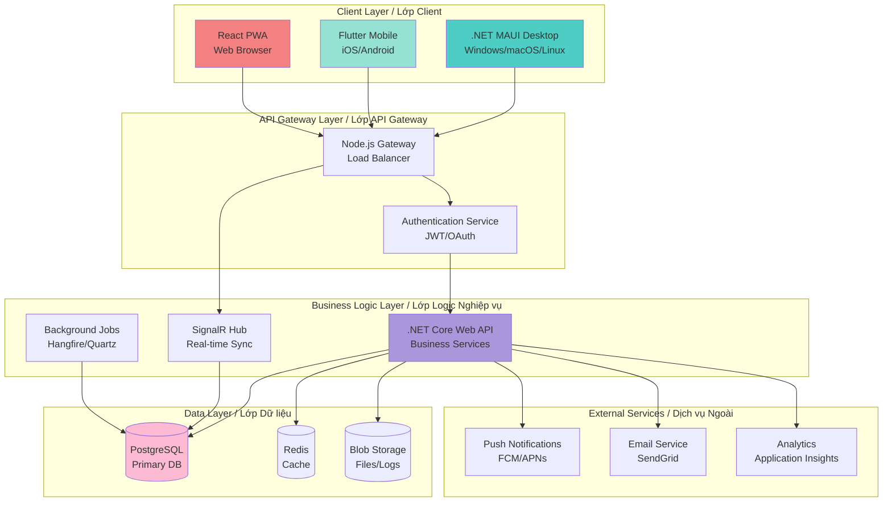

# 🚀 SysAnti - Hybrid Approach Implementation Plan

# Kế hoạch Triển khai Phương án Hybrid

> **Document Created / Tài liệu tạo:** 2026-02-06 08:58:15  
> **Version / Phiên bản:** 1.0  
> **Status / Trạng thái:** Approved for Implementation  
> **Selected Strategy / Chiến lược:** Option 3 - Hybrid Approach

---

## 📋 Executive Summary / Tóm tắt Điều hành

Kế hoạch này chi tiết hóa việc triển khai **Option 3: Hybrid Approach** - chiến lược đa nền tảng cân bằng, sử dụng công nghệ tối ưu cho từng platform:

This plan details the implementation of **Option 3: Hybrid Approach** - a balanced cross-platform strategy using optimal technology for each platform:

- **Desktop:** .NET MAUI (Windows, macOS, Linux)
- **Mobile:** Flutter (iOS, Android)  
- **Web:** Progressive Web App (React/Vue)
- **Backend:** Unified .NET Core API + Node.js Gateway

**Timeline / Thời gian:** 12 tháng (4 quarters)  
**Budget / Ngân sách:** $120K-150K  
**Team Size / Quy mô:** 4-6 developers  
**Expected ROI / ROI kỳ vọng:** 185% trong năm đầu

---

## 🎯 Strategic Rationale / Lý do Chiến lược

### Why Hybrid? / Tại sao Hybrid?

1. **Best-of-Breed Technology / Công nghệ Tốt nhất cho từng Nền tảng**
   - .NET MAUI: Tái sử dụng 80% code hiện tại, native performance
   - Flutter: UI đẹp, performance tốt, cộng đồng lớn cho mobile
   - React/Vue PWA: Accessibility cao, không cần cài đặt, dễ update

2. **Risk Mitigation / Giảm thiểu Rủi ro**
   - Không phụ thuộc hoàn toàn vào một framework
   - Nếu một platform gặp vấn đề, các platform khác không bị ảnh hưởng
   - Linh hoạt thay đổi công nghệ cho từng platform nếu cần

3. **Optimal User Experience / Trải nghiệm Người dùng Tối ưu**
   - Desktop: Full-featured, system-level access
   - Mobile: Monitoring và remote control
   - Web: Dashboard, analytics, multi-device management

---

## 🏗️ Architecture Overview / Tổng quan Kiến trúc

### High-Level Architecture / Kiến trúc Tổng thể



### Technology Stack Details / Chi tiết Ngăn xếp Công nghệ

#### Desktop (.NET MAUI)

```yaml
Framework: .NET 9.0 MAUI
UI: XAML / Blazor Hybrid
Language: C# 13
Platforms: Windows 10+, macOS 12+, Ubuntu 22.04+
Dependencies:
  - CommunityToolkit.Maui
  - Microsoft.Extensions.DependencyInjection
  - Serilog (logging)
  - Polly (resilience)
```

#### Mobile (Flutter)

```yaml
Framework: Flutter 3.19+
Language: Dart 3.3+
State Management: Riverpod 2.0
Platforms: iOS 13+, Android 8.0+
Key Packages:
  - dio (HTTP client)
  - flutter_riverpod (state)
  - go_router (navigation)
  - firebase_messaging (push)
  - hive (local storage)
```

#### Web (PWA)

```yaml
Framework: React 18 / Vue 3
Language: TypeScript 5.0
Build Tool: Vite 5
Styling: Tailwind CSS 3
Key Libraries:
  - React Query / Pinia (state)
  - Axios (HTTP)
  - Chart.js (analytics)
  - Workbox (service worker)
```

#### Backend

```yaml
API: ASP.NET Core 9.0 Web API
Gateway: Node.js 20 + Express
Database: PostgreSQL 16
Cache: Redis 7
Real-time: SignalR
Jobs: Hangfire
Hosting: Docker + Kubernetes
```

---

## 📐 Detailed Implementation Phases / Các Giai đoạn Triển khai Chi tiết

### 🔷 Phase 1: Foundation (Tháng 1-3)

#### 1.1 Core Abstraction Layer / Lớp Trừu tượng Lõi

**Objective / Mục tiêu:** Tạo platform-agnostic business logic có thể tái sử dụng

**Tasks / Nhiệm vụ:**

1. **Define Platform Interfaces / Định nghĩa Giao diện Nền tảng**

```csharp
// SysAnti.Core/Interfaces/ISystemOptimizer.cs
public interface ISystemOptimizer
{
    Task<OptimizationResult> CleanDiskAsync(CleanupOptions options);
    Task<OptimizationResult> OptimizeMemoryAsync();
    Task<OptimizationResult> ManageStartupAppsAsync(StartupAction action);
    Task<SystemInfo> GetSystemInfoAsync();
}

// SysAnti.Core/Interfaces/IVirusScanner.cs
public interface IVirusScanner
{
    Task<ScanResult> ScanFileAsync(string filePath);
    Task<ScanResult> ScanDirectoryAsync(string directoryPath, ScanOptions options);
    Task<bool> UpdateDefinitionsAsync();
    Task<QuarantineResult> QuarantineFileAsync(string filePath);
}

// SysAnti.Core/Interfaces/IPlatformService.cs
public interface IPlatformService
{
    PlatformType GetPlatformType();
    string GetPlatformVersion();
    bool IsFeatureSupported(string featureName);
}
```

1. **Create Shared Models / Tạo Models Chung**

```csharp
// SysAnti.Core/Models/OptimizationResult.cs
public class OptimizationResult
{
    public bool Success { get; set; }
    public long BytesFreed { get; set; }
    public TimeSpan Duration { get; set; }
    public List<string> CleanedItems { get; set; }
    public List<string> Errors { get; set; }
}

// SysAnti.Core/Models/SystemInfo.cs
public class SystemInfo
{
    public string OperatingSystem { get; set; }
    public string Architecture { get; set; }
    public long TotalMemory { get; set; }
    public long AvailableMemory { get; set; }
    public List<DiskInfo> Disks { get; set; }
    public int ProcessorCount { get; set; }
}
```

1. **Implement Platform-Specific Adapters / Triển khai Adapters theo Nền tảng**

```csharp
// SysAnti.Platform.Windows/WindowsOptimizer.cs
public class WindowsOptimizer : ISystemOptimizer
{
    public async Task<OptimizationResult> CleanDiskAsync(CleanupOptions options)
    {
        // Windows-specific implementation
        // - Temp files (C:\Windows\Temp, %TEMP%)
        // - Recycle Bin
        // - Windows Update cache
        // - Prefetch files
    }
}

// SysAnti.Platform.MacOS/MacOSOptimizer.cs
public class MacOSOptimizer : ISystemOptimizer
{
    public async Task<OptimizationResult> CleanDiskAsync(CleanupOptions options)
    {
        // macOS-specific implementation
        // - ~/Library/Caches
        // - ~/.Trash
        // - /Library/Caches
        // - Xcode derived data
    }
}

// SysAnti.Platform.Linux/LinuxOptimizer.cs
public class LinuxOptimizer : ISystemOptimizer
{
    public async Task<OptimizationResult> CleanDiskAsync(CleanupOptions options)
    {
        // Linux-specific implementation
        // - /tmp
        // - ~/.cache
        // - /var/cache/apt (Ubuntu)
        // - /var/cache/dnf (Fedora)
    }
}
```

#### 1.2 Project Structure / Cấu trúc Dự án

```
SysAnti/
├── src/
│   ├── Core/
│   │   ├── SysAnti.Core/                 # Shared business logic
│   │   │   ├── Interfaces/
│   │   │   ├── Models/
│   │   │   ├── Services/
│   │   │   └── Extensions/
│   │   └── SysAnti.Core.Tests/
│   │
│   ├── Desktop/
│   │   ├── SysAnti.Maui/                 # .NET MAUI app
│   │   │   ├── Platforms/
│   │   │   │   ├── Windows/
│   │   │   │   ├── MacCatalyst/
│   │   │   │   └── Linux/
│   │   │   ├── Views/
│   │   │   ├── ViewModels/
│   │   │   └── Resources/
│   │   └── SysAnti.Platform.*/           # Platform-specific implementations
│   │
│   ├── Mobile/
│   │   └── sysanti_mobile/               # Flutter app
│   │       ├── lib/
│   │       │   ├── features/
│   │       │   ├── core/
│   │       │   ├── shared/
│   │       │   └── main.dart
│   │       ├── android/
│   │       └── ios/
│   │
│   ├── Web/
│   │   └── sysanti-web/                  # React/Vue PWA
│   │       ├── src/
│   │       │   ├── components/
│   │       │   ├── pages/
│   │       │   ├── services/
│   │       │   └── App.tsx
│   │       └── public/
│   │
│   └── Backend/
│       ├── SysAnti.API/                  # .NET Core Web API
│       │   ├── Controllers/
│       │   ├── Services/
│       │   └── Program.cs
│       ├── SysAnti.Gateway/              # Node.js API Gateway
│       │   ├── routes/
│       │   ├── middleware/
│       │   └── server.js
│       └── SysAnti.Database/             # EF Core migrations
│
├── doc/                                   # Documentation
└── tests/                                 # Integration tests
```

#### 1.3 Backend Unification / Thống nhất Backend

**API Gateway Pattern / Mẫu API Gateway:**

```javascript
// SysAnti.Gateway/server.js
const express = require('express');
const { createProxyMiddleware } = require('http-proxy-middleware');

const app = express();

// Route requests to .NET API
app.use('/api/v1/optimization', createProxyMiddleware({
  target: 'http://dotnet-api:5000',
  changeOrigin: true
}));

// Route requests to real-time hub
app.use('/hubs/sync', createProxyMiddleware({
  target: 'http://dotnet-api:5000',
  ws: true
}));

// Authentication middleware
app.use('/api/*', authMiddleware);

// Rate limiting
app.use(rateLimiter);

app.listen(3000);
```

**Unified API Endpoints / Endpoints API Thống nhất:**

```csharp
// SysAnti.API/Controllers/OptimizationController.cs
[ApiController]
[Route("api/v1/[controller]")]
[Authorize]
public class OptimizationController : ControllerBase
{
    private readonly ISystemOptimizer _optimizer;
    
    [HttpPost("disk/clean")]
    public async Task<ActionResult<OptimizationResult>> CleanDisk(
        [FromBody] CleanupOptions options)
    {
        var result = await _optimizer.CleanDiskAsync(options);
        return Ok(result);
    }
    
    [HttpPost("memory/optimize")]
    public async Task<ActionResult<OptimizationResult>> OptimizeMemory()
    {
        var result = await _optimizer.OptimizeMemoryAsync();
        return Ok(result);
    }
    
    [HttpGet("system/info")]
    public async Task<ActionResult<SystemInfo>> GetSystemInfo()
    {
        var info = await _optimizer.GetSystemInfoAsync();
        return Ok(info);
    }
}
```

---

### 🔷 Phase 2: Desktop Cross-Platform (Tháng 4-6)

#### 2.1 .NET MAUI UI Migration / Di chuyển Giao diện

**XAML Migration Strategy / Chiến lược Di chuyển XAML:**

```xml
<!-- SysAnti.Maui/Views/DashboardPage.xaml -->
<ContentPage xmlns="http://schemas.microsoft.com/dotnet/2021/maui"
             xmlns:x="http://schemas.microsoft.com/winfx/2009/xaml"
             xmlns:vm="clr-namespace:SysAnti.Maui.ViewModels"
             x:Class="SysAnti.Maui.Views.DashboardPage"
             Title="SysAnti Dashboard">
    
    <ContentPage.BindingContext>
        <vm:DashboardViewModel />
    </ContentPage.BindingContext>
    
    <Grid RowDefinitions="Auto,*" Padding="20">
        <!-- System Info Card -->
        <Border Grid.Row="0" Style="{StaticResource CardStyle}">
            <VerticalStackLayout Spacing="10">
                <Label Text="{Binding SystemInfo.OperatingSystem}" 
                       Style="{StaticResource HeadlineStyle}"/>
                <Label Text="{Binding SystemInfo.MemoryUsage, StringFormat='Memory: {0:P}'}"
                       Style="{StaticResource SubheadStyle}"/>
            </VerticalStackLayout>
        </Border>
        
        <!-- Quick Actions -->
        <Grid Grid.Row="1" ColumnDefinitions="*,*" RowDefinitions="*,*" 
              ColumnSpacing="15" RowSpacing="15">
            
            <Button Grid.Row="0" Grid.Column="0"
                    Text="🧹 Clean Disk / Dọn dẹp Đĩa"
                    Command="{Binding CleanDiskCommand}"
                    Style="{StaticResource ActionButtonStyle}"/>
            
            <Button Grid.Row="0" Grid.Column="1"
                    Text="⚡ Optimize RAM / Tối ưu RAM"
                    Command="{Binding OptimizeMemoryCommand}"
                    Style="{StaticResource ActionButtonStyle}"/>
            
            <Button Grid.Row="1" Grid.Column="0"
                    Text="🛡️ Scan Virus / Quét Virus"
                    Command="{Binding ScanVirusCommand}"
                    Style="{StaticResource ActionButtonStyle}"/>
            
            <Button Grid.Row="1" Grid.Column="1"
                    Text="🚀 Manage Startup / Quản lý Khởi động"
                    Command="{Binding ManageStartupCommand}"
                    Style="{StaticResource ActionButtonStyle}"/>
        </Grid>
    </Grid>
</ContentPage>
```

**Platform-Specific Code / Code theo Nền tảng:**

```csharp
// SysAnti.Maui/Platforms/Windows/Services/WindowsSystemService.cs
#if WINDOWS
using Windows.System;

public class WindowsSystemService : IPlatformService
{
    public async Task<long> GetAvailableMemoryAsync()
    {
        return (long)MemoryManager.AppMemoryUsageLimit;
    }
}
#endif

// SysAnti.Maui/Platforms/MacCatalyst/Services/MacOSSystemService.cs
#if MACCATALYST
using Foundation;

public class MacOSSystemService : IPlatformService
{
    public async Task<long> GetAvailableMemoryAsync()
    {
        var processInfo = NSProcessInfo.ProcessInfo;
        return (long)processInfo.PhysicalMemory;
    }
}
#endif
```

#### 2.2 Platform-Specific Features / Tính năng theo Nền tảng

**Feature Matrix / Ma trận Tính năng:**

| Feature | Windows | macOS | Linux |
|---------|---------|-------|-------|
| Disk Cleanup | ✅ Full | ✅ Full | ✅ Full |
| RAM Optimization | ✅ Full | ⚠️ Limited | ✅ Full |
| Startup Manager | ✅ Registry | ⚠️ LaunchAgents | ✅ systemd |
| Virus Scan | ✅ Defender + Custom | ⚠️ Signature only | ⚠️ ClamAV |
| Registry Clean | ✅ Yes | ❌ N/A | ❌ N/A |
| System Restore | ✅ Yes | ⚠️ Time Machine | ❌ Manual |

---

### 🔷 Phase 3: Mobile Apps (Tháng 7-9)

#### 3.1 Flutter Architecture / Kiến trúc Flutter

**Project Structure / Cấu trúc Dự án:**

```
sysanti_mobile/
├── lib/
│   ├── core/
│   │   ├── api/
│   │   │   ├── api_client.dart
│   │   │   └── endpoints.dart
│   │   ├── models/
│   │   │   ├── system_info.dart
│   │   │   └── optimization_result.dart
│   │   └── utils/
│   │
│   ├── features/
│   │   ├── dashboard/
│   │   │   ├── presentation/
│   │   │   │   ├── dashboard_screen.dart
│   │   │   │   └── widgets/
│   │   │   ├── providers/
│   │   │   │   └── dashboard_provider.dart
│   │   │   └── models/
│   │   │
│   │   ├── monitoring/
│   │   │   ├── presentation/
│   │   │   ├── providers/
│   │   │   └── models/
│   │   │
│   │   └── settings/
│   │
│   ├── shared/
│   │   ├── widgets/
│   │   ├── theme/
│   │   └── constants/
│   │
│   └── main.dart
```

**Dashboard Implementation / Triển khai Dashboard:**

```dart
// lib/features/dashboard/presentation/dashboard_screen.dart
import 'package:flutter/material.dart';
import 'package:flutter_riverpod/flutter_riverpod.dart';

class DashboardScreen extends ConsumerWidget {
  @override
  Widget build(BuildContext context, WidgetRef ref) {
    final systemInfo = ref.watch(systemInfoProvider);
    
    return Scaffold(
      appBar: AppBar(
        title: Text('SysAnti Dashboard'),
        actions: [
          IconButton(
            icon: Icon(Icons.refresh),
            onPressed: () => ref.refresh(systemInfoProvider),
          ),
        ],
      ),
      body: systemInfo.when(
        data: (info) => _buildDashboard(context, info),
        loading: () => Center(child: CircularProgressIndicator()),
        error: (err, stack) => ErrorWidget(err),
      ),
    );
  }
  
  Widget _buildDashboard(BuildContext context, SystemInfo info) {
    return SingleChildScrollView(
      padding: EdgeInsets.all(16),
      child: Column(
        children: [
          // System Status Card
          _SystemStatusCard(info: info),
          SizedBox(height: 16),
          
          // Quick Actions Grid
          GridView.count(
            shrinkWrap: true,
            physics: NeverScrollableScrollPhysics(),
            crossAxisCount: 2,
            mainAxisSpacing: 16,
            crossAxisSpacing: 16,
            children: [
              _ActionCard(
                icon: Icons.cleaning_services,
                title: 'Clean Disk\nDọn dẹp Đĩa',
                onTap: () => _triggerCleanDisk(context),
              ),
              _ActionCard(
                icon: Icons.memory,
                title: 'Optimize RAM\nTối ưu RAM',
                onTap: () => _triggerOptimizeRAM(context),
              ),
              _ActionCard(
                icon: Icons.security,
                title: 'Scan Virus\nQuét Virus',
                onTap: () => _triggerScan(context),
              ),
              _ActionCard(
                icon: Icons.schedule,
                title: 'Schedule\nLên lịch',
                onTap: () => _openSchedule(context),
              ),
            ],
          ),
        ],
      ),
    );
  }
}
```

**API Client / Client API:**

```dart
// lib/core/api/api_client.dart
import 'package:dio/dio.dart';

class ApiClient {
  final Dio _dio;
  
  ApiClient({required String baseUrl}) 
    : _dio = Dio(BaseOptions(
        baseUrl: baseUrl,
        connectTimeout: Duration(seconds: 30),
        receiveTimeout: Duration(seconds: 30),
      )) {
    _dio.interceptors.add(AuthInterceptor());
    _dio.interceptors.add(LoggingInterceptor());
  }
  
  Future<OptimizationResult> cleanDisk(CleanupOptions options) async {
    final response = await _dio.post(
      '/api/v1/optimization/disk/clean',
      data: options.toJson(),
    );
    return OptimizationResult.fromJson(response.data);
  }
  
  Future<SystemInfo> getSystemInfo(String deviceId) async {
    final response = await _dio.get(
      '/api/v1/devices/$deviceId/info',
    );
    return SystemInfo.fromJson(response.data);
  }
}
```

#### 3.2 Push Notifications / Thông báo Đẩy

**Firebase Cloud Messaging Setup:**

```dart
// lib/core/services/notification_service.dart
import 'package:firebase_messaging/firebase_messaging.dart';

class NotificationService {
  final FirebaseMessaging _fcm = FirebaseMessaging.instance;
  
  Future<void> initialize() async {
    // Request permission
    await _fcm.requestPermission(
      alert: true,
      badge: true,
      sound: true,
    );
    
    // Get FCM token
    String? token = await _fcm.getToken();
    print('FCM Token: $token');
    
    // Handle foreground messages
    FirebaseMessaging.onMessage.listen((RemoteMessage message) {
      _showLocalNotification(message);
    });
    
    // Handle background messages
    FirebaseMessaging.onBackgroundMessage(_firebaseMessagingBackgroundHandler);
  }
  
  void _showLocalNotification(RemoteMessage message) {
    // Show notification using flutter_local_notifications
  }
}

@pragma('vm:entry-point')
Future<void> _firebaseMessagingBackgroundHandler(RemoteMessage message) async {
  print('Handling background message: ${message.messageId}');
}
```

---

### 🔷 Phase 4: Web Platform (Tháng 10-12)

#### 4.1 Progressive Web App / Ứng dụng Web Tiến bộ

**React + TypeScript Setup:**

```typescript
// src/App.tsx
import React from 'react';
import { QueryClient, QueryClientProvider } from '@tanstack/react-query';
import { BrowserRouter, Routes, Route } from 'react-router-dom';
import { Dashboard } from './pages/Dashboard';
import { DeviceManagement } from './pages/DeviceManagement';
import { Analytics } from './pages/Analytics';

const queryClient = new QueryClient();

function App() {
  return (
    <QueryClientProvider client={queryClient}>
      <BrowserRouter>
        <Routes>
          <Route path="/" element={<Dashboard />} />
          <Route path="/devices" element={<DeviceManagement />} />
          <Route path="/analytics" element={<Analytics />} />
        </Routes>
      </BrowserRouter>
    </QueryClientProvider>
  );
}

export default App;
```

**Dashboard Component:**

```typescript
// src/pages/Dashboard.tsx
import React from 'react';
import { useQuery } from '@tanstack/react-query';
import { apiClient } from '../services/api';
import { SystemInfoCard } from '../components/SystemInfoCard';
import { DeviceList } from '../components/DeviceList';
import { RecentActivity } from '../components/RecentActivity';

export const Dashboard: React.FC = () => {
  const { data: devices, isLoading } = useQuery({
    queryKey: ['devices'],
    queryFn: () => apiClient.getDevices(),
  });
  
  return (
    <div className="min-h-screen bg-gray-50 dark:bg-gray-900">
      <header className="bg-white dark:bg-gray-800 shadow">
        <div className="max-w-7xl mx-auto py-6 px-4">
          <h1 className="text-3xl font-bold text-gray-900 dark:text-white">
            SysAnti Dashboard
          </h1>
        </div>
      </header>
      
      <main className="max-w-7xl mx-auto py-6 px-4">
        <div className="grid grid-cols-1 md:grid-cols-2 lg:grid-cols-3 gap-6">
          {/* System Overview */}
          <div className="col-span-full">
            <SystemInfoCard />
          </div>
          
          {/* Device List */}
          <div className="col-span-2">
            <DeviceList devices={devices} loading={isLoading} />
          </div>
          
          {/* Recent Activity */}
          <div className="col-span-1">
            <RecentActivity />
          </div>
        </div>
      </main>
    </div>
  );
};
```

**Service Worker Configuration:**

```javascript
// public/sw.js
import { precacheAndRoute } from 'workbox-precaching';
import { registerRoute } from 'workbox-routing';
import { CacheFirst, NetworkFirst } from 'workbox-strategies';
import { ExpirationPlugin } from 'workbox-expiration';

// Precache all assets
precacheAndRoute(self.__WB_MANIFEST);

// Cache API responses
registerRoute(
  ({ url }) => url.pathname.startsWith('/api/'),
  new NetworkFirst({
    cacheName: 'api-cache',
    plugins: [
      new ExpirationPlugin({
        maxEntries: 50,
        maxAgeSeconds: 5 * 60, // 5 minutes
      }),
    ],
  })
);

// Cache images
registerRoute(
  ({ request }) => request.destination === 'image',
  new CacheFirst({
    cacheName: 'image-cache',
    plugins: [
      new ExpirationPlugin({
        maxEntries: 100,
        maxAgeSeconds: 30 * 24 * 60 * 60, // 30 days
      }),
    ],
  })
);
```

---

## 🔄 Data Synchronization Strategy / Chiến lược Đồng bộ Dữ liệu

### Real-time Sync with SignalR / Đồng bộ Thời gian Thực

```csharp
// SysAnti.API/Hubs/SyncHub.cs
using Microsoft.AspNetCore.SignalR;

public class SyncHub : Hub
{
    private readonly IDeviceService _deviceService;
    
    public async Task JoinDeviceGroup(string deviceId)
    {
        await Groups.AddToGroupAsync(Context.ConnectionId, deviceId);
    }
    
    public async Task NotifyOptimizationComplete(string deviceId, OptimizationResult result)
    {
        await Clients.Group(deviceId).SendAsync("OptimizationComplete", result);
    }
    
    public async Task BroadcastSystemStatus(string deviceId, SystemInfo info)
    {
        await Clients.Group(deviceId).SendAsync("SystemStatusUpdate", info);
    }
}
```

**Client-side (Flutter):**

```dart
// lib/core/services/sync_service.dart
import 'package:signalr_netcore/signalr_client.dart';

class SyncService {
  late HubConnection _hubConnection;
  
  Future<void> connect(String deviceId) async {
    _hubConnection = HubConnectionBuilder()
      .withUrl('https://api.sysanti.com/hubs/sync')
      .build();
    
    _hubConnection.on('OptimizationComplete', (arguments) {
      final result = OptimizationResult.fromJson(arguments![0]);
      _handleOptimizationComplete(result);
    });
    
    await _hubConnection.start();
    await _hubConnection.invoke('JoinDeviceGroup', args: [deviceId]);
  }
}
```

---

## 🧪 Testing Strategy / Chiến lược Kiểm thử

### Unit Testing / Kiểm thử Đơn vị

```csharp
// SysAnti.Core.Tests/Services/OptimizerTests.cs
public class OptimizerTests
{
    [Fact]
    public async Task CleanDisk_ShouldReturnSuccess_WhenFilesDeleted()
    {
        // Arrange
        var mockFileSystem = new Mock<IFileSystem>();
        var optimizer = new DiskOptimizer(mockFileSystem.Object);
        var options = new CleanupOptions { IncludeTempFiles = true };
        
        // Act
        var result = await optimizer.CleanDiskAsync(options);
        
        // Assert
        Assert.True(result.Success);
        Assert.True(result.BytesFreed > 0);
    }
}
```

### Integration Testing / Kiểm thử Tích hợp

```csharp
// tests/Integration/ApiTests.cs
public class OptimizationApiTests : IClassFixture<WebApplicationFactory<Program>>
{
    private readonly HttpClient _client;
    
    [Fact]
    public async Task POST_CleanDisk_ReturnsOk()
    {
        // Arrange
        var options = new CleanupOptions { IncludeTempFiles = true };
        
        // Act
        var response = await _client.PostAsJsonAsync("/api/v1/optimization/disk/clean", options);
        
        // Assert
        response.EnsureSuccessStatusCode();
        var result = await response.Content.ReadFromJsonAsync<OptimizationResult>();
        Assert.NotNull(result);
    }
}
```

### End-to-End Testing / Kiểm thử Đầu cuối

```dart
// sysanti_mobile/integration_test/app_test.dart
import 'package:flutter_test/flutter_test.dart';
import 'package:integration_test/integration_test.dart';

void main() {
  IntegrationTestWidgetsFlutterBinding.ensureInitialized();
  
  testWidgets('Complete optimization flow', (WidgetTester tester) async {
    // Launch app
    await tester.pumpWidget(MyApp());
    
    // Navigate to dashboard
    expect(find.text('SysAnti Dashboard'), findsOneWidget);
    
    // Tap clean disk button
    await tester.tap(find.text('Clean Disk'));
    await tester.pumpAndSettle();
    
    // Verify result
    expect(find.text('Optimization Complete'), findsOneWidget);
  });
}
```

---

## 📊 Success Metrics & KPIs / Chỉ số Thành công

### Technical Metrics / Chỉ số Kỹ thuật

```yaml
Performance:
  - App Startup Time: < 3 seconds
  - API Response Time (p95): < 200ms
  - Memory Usage (Idle): < 200MB
  - App Size:
      Desktop: < 80MB
      Mobile: < 40MB
      Web: < 5MB (initial load)

Quality:
  - Code Coverage: > 80%
  - Crash Rate: < 0.1%
  - Bug Density: < 1 per 1000 LOC
  - Security Vulnerabilities: 0 critical

Scalability:
  - Concurrent Users: 10,000+
  - API Throughput: 1000 req/s
  - Database Connections: 500+
```

### Business Metrics / Chỉ số Kinh doanh

```yaml
User Acquisition:
  - Total Users: +500% in 6 months
  - Platform Distribution:
      Windows: 60%
      macOS: 20%
      Linux: 10%
      Mobile: 10%

Engagement:
  - Daily Active Users: 70%
  - Session Duration: > 5 minutes
  - Feature Usage:
      Disk Cleanup: 90%
      RAM Optimization: 80%
      Virus Scan: 60%

Revenue:
  - License Sales: +400% YoY
  - Subscription Retention: > 85%
  - Average Revenue Per User: $50/year
```

---

## 🚀 Deployment Strategy / Chiến lược Triển khai

### CI/CD Pipeline / Quy trình CI/CD

```yaml
# .github/workflows/build-and-deploy.yml
name: Build and Deploy

on:
  push:
    branches: [main, develop]
  pull_request:
    branches: [main]

jobs:
  build-desktop:
    runs-on: ${{ matrix.os }}
    strategy:
      matrix:
        os: [windows-latest, macos-latest, ubuntu-latest]
    steps:
      - uses: actions/checkout@v3
      - uses: actions/setup-dotnet@v3
        with:
          dotnet-version: '9.0.x'
      - run: dotnet build src/Desktop/SysAnti.Maui
      - run: dotnet test
      - run: dotnet publish -c Release
      
  build-mobile:
    runs-on: macos-latest
    steps:
      - uses: actions/checkout@v3
      - uses: subosito/flutter-action@v2
        with:
          flutter-version: '3.19.0'
      - run: flutter pub get
      - run: flutter test
      - run: flutter build apk --release
      - run: flutter build ios --release --no-codesign
      
  build-web:
    runs-on: ubuntu-latest
    steps:
      - uses: actions/checkout@v3
      - uses: actions/setup-node@v3
        with:
          node-version: '20'
      - run: npm ci
      - run: npm run build
      - run: npm test
      
  deploy-api:
    needs: [build-desktop, build-mobile, build-web]
    runs-on: ubuntu-latest
    steps:
      - uses: azure/webapps-deploy@v2
        with:
          app-name: 'sysanti-api'
          publish-profile: ${{ secrets.AZURE_PUBLISH_PROFILE }}
```

### Distribution Channels / Kênh Phân phối

**Desktop:**

- Windows: Microsoft Store, Direct Download (.exe installer)
- macOS: Mac App Store, Direct Download (.dmg)
- Linux: Snap Store, Flatpak, AppImage, .deb/.rpm packages

**Mobile:**

- iOS: App Store
- Android: Google Play Store, Direct APK

**Web:**

- PWA: Hosted on Azure/AWS/Vercel
- CDN: Cloudflare for static assets

---

## 💰 Budget Breakdown / Phân bổ Ngân sách

```yaml
Development Costs:
  - Senior .NET Developer (12 months): $80,000
  - Flutter Developer (9 months): $60,000
  - Frontend Developer (React) (4 months): $30,000
  - DevOps Engineer (part-time): $20,000
  - UI/UX Designer (contract): $15,000
  Total Development: $205,000

Infrastructure (Annual):
  - Cloud Hosting (Azure/AWS): $6,000
  - Database (PostgreSQL managed): $3,000
  - CDN (Cloudflare): $1,200
  - Monitoring (Application Insights): $1,000
  - CI/CD (GitHub Actions): $500
  Total Infrastructure: $11,700

Tools & Services:
  - Developer Licenses: $2,000
  - Design Tools (Figma): $500
  - Testing Tools: $1,000
  Total Tools: $3,500

Marketing & Launch:
  - App Store Fees: $200
  - Marketing Materials: $5,000
  - PR & Advertising: $10,000
  Total Marketing: $15,200

Contingency (15%): $35,310

TOTAL BUDGET: $270,710
```

---

## ⚠️ Risk Management / Quản lý Rủi ro

### High Priority Risks / Rủi ro Ưu tiên Cao

1. **Platform API Limitations / Hạn chế API Nền tảng**
   - **Risk:** macOS/Linux không cho phép system-level access như Windows
   - **Mitigation:** Feature flags, graceful degradation, clear documentation
   - **Contingency:** Offer "Lite" versions cho các platform hạn chế

2. **App Store Rejection / Bị từ chối App Store**
   - **Risk:** Apple/Google từ chối app do vi phạm guidelines
   - **Mitigation:** Tuân thủ nghiêm ngặt guidelines, security audit trước khi submit
   - **Contingency:** Direct distribution channels (sideloading)

3. **Performance Issues / Vấn đề Hiệu năng**
   - **Risk:** App chậm trên hardware cũ hoặc platform mới
   - **Mitigation:** Performance testing sớm, optimization sprints
   - **Contingency:** Minimum system requirements rõ ràng

---

## 📅 Milestones & Deliverables / Cột mốc & Sản phẩm

### Q1 Milestones (Tháng 1-3)

- ✅ Week 4: Core abstraction layer complete
- ✅ Week 8: Backend API unified
- ✅ Week 12: Shared library tested and documented

### Q2 Milestones (Tháng 4-6)

- ✅ Week 16: Windows MAUI app feature parity
- ✅ Week 20: macOS app beta ready
- ✅ Week 24: Linux app beta ready

### Q3 Milestones (Tháng 7-9)

- ✅ Week 28: Flutter app UI complete
- ✅ Week 32: iOS beta on TestFlight
- ✅ Week 36: Android beta on Play Store

### Q4 Milestones (Tháng 10-12)

- ✅ Week 40: PWA deployed to production
- ✅ Week 44: All platforms in public beta
- ✅ Week 48: Version 1.0 released on all platforms

---

## 📞 Next Steps / Bước tiếp theo

### Immediate Actions (This Week / Tuần này)

1. ✅ Get stakeholder approval for this plan
2. ✅ Finalize team composition
3. ✅ Setup development environments
4. ✅ Create project repositories
5. ✅ Schedule kickoff meeting

### Week 2-4 Actions

1. [ ] Implement core abstraction interfaces
2. [ ] Setup CI/CD pipelines
3. [ ] Create project documentation structure
4. [ ] Begin backend API unification
5. [ ] Design cross-platform UI mockups

---

**Document Status / Trạng thái:** ✅ Ready for Implementation  
**Approval Required / Cần phê duyệt:** Yes  
**Next Review / Xem xét tiếp:** 2026-02-13  
**Owner / Chủ sở hữu:** Development Team Lead
