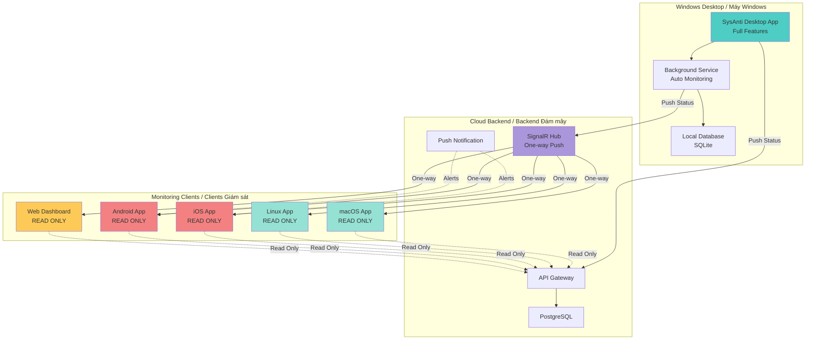
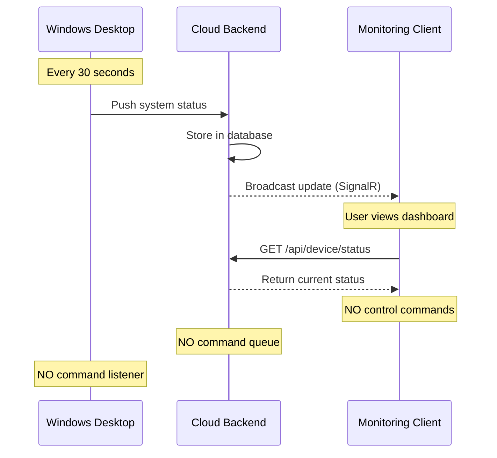

# 🌐 SysAnti - Monitoring Only Strategy (Final)
# Chiến lược Chỉ Giám sát SysAnti (Cuối cùng)

> **Document Created / Tài liệu tạo:** 2026-02-06 09:27:51  
> **Version / Phiên bản:** 3.0 (Final - Monitoring Only)  
> **Status / Trạng thái:** Ready for Implementation  
> **Strategy / Chiến lược:** Windows Full-Featured + Monitoring Only

---

## 📋 Executive Summary / Tóm tắt Điều hành

### Final Clarified Requirements / Yêu cầu Cuối cùng Đã làm rõ

**Core Principle / Nguyên tắc Cốt lõi:**
- ✅ **Windows Desktop:** Full-featured optimization tool (WPF/.NET MAUI)
- ✅ **Other Platforms:** **MONITORING ONLY** (Read-only / Chỉ xem - KHÔNG điều khiển)
  - macOS Desktop/Mobile
  - Linux Desktop
  - Android/iOS Mobile
  - Web Browser

**Use Case / Trường hợp Sử dụng:**
```text
User có Windows PC tại nhà/văn phòng
  ↓
Cài đặt SysAnti Desktop (Windows) - Tối ưu hóa tự động hoặc thủ công
  ↓
Sử dụng macOS/Mobile/Web để:
  ✅ Xem trạng thái Windows PC từ xa (READ ONLY)
  ✅ Xem lịch sử optimization
  ✅ Nhận cảnh báo virus (notifications)
  ✅ Xem reports và logs
  ✅ Xem real-time metrics
  ❌ KHÔNG thể trigger/điều khiển từ xa
  ❌ KHÔNG thể bật/tắt tính năng
  ❌ KHÔNG thể thay đổi settings
```

---

## 🏗️ System Architecture / Kiến trúc Hệ thống

### Architecture Diagram / Sơ đồ Kiến trúc



**Key Points / Điểm Chính:**
- Windows → Cloud: **One-way PUSH** (Windows gửi status)
- Cloud → Monitoring Clients: **One-way PUSH** (Cloud broadcast status)
- Monitoring Clients → Cloud: **READ requests ONLY** (chỉ đọc dữ liệu)

---

## 🎯 Platform Responsibilities / Trách nhiệm từng Nền tảng

### 1. Windows Desktop (Full-Featured / Đầy đủ Tính năng)

**Technology / Công nghệ:**
- Current: WPF + .NET 9.0
- Future (Optional): .NET MAUI for modern UI

**Features / Tính năng:**
- ✅ Disk Cleanup (Dọn dẹp đĩa)
- ✅ RAM Optimization (Tối ưu RAM)
- ✅ Startup Manager (Quản lý khởi động)
- ✅ Virus Scanner (Quét virus)
- ✅ Registry Cleaner (Dọn dẹp Registry)
- ✅ Real-time Monitoring (Giám sát thời gian thực)
- ✅ Scheduled Tasks (Tác vụ theo lịch)
- ✅ Cloud Sync (Đồng bộ status lên cloud)

**New Component / Thành phần Mới:**
```csharp
// SysAnti.Desktop/Services/CloudStatusReporter.cs
public class CloudStatusReporter
{
    private readonly HubConnection _hubConnection;
    private readonly ISystemMonitor _monitor;
    private Timer _statusTimer;
    
    public async Task StartReportingAsync()
    {
        // Connect to cloud
        await _hubConnection.StartAsync();
        
        // Send system status every 30 seconds
        _statusTimer = new Timer(async _ => 
        {
            var status = await _monitor.GetSystemStatusAsync();
            await _hubConnection.InvokeAsync("ReportDeviceStatus", status);
        }, null, TimeSpan.Zero, TimeSpan.FromSeconds(30));
    }
    
    // NO remote command listener - monitoring clients can't control
}
```

---

### 2. macOS/Linux Desktop (Monitoring ONLY)

**Technology / Công nghệ:**
- Electron (web-based, cross-platform)
- Shared codebase with Web dashboard

**Features / Tính năng (READ ONLY):**
- ✅ View Windows PC status
- ✅ View real-time metrics (CPU, RAM, Disk)
- ✅ View virus scan reports
- ✅ View optimization history
- ✅ View system logs
- ✅ Receive notifications
- ✅ Export reports
- ❌ NO remote control
- ❌ NO trigger optimization
- ❌ NO settings changes

**UI Example:**
```typescript
// electron-app/src/components/MonitoringDashboard.tsx
import React from 'react';
import { useQuery } from '@tanstack/react-query';

export const MonitoringDashboard: React.FC = () => {
  const { data: device } = useQuery({
    queryKey: ['device', deviceId],
    queryFn: () => api.getDeviceStatus(deviceId),
    refetchInterval: 30000,
  });
  
  return (
    <div className="monitoring-dashboard">
      <header>
        <h1>{device?.name}</h1>
        <Badge>Monitoring Mode / Chế độ Giám sát</Badge>
      </header>
      
      {/* Status Display - READ ONLY */}
      <StatusGrid>
        <StatusCard title="CPU" value={`${device?.cpu}%`} />
        <StatusCard title="RAM" value={`${device?.memory}%`} />
        <StatusCard title="Disk" value={`${device?.disk}%`} />
        <StatusCard title="Threats" value={device?.threatsCount} />
      </StatusGrid>
      
      {/* Real-time Chart */}
      <MetricsChart data={device?.metricsHistory} />
      
      {/* Activity Log */}
      <ActivityLog activities={device?.recentActivities} />
      
      {/* Optimization History */}
      <OptimizationHistory items={device?.optimizationHistory} />
      
      {/* NO ACTION BUTTONS */}
    </div>
  );
};
```

---

### 3. Mobile Apps (iOS/Android) - Monitoring ONLY

**Technology / Công nghệ:**
- Flutter (single codebase)

**Features / Tính năng (READ ONLY):**
- ✅ View Windows PC status
- ✅ View real-time metrics
- ✅ Push notifications for alerts
- ✅ View scan history
- ✅ View optimization history
- ✅ Multi-device support
- ❌ NO remote control

**Flutter Implementation:**
```dart
// lib/features/monitoring/presentation/monitoring_screen.dart
import 'package:flutter/material.dart';
import 'package:flutter_riverpod/flutter_riverpod.dart';

class MonitoringScreen extends ConsumerWidget {
  final String deviceId;
  
  @override
  Widget build(BuildContext context, WidgetRef ref) {
    final deviceState = ref.watch(deviceStatusProvider(deviceId));
    
    return Scaffold(
      appBar: AppBar(
        title: Text('Windows PC Monitor'),
        subtitle: Text('Read-only / Chỉ xem'),
      ),
      body: deviceState.when(
        data: (device) => SingleChildScrollView(
          padding: EdgeInsets.all(16),
          child: Column(
            children: [
              // Status Cards
              StatusCard(
                title: 'System Status',
                children: [
                  StatusRow(label: 'CPU', value: '${device.cpu}%'),
                  StatusRow(label: 'RAM', value: '${device.memory}%'),
                  StatusRow(label: 'Disk', value: '${device.disk}%'),
                  StatusRow(label: 'Threats', value: '${device.threats}'),
                ],
              ),
              
              SizedBox(height: 16),
              
              // Metrics Chart
              MetricsChart(data: device.metricsHistory),
              
              SizedBox(height: 16),
              
              // Recent Activity
              ActivityList(activities: device.recentActivities),
              
              SizedBox(height: 16),
              
              // Optimization History
              OptimizationHistoryList(items: device.optimizationHistory),
            ],
          ),
        ),
        loading: () => Center(child: CircularProgressIndicator()),
        error: (err, stack) => ErrorWidget(err),
      ),
    );
  }
}
```

---

### 4. Web Dashboard (Progressive Web App) - Monitoring ONLY

**Technology / Công nghệ:**
- React 18 + TypeScript
- Tailwind CSS
- PWA

**Features / Tính năng (READ ONLY):**
- ✅ Multi-device monitoring
- ✅ Advanced analytics
- ✅ Detailed reports
- ✅ Real-time dashboards
- ✅ Historical data viewing
- ✅ Export reports (PDF, CSV)
- ❌ NO remote control
- ❌ NO admin controls

---

## 🔄 Data Flow / Luồng Dữ liệu

### Status Reporting Flow / Luồng Báo cáo Trạng thái



### Backend API (READ ONLY)

```csharp
// SysAnti.API/Controllers/MonitoringController.cs
[ApiController]
[Route("api/[controller]")]
[Authorize]
public class MonitoringController : ControllerBase
{
    private readonly IDeviceService _deviceService;
    
    // READ ONLY endpoints
    [HttpGet("devices")]
    public async Task<ActionResult<List<DeviceInfo>>> GetDevices()
    {
        var devices = await _deviceService.GetUserDevicesAsync(User.GetUserId());
        return Ok(devices);
    }
    
    [HttpGet("devices/{deviceId}/status")]
    public async Task<ActionResult<DeviceStatus>> GetDeviceStatus(string deviceId)
    {
        var status = await _deviceService.GetDeviceStatusAsync(deviceId);
        return Ok(status);
    }
    
    [HttpGet("devices/{deviceId}/history")]
    public async Task<ActionResult<List<OptimizationHistory>>> GetHistory(string deviceId)
    {
        var history = await _deviceService.GetOptimizationHistoryAsync(deviceId);
        return Ok(history);
    }
    
    [HttpGet("devices/{deviceId}/metrics")]
    public async Task<ActionResult<MetricsData>> GetMetrics(
        string deviceId, 
        [FromQuery] DateTime from, 
        [FromQuery] DateTime to)
    {
        var metrics = await _deviceService.GetMetricsAsync(deviceId, from, to);
        return Ok(metrics);
    }
    
    // NO POST/PUT/DELETE endpoints for remote control
}
```

---

## 📊 Implementation Plan / Kế hoạch Triển khai

### Phase 1: Backend Infrastructure (Tháng 1-2)

**Tasks:**
- [ ] Setup cloud backend (Azure/AWS)
- [ ] Implement READ-ONLY API endpoints
- [ ] Setup SignalR Hub for one-way broadcasting
- [ ] Create PostgreSQL database
- [ ] Implement authentication (JWT)
- [ ] Setup push notification service

**Deliverables:**
- ✅ Cloud API deployed
- ✅ One-way status broadcasting working
- ✅ Database schema created

---

### Phase 2: Windows Desktop Enhancement (Tháng 2-3)

**Tasks:**
- [ ] Add CloudStatusReporter to existing WPF app
- [ ] Implement background monitoring service
- [ ] Create device registration flow
- [ ] Implement status reporting (every 30s)
- [ ] Add notification triggers for alerts

**Deliverables:**
- ✅ Windows app with cloud status reporting
- ✅ Background service running
- ✅ Status sync working

---

### Phase 3: Mobile Apps (Tháng 3-5)

**Tasks:**
- [ ] Build Flutter app structure
- [ ] Implement monitoring UI (READ ONLY)
- [ ] Setup push notifications (FCM/APNs)
- [ ] Implement multi-device support
- [ ] Add charts and analytics
- [ ] Testing on iOS and Android

**Deliverables:**
- ✅ iOS app on TestFlight
- ✅ Android app on Play Store beta

---

### Phase 4: Web Dashboard (Tháng 5-6)

**Tasks:**
- [ ] Build React PWA
- [ ] Implement multi-device monitoring dashboard
- [ ] Add analytics and charts
- [ ] Create report export functionality
- [ ] PWA features (offline, install)

**Deliverables:**
- ✅ Web dashboard deployed
- ✅ PWA installable

---

### Phase 5: Desktop Apps (macOS/Linux) - Optional (Tháng 6-7)

**Tasks:**
- [ ] Build Electron app (shared with Web)
- [ ] Package for macOS (.dmg)
- [ ] Package for Linux (.AppImage, .deb)

**Deliverables:**
- ✅ macOS app
- ✅ Linux app

---

## 💰 Budget / Ngân sách

```yaml
Development Costs (Simplified):
  - Backend Developer (2 months): $20,000
  - Windows Enhancement (2 months): $20,000
  - Flutter Developer (3 months): $30,000
  - Frontend Developer (React) (2 months): $20,000
  Total Development: $90,000

Infrastructure (Annual):
  - Cloud Hosting: $2,400
  - Database: $1,800
  - Push Notifications: $1,200
  - CDN: $600
  Total Infrastructure: $6,000

Total Budget: ~$96,000
Savings vs Remote Management: $14,000
Savings vs Hybrid: $174,000 (64% cheaper!)
```

---

## ⏱️ Timeline / Thời gian

```text
Month 1-2: Backend Infrastructure (READ ONLY APIs)
Month 2-3: Windows Desktop Enhancement (Status Reporting)
Month 3-5: Mobile Apps (Monitoring UI)
Month 5-6: Web Dashboard (Monitoring UI)
Month 6-7: Desktop Apps (Optional)

Total: 6-7 months
```

---

## ✅ Advantages / Ưu điểm

1. **Simplest Architecture / Kiến trúc Đơn giản nhất**
   - No command queue
   - No remote execution logic
   - One-way data flow only

2. **Lowest Cost / Chi phí Thấp nhất**
   - $96K (vs $110K remote mgmt, $270K hybrid)

3. **Fastest Development / Phát triển Nhanh nhất**
   - No complex remote control logic
   - Just display data

4. **Most Secure / An toàn nhất**
   - No remote commands = no attack vector
   - Read-only access

5. **Easier Maintenance / Bảo trì Dễ dàng**
   - Less code
   - Fewer edge cases

---

## 📞 Next Steps / Bước tiếp theo

1. ✅ **Confirm this MONITORING ONLY approach**
2. Start Backend Infrastructure
3. Enhance Windows Desktop
4. Build Mobile Apps
5. Build Web Dashboard

---

**Bạn có đồng ý với chiến lược MONITORING ONLY này không?**
**Do you agree with this MONITORING ONLY strategy?**
