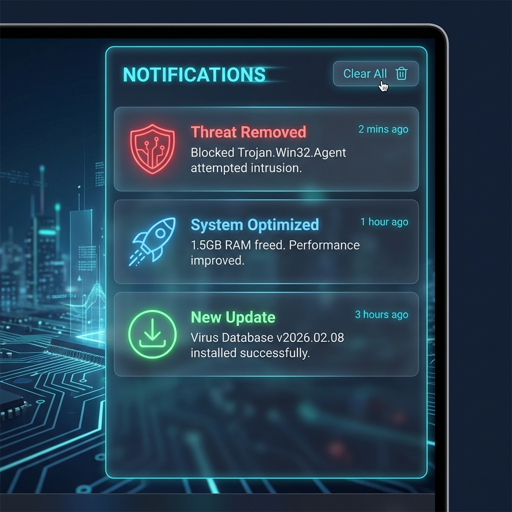

# 🔔 Notification System Upgrade Plan

**Objective:** Implement a centralized Notification Center and real-time Toast Notifications to keep users informed about system events.

## 1. Concept & Visualization

The new notification system will follow the "Ultra Cyber" aesthetic.
*(Concept Image generated: `design/notification_ui_mockup.png`)*

### Key Features

- **Toast Notifications:** Pop-ups in the bottom-right corner for urgent events (Virus found, Scan complete).
- **Notification Center:** A side panel (slide-in) storing notification history.
- **Categorization:** Security (Red), System (Blue), Updates (Green).
- **Actions:** Buttons directly in notifications (e.g., "Review", "Update Now").

---

## 2. Technical Architecture

### A. Core Service (`SysAnti.Core`)

Create `INotificationService` and `NotificationService`.

- **Model:** `AppNotification` (Id, Title, Message, Type, Time, IsRead, ActionLink).
- **Methods:** `Show(title, message, type)`, `GetHistory()`, `ClearAll()`.
- **Persistence:** Save history to `notifications.json` (similar to standard logs but user-friendly).

### B. UI Component (`SysAnti.UI`)

- **Control:** `NotificationToast.xaml` (The popup bubble).
- **View:** `NotificationCenterView.xaml` (The side panel).
- **Integration:**
  - Add a "Bell" icon to the `DashboardView` header.
  - Overlay the Notification Center on top of the main content (ZIndex).

---

## 3. Implementation Tasks

1. **Define Models:** `AppNotification`, `NotificationType`.
2. **Create Service:** Implement `NotificationService` with event broadcasting.
3. **Create Toast UI:** Design the popup bubble with animation (Slide up/Fade in).
4. **Create Center UI:** Design the history list with valid DataTemplates for different types.
5. **Wire up:** Connect service to Dashboard (Bell icon).

---

## 4. User Experience (UX)

- **Sound:** Subtle "ping" for success, "alert" sound for threats.
- **Do Not Disturb:** Option to suppress toasts when gaming (Game Mode).
