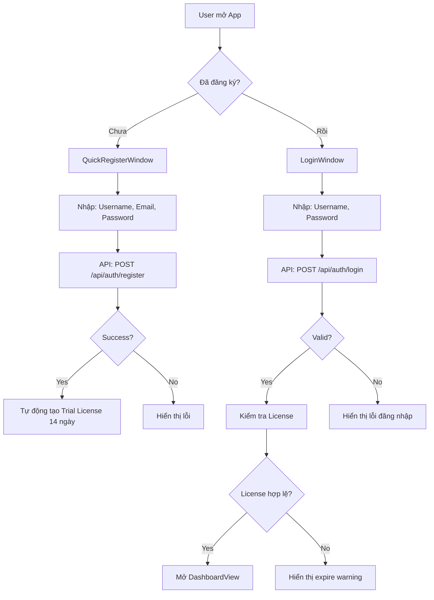
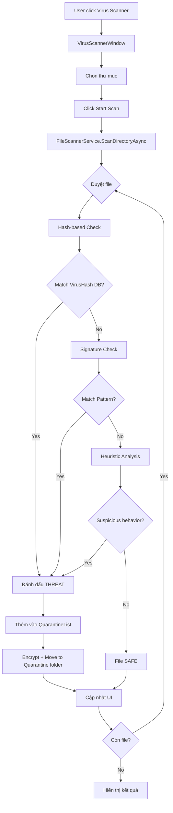
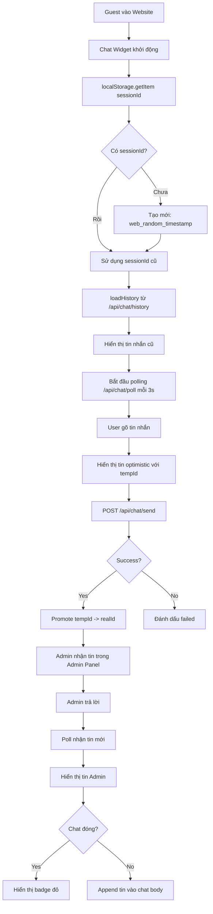

# 📊 Báo Cáo Tổng Thể Dự Án SysAnti - Phân Tích UI/UX & Đề Xuất Nâng Cấp 2026
**Ngày**: 2026-02-08  
**Phiên bản**: SysAntiUltra3  
**Phân tích bởi**: Antigravity AI

---

## 1. TỔNG QUAN DỰ ÁN (Project Overview)

### 1.1. Kiến trúc Hệ thống (System Architecture)

**SysAnti** là một giải pháp bảo mật và tối ưu hóa toàn diện cho Windows, được xây dựng theo kiến trúc **Hybrid Desktop-Web**:

```
┌─────────────────────────────────────────────────┐
│          CLIENT LAYER (Desktop WPF)             │
│  - Windows 10/11 Native Application            │
│  - .NET 9.0 + WPF (XAML)                       │
│  - MVVM Architecture Pattern                    │
└─────────────────────────────────────────────────┘
                      ↕ (REST API)
┌─────────────────────────────────────────────────┐
│        SERVER LAYER (Node.js Backend)           │
│  - Express.js API Server (Port 3000)           │
│  - MySQL Database (User/License/Chat)          │
│  - Real-time Chat Support                       │
└─────────────────────────────────────────────────┘
                      ↕
┌─────────────────────────────────────────────────┐
│         WEB LAYER (Public Portal)               │
│  - Responsive HTML5/CSS3/JavaScript            │
│  - Bootstrap 5 Framework                        │
│  - Live Chat Widget (Guest Support)            │
└─────────────────────────────────────────────────┘
```

### 1.2. Các Module Core (Core Modules)

| Module | Công nghệ | Chức năng chính |
|--------|-----------|----------------|
| **SysAnti.UI** | WPF (.NET 9) | Giao diện Desktop chính |
| **SysAnti.Core** | C# Class Library | Business Logic tổng hợp |
| **SysAnti.Antivirus** | C# + Win32 API | Quét Virus đa tầng (Hash/Signature/Heuristic) |
| **SysAnti.Optimization** | C# + System.Management | Tối ưu RAM, Disk, Startup |
| **SysAnti.Authentication** | EF Core + BCrypt | Quản lý User/License |
| **SysAnti.Plugin.Core** | Plugin Architecture | Hệ thống Plugin động |
| **SysAnti.Server** | Node.js + Express | Backend API + Web Portal |
| **SysAnti.Chat.Core** | SignalR (planned) | Chat thời gian thực |

---

## 2. PHÂN TÍCH GIAO DIỆN HIỆN TẠI (Current UI Analysis)

### 2.1. Desktop UI (WPF)

**Design Language**: **Professional Dark Slate Theme**
- **Palette chính**:
  - Background: `#0F172A` (Slate-900) - Nền tối chủ đạo
  - Surface: `#1E293B` (Slate-800) - Card/Panel
  - Border: `#334155` (Slate-700) - Viền mỏng
  - Primary Accent: `#6366F1` (Indigo-500)
  - Success: `#10B981` (Emerald-500)
  - Warning: `#F59E0B` (Amber-500)
  - Danger: `#EF4444` (Red-500)

**Các cửa sổ chính**:
1. **DashboardView.xaml** (964 dòng)
   - Header: Logo + Tiêu đề + Thông báo + Nút Premium
   - Body: Feature Cards (Virus Scanner, Disk Cleanup, RAM Optimizer, Startup Manager)
   - Sidebar: Điều hướng (Dashboard, Virus Scanner, Optimization Tools, Settings, ...)
   - Footer: Thông tin phiên bản + Trạng thái bản quyền
   - Gamification: Điểm thành tựu, thanh tiến trình

2. **LoginWindow.xaml**
   - Gradient Background với màu thương hiệu
   - Form đăng nhập/đăng ký song ngữ (Việt-Anh)
   - Biểu tượng Shield/Lock cho Security

3. **VirusScannerWindow.xaml**
   - TreeView hiển thị cây thư mục
   - Progress bar thời gian thực
   - Danh sách threat detection

4. **CyberToolboxView.xaml**
   - Plugin Cards: Network Fortress, Game Booster, System Sweeper, Registry Doctor, Privacy Shredder
   - Mỗi plugin có icon, mô tả, nút Enable/Disable

5. **QuarantineWindow.xaml**
   - Danh sách file bị cách ly
   - Nút Restore/Delete

**Điểm mạnh**:
- ✅ Dark Theme hiện đại, chuyên nghiệp
- ✅ Micro-animations mượt mà (Fade In/Out, Slide, Glow)
- ✅ Bilingual (Việt-Anh) native
- ✅ Gamification tích hợp (Points, Badges)
- ✅ Real-time metrics (CPU, RAM, Disk)

**Điểm yếu**:
- ❌ Chưa tuân thủ hoàn toàn **Windows 11 Design Language** (Fluent Design System)
- ❌ Thiếu **Mica Material** (nền mờ trong suốt đặc trưng Win11)
- ❌ Thiếu **Rounded Corners** 12px theo chuẩn Win11
- ❌ Thiếu **Acrylic Blur** cho cửa sổ nổi (Popup, Dropdown)
- ❌ Chưa có **Compact Mode** cho màn hình nhỏ
- ❌ Animation chưa sử dụng Composition API (WinUI 3 style)

### 2.2. Web Portal UI (HTML/CSS/JS)

**Design Language**: **Dark Glassmorphism**
- Nền gradient tím-xanh (`linear-gradient(135deg, #667eea 0%, #764ba2 100%)`)
- Glass panels với blur (`backdrop-filter: blur(10px)`)
- Animated flags 🚩 (hiệu ứng sóng)

**Các trang chính**:
1. **index.html** (Login/Register)
   - Glass panel với animated flags
   - Member benefits inline
   - Chat widget tích hợp (góc phải dưới)

2. **dashboard.html** (User Dashboard)
   - Metrics cards: License, System Status
   - Chat support panel
   - Notifications

3. **admin.html** (Admin Panel)
   - User management
   - License activation
   - Chat session management

**Điểm mạnh**:
- ✅ Responsive design (Bootstrap 5)
- ✅ Live Chat widget hiện đại
- ✅ Glassmorphism trendy

**Điểm yếu**:
- ❌ Chưa có Progressive Web App (PWA) support
- ❌ Chưa tối ưu cho Dark Mode system preference
- ❌ Thiếu Service Worker cho offline capability

---

## 3. LUỒNG HOẠT ĐỘNG (Workflow Flow)

### 3.1. Luồng Đăng ký & Đăng nhập



### 3.2. Luồng Quét Virus



### 3.3. Luồng Chat Support



---

## 4. ĐỀ XUẤT NÂNG CẤP 2026 (2026 Upgrade Proposals)

### 4.1. Windows 11 Design System (Fluent Design v2)

#### 4.1.1. Áp dụng Mica Material
**Mục tiêu**: Nền cửa sổ mờ trong suốt, tích hợp với Desktop background

**Implementation**:
```xml
<!-- App.xaml: Add Mica Backdrop -->
<Window.SystemBackdrop>
    <MicaBackdrop Kind="BaseAlt"/>
</Window.SystemBackdrop>
```

**Benefits**:
- Tạo cảm giác "gắn liền" với hệ điều hành
- Giảm độ tương phản, dễ nhìn hơn trong thời gian dài
- Thương hiệu Windows 11 rõ nét

#### 4.1.2. Rounded Corners 12px
**Hiện tại**: `CornerRadius="8"`  
**Đề xuất**: `CornerRadius="12"` (chuẩn Win11)

**Áp dụng cho**:
- Window borders
- Button, Card, Panel
- Popup, Tooltip

#### 4.1.3. Acrylic Blur cho Overlay
**Mục tiêu**: Popup/Dropdown với hiệu ứng blur nền

**Implementation**:
```xml
<Border Background="{ThemeResource AcrylicInAppFillColorDefaultBrush}">
    <!-- Popup content -->
</Border>
```

#### 4.1.4. Compact Sizing (Adaptive Layout)
**Mục tiêu**: Hỗ trợ màn hình nhỏ (Tablet, 1366x768)

**Strategy**:
- Thêm `VisualStateManager` cho các size: Compact (<768px), Normal (>=768px), Large (>=1200px)
- Sidebar collapse tự động ở Compact mode
- Card grid: 1 cột (Compact) → 2 cột (Normal) → 4 cột (Large)

### 4.2. Tính năng mới 2026

#### 4.2.1. AI-Powered Threat Detection
**Công nghệ**: TensorFlow.NET hoặc ONNX Runtime

**Workflow**:
1. Pre-trained model phát hiện malware dựa trên behavioral analysis
2. Chạy local (không cần internet)
3. Cập nhật model qua server định kỳ

**UI**:
- Thêm toggle "AI Protection" trong Settings
- Hiển thị AI confidence score (%) khi detect threat
- Animation "scanning with AI" với icon robot

#### 4.2.2. Cloud Sync Settings & Preferences
**Mục tiêu**: Đồng bộ cài đặt giữa nhiều máy

**Features**:
- Backup/Restore settings lên cloud (Firebase/Azure)
- Login tự động đồng bộ: Theme preference, Whitelist files, Custom scans
- Hiển thị "Last synced" timestamp

**UI**:
- Settings → Cloud Sync → Enable/Disable
- Icon cloud với animation khi đang sync

#### 4.2.3. Performance Benchmarking
**Mục tiêu**: So sánh hiệu năng trước/sau tối ưu

**Features**:
- Chạy benchmark: CPU score, RAM speed, Disk I/O
- Chart so sánh theo thời gian
- Đề xuất tối ưu dựa trên score

**UI**:
- Tab mới "Benchmark" trong Dashboard
- Biểu đồ cột so sánh Before/After
- Badge "Performance Improved +25%"

#### 4.2.4. Privacy Guardian (Anti-Tracking)
**Mục tiêu**: Chặn tracker, cookies bẩn

**Features**:
- Tích hợp hosts file editor
- DNS filter (chặn domain quảng cáo/tracking)
- Browser extension killer (tìm extension độc hại)

**UI**:
- Shield icon với số lượng tracker đã chặn hôm nay
- List domain blocked
- Quick toggle On/Off

#### 4.2.5. Game Mode Ultra
**Nâng cấp từ Game Booster hiện tại**:
- Profile switching: Gaming/Work/Quiet
- Auto-detect game launch (monitor process)
- Boost RAM/CPU priority cho game
- Tắt Windows Updates tạm thời

**UI**:
- Toggle "Game Mode" với icon gamepad
- Profile selector dropdown
- Notification "Game detected: Valorant.exe"

### 4.3. UX Improvements

#### 4.3.1. Onboarding Tutorial
**Hiện tại**: Không có  
**Đề xuất**: First-time user guide

**Flow**:
1. Welcome screen với video 30s giới thiệu
2. Interactive tour: "Click here to scan virus"
3. Quick setup: Choose language, Auto-scan schedule

#### 4.3.2. Contextual Help (?)
**Mục tiêu**: Giải thích tính năng ngay tại chỗ

**Implementation**:
- Icon "?" bên cạnh mỗi feature
- Hover hiển thị Tooltip giải thích
- Click mở Help Panel (slide từ phải)

#### 4.3.3. Notification Center nâng cao
**Hiện tại**: Popup đơn giản  
**Đề xuất**: Windows 11-style notification center

**Features**:
- History 7 ngày
- Group by category: Security, Optimization, Updates
- Action buttons: "Scan now", "Dismiss"

#### 4.3.4. Accessibility (A11y)
**Mục tiêu**: Hỗ trợ người khiếm thị, khó khăn vận động

**Features**:
- Screen reader support (Narrator)
- Keyboard shortcuts cho mọi tính năng (Ctrl+S: Scan, Ctrl+O: Optimize, ...)
- High contrast mode toggle
- Font size scaling (100%, 125%, 150%)

---

## 5. KẾ HOẠCH TRIỂN KHAI (Implementation Roadmap)

### Phase 1: Window 11 Design Migration (2-3 tuần)
- [ ] Week 1: Apply Mica, Rounded Corners, Acrylic
- [ ] Week 2: Refactor DashboardView với VisualStateManager (Compact/Normal/Large)
- [ ] Week 3: Testing trên Win10/Win11, fix compatibility issues

### Phase 2: AI & Cloud Features (3-4 tuần)
- [ ] Week 4-5: Integrate ONNX Runtime, train/deploy malware detection model
- [ ] Week 6: Implement Cloud Sync với Firebase
- [ ] Week 7: Testing AI accuracy, cloud sync reliability

### Phase 3: New Features (3 tuần)
- [ ] Week 8: Performance Benchmarking module
- [ ] Week 9: Privacy Guardian + Game Mode Ultra
- [ ] Week 10: Onboarding Tutorial + Contextual Help

### Phase 4: UX Polish & Accessibility (2 tuần)
- [ ] Week 11: Notification Center, A11y features
- [ ] Week 12: User testing, bug fixes, performance optimization

### Phase 5: Release (1 tuần)
- [ ] Week 13: Build installer, update docs, marketing materials

**Total**: 13 tuần (3.25 tháng)

---

## 6. KẾT LUẬN (Conclusion)

**SysAnti** đã có nền tảng vững chắc với kiến trúc modular, UI chuyên nghiệp và các tính năng core đầy đủ. Để trở thành sản phẩm cạnh tranh trong năm 2026, cần:

1. **Modernize UI**: Áp dụng triệt để Windows 11 Fluent Design System
2. **AI Integration**: Malware detection thông minh, giảm false positive
3. **Cloud Connectivity**: Đồng bộ cài đặt, backup data
4. **User Experience**: Onboarding mượt mà, A11y đầy đủ, Help ngữ cảnh
5. **Ecosystem Expansion**: PWA cho web, mobile companion app (tương lai)

**Ưu tiên cao nhất**:
- ✅ Mica Material & Round Corners (tác động trực quan lớn)
- ✅ AI Threat Detection (unique selling point)
- ✅ Onboarding Tutorial (giảm churn rate)

Với roadmap 13 tuần, SysAnti sẽ sẵn sàng ra mắt phiên bản **Ultra 2026** với trải nghiệm hiện đại nhất thị trường.
