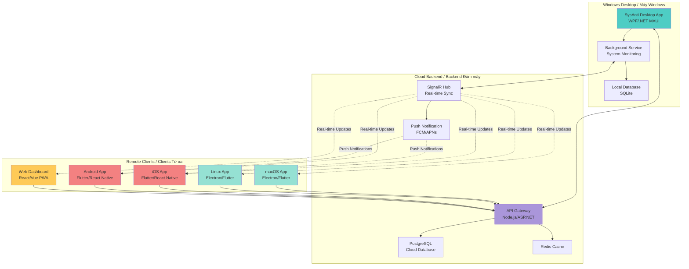
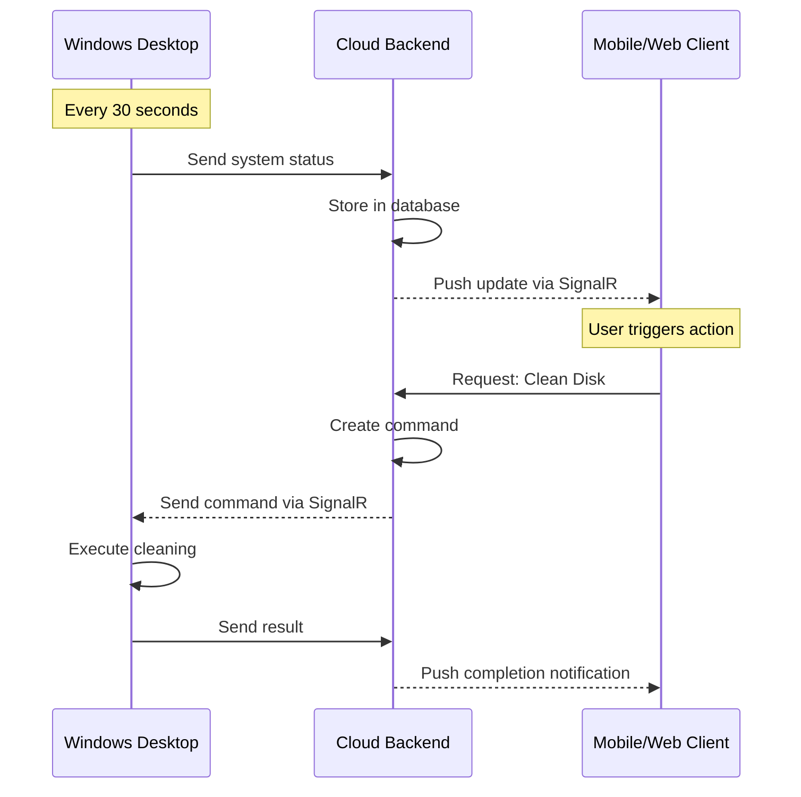

# 🌐 SysAnti - Remote Management Strategy (Revised)

# Chiến lược Quản lý Từ xa SysAnti (Đã sửa đổi)

> **Document Created / Tài liệu tạo:** 2026-02-06 09:21:37  
> **Version / Phiên bản:** 2.0 (Revised)  
> **Status / Trạng thái:** Planning Phase  
> **Strategy / Chiến lược:** Windows-Centric with Remote Management

---

## 📋 Executive Summary / Tóm tắt Điều hành

### Clarified Requirements / Yêu cầu Đã làm rõ

**Core Principle / Nguyên tắc Cốt lõi:**

- ✅ **Windows Desktop:** Full-featured optimization tool (WPF/.NET MAUI)
- ✅ **Other Platforms:** Remote management & monitoring ONLY
  - macOS Desktop/Mobile
  - Linux Desktop
  - Android/iOS Mobile
  - Web Browser

**Use Case / Trường hợp Sử dụng:**

```
User có Windows PC tại nhà/văn phòng
  ↓
Cài đặt SysAnti Desktop (Windows)
  ↓
Sử dụng macOS/Mobile/Web để:
  - Xem trạng thái Windows PC từ xa
  - Trigger optimization tasks
  - Nhận cảnh báo virus
  - Xem reports và logs
```

---

## 🏗️ Revised Architecture / Kiến trúc Đã sửa đổi

### System Architecture / Kiến trúc Hệ thống



---

## 🎯 Platform Responsibilities / Trách nhiệm từng Nền tảng

### Windows Desktop (Full-Featured / Đầy đủ Tính năng)

**Technology / Công nghệ:**

- Current: WPF + .NET 9.0
- Future: .NET MAUI (optional upgrade for modern UI)

**Features / Tính năng:**

- ✅ Disk Cleanup (Dọn dẹp đĩa)
- ✅ RAM Optimization (Tối ưu RAM)
- ✅ Startup Manager (Quản lý khởi động)
- ✅ Virus Scanner (Quét virus)
- ✅ Registry Cleaner (Dọn dẹp Registry)
- ✅ Real-time Monitoring (Giám sát thời gian thực)
- ✅ Scheduled Tasks (Tác vụ theo lịch)
- ✅ Cloud Sync (Đồng bộ đám mây)

**New Components / Thành phần Mới:**

```csharp
// SysAnti.Desktop/Services/CloudSyncService.cs
public class CloudSyncService
{
    private readonly HubConnection _hubConnection;
    private readonly ISystemMonitor _monitor;
    
    public async Task StartMonitoringAsync()
    {
        // Connect to cloud
        await _hubConnection.StartAsync();
        
        // Send system status every 30 seconds
        _timer = new Timer(async _ => 
        {
            var status = await _monitor.GetSystemStatusAsync();
            await _hubConnection.InvokeAsync("UpdateDeviceStatus", status);
        }, null, TimeSpan.Zero, TimeSpan.FromSeconds(30));
    }
    
    public async Task ExecuteRemoteCommandAsync(RemoteCommand command)
    {
        switch (command.Type)
        {
            case CommandType.CleanDisk:
                await _optimizer.CleanDiskAsync(command.Options);
                break;
            case CommandType.OptimizeRAM:
                await _optimizer.OptimizeMemoryAsync();
                break;
            case CommandType.ScanVirus:
                await _scanner.ScanAsync(command.Options);
                break;
        }
        
        // Send result back to cloud
        await _hubConnection.InvokeAsync("CommandCompleted", command.Id, result);
    }
}
```

---

### macOS/Linux Desktop (Remote Management / Quản lý Từ xa)

**Technology / Công nghệ:**

- **Option A:** Electron (Web-based, cross-platform)
- **Option B:** Flutter Desktop (Native performance)
- **Recommended:** Electron (faster development, shared code with Web)

**Features / Tính năng:**

- ✅ View Windows PC status (Xem trạng thái PC Windows)
- ✅ Trigger optimization tasks (Kích hoạt tối ưu hóa)
- ✅ View virus scan reports (Xem báo cáo quét virus)
- ✅ Manage scheduled tasks (Quản lý tác vụ lịch)
- ✅ View system logs (Xem logs hệ thống)
- ✅ Receive notifications (Nhận thông báo)
- ❌ NO local system optimization (KHÔNG tối ưu hệ thống local)

**UI Example / Ví dụ Giao diện:**

```typescript
// electron-app/src/components/DeviceDashboard.tsx
import React from 'react';
import { useQuery, useMutation } from '@tanstack/react-query';

export const DeviceDashboard: React.FC = () => {
  const { data: device } = useQuery({
    queryKey: ['device', deviceId],
    queryFn: () => api.getDeviceStatus(deviceId),
    refetchInterval: 30000, // Refresh every 30s
  });
  
  const cleanDisk = useMutation({
    mutationFn: () => api.triggerCleanDisk(deviceId),
  });
  
  return (
    <div className="dashboard">
      <h1>Windows PC: {device?.name}</h1>
      
      {/* System Status */}
      <div className="status-card">
        <h2>System Status / Trạng thái Hệ thống</h2>
        <p>OS: {device?.os}</p>
        <p>CPU: {device?.cpu}%</p>
        <p>RAM: {device?.memory}%</p>
        <p>Disk: {device?.disk}%</p>
        <p>Last Scan: {device?.lastScan}</p>
      </div>
      
      {/* Remote Actions */}
      <div className="actions">
        <button onClick={() => cleanDisk.mutate()}>
          🧹 Clean Disk / Dọn dẹp Đĩa
        </button>
        <button onClick={() => optimizeRAM.mutate()}>
          ⚡ Optimize RAM / Tối ưu RAM
        </button>
        <button onClick={() => scanVirus.mutate()}>
          🛡️ Scan Virus / Quét Virus
        </button>
      </div>
      
      {/* Recent Activity */}
      <div className="activity">
        <h2>Recent Activity / Hoạt động Gần đây</h2>
        {device?.recentActivities.map(activity => (
          <div key={activity.id}>
            {activity.type} - {activity.timestamp}
          </div>
        ))}
      </div>
    </div>
  );
};
```

---

### Mobile Apps (iOS/Android) - Remote Management

**Technology / Công nghệ:**

- **Flutter** (Single codebase for both iOS and Android)

**Features / Tính năng:**

- ✅ View Windows PC status (Xem trạng thái PC)
- ✅ Trigger optimization remotely (Kích hoạt tối ưu từ xa)
- ✅ Push notifications for virus alerts (Thông báo virus)
- ✅ View scan history (Xem lịch sử quét)
- ✅ Quick actions (Hành động nhanh)
- ✅ Multi-device support (Hỗ trợ nhiều thiết bị)

**Flutter Implementation / Triển khai Flutter (READ ONLY):**

```dart
// lib/features/device_monitor/presentation/device_screen.dart
import 'package:flutter/material.dart';
import 'package:flutter_riverpod/flutter_riverpod.dart';

class DeviceMonitorScreen extends ConsumerWidget {
  final String deviceId;
  
  @override
  Widget build(BuildContext context, WidgetRef ref) {
    final deviceState = ref.watch(deviceStatusProvider(deviceId));
    
    return Scaffold(
      appBar: AppBar(
        title: Text('Windows PC Monitor'),
        subtitle: Text('Read-only Mode / Chế độ Chỉ xem'),
        actions: [
          IconButton(
            icon: Icon(Icons.refresh),
            onPressed: () => ref.refresh(deviceStatusProvider(deviceId)),
          ),
        ],
      ),
      body: deviceState.when(
        data: (device) => _buildDeviceInfo(context, ref, device),
        loading: () => Center(child: CircularProgressIndicator()),
        error: (err, stack) => ErrorWidget(err),
      ),
    );
  }
  
  Widget _buildDeviceInfo(BuildContext context, WidgetRef ref, Device device) {
    return SingleChildScrollView(
      padding: EdgeInsets.all(16),
      child: Column(
        crossAxisAlignment: CrossAxisAlignment.start,
        children: [
          // Status Card
          Card(
            child: Padding(
              padding: EdgeInsets.all(16),
              child: Column(
                crossAxisAlignment: CrossAxisAlignment.start,
                children: [
                  Text(
                    'System Status / Trạng thái Hệ thống',
                    style: Theme.of(context).textTheme.titleLarge,
                  ),
                  SizedBox(height: 16),
                  _StatusRow(
                    icon: Icons.computer,
                    label: 'Device / Thiết bị',
                    value: device.name,
                  ),
                  _StatusRow(
                    icon: Icons.memory,
                    label: 'RAM Usage / Sử dụng RAM',
                    value: '${device.memoryUsage}%',
                    color: _getStatusColor(device.memoryUsage),
                  ),
                  _StatusRow(
                    icon: Icons.storage,
                    label: 'Disk Usage / Sử dụng Đĩa',
                    value: '${device.diskUsage}%',
                    color: _getStatusColor(device.diskUsage),
                  ),
                  _StatusRow(
                    icon: Icons.speed,
                    label: 'CPU Usage / Sử dụng CPU',
                    value: '${device.cpuUsage}%',
                    color: _getStatusColor(device.cpuUsage),
                  ),
                  _StatusRow(
                    icon: Icons.security,
                    label: 'Last Scan / Quét cuối',
                    value: _formatDate(device.lastScan),
                  ),
                  _StatusRow(
                    icon: Icons.warning,
                    label: 'Threats Found / Phát hiện Mối đe dọa',
                    value: '${device.threatsCount}',
                    color: device.threatsCount > 0 ? Colors.red : Colors.green,
                  ),
                ],
              ),
            ),
          ),
          
          SizedBox(height: 24),
          
          // Real-time Metrics Chart
          Card(
            child: Padding(
              padding: EdgeInsets.all(16),
              child: Column(
                crossAxisAlignment: CrossAxisAlignment.start,
                children: [
                  Text(
                    'Real-time Metrics / Metrics Thời gian Thực',
                    style: Theme.of(context).textTheme.titleLarge,
                  ),
                  SizedBox(height: 16),
                  MetricsChart(data: device.metricsHistory),
                ],
              ),
            ),
          ),
          
          SizedBox(height: 24),
          
          // Recent Activity
          Text(
            'Recent Activity / Hoạt động Gần đây',
            style: Theme.of(context).textTheme.titleLarge,
          ),
          SizedBox(height: 16),
          
          ...device.recentActivities.map((activity) => 
            ActivityCard(activity: activity)
          ),
          
          SizedBox(height: 24),
          
          // Optimization History
          Text(
            'Optimization History / Lịch sử Tối ưu hóa',
            style: Theme.of(context).textTheme.titleLarge,
          ),
          SizedBox(height: 16),
          
          ...device.optimizationHistory.map((item) => 
            OptimizationHistoryCard(item: item)
          ),
        ],
      ),
    );
  }
}
```

---

### Web Dashboard (Progressive Web App)

**Technology / Công nghệ:**

- React 18 + TypeScript
- Tailwind CSS
- PWA (Service Workers)

**Features / Tính năng:**

- ✅ Multi-device management (Quản lý nhiều thiết bị)
- ✅ Advanced analytics (Phân tích nâng cao)
- ✅ User management (Quản lý người dùng)
- ✅ License management (Quản lý license)
- ✅ Detailed reports (Báo cáo chi tiết)
- ✅ Admin controls (Điều khiển admin)

**Dashboard Example:**

```typescript
// src/pages/Dashboard.tsx
import React from 'react';
import { useQuery } from '@tanstack/react-query';
import { DeviceCard } from '../components/DeviceCard';
import { SystemChart } from '../components/SystemChart';

export const Dashboard: React.FC = () => {
  const { data: devices } = useQuery({
    queryKey: ['devices'],
    queryFn: api.getDevices,
  });
  
  return (
    <div className="min-h-screen bg-gray-50 dark:bg-gray-900">
      <header className="bg-white dark:bg-gray-800 shadow">
        <div className="max-w-7xl mx-auto py-6 px-4">
          <h1 className="text-3xl font-bold text-gray-900 dark:text-white">
            SysAnti Dashboard
          </h1>
        </div>
      </header>
      
      <main className="max-w-7xl mx-auto py-6 px-4">
        {/* Overview Stats */}
        <div className="grid grid-cols-1 md:grid-cols-4 gap-6 mb-8">
          <StatCard
            title="Total Devices / Tổng Thiết bị"
            value={devices?.length || 0}
            icon="💻"
          />
          <StatCard
            title="Active Now / Đang Hoạt động"
            value={devices?.filter(d => d.isOnline).length || 0}
            icon="🟢"
          />
          <StatCard
            title="Threats Detected / Phát hiện Mối đe dọa"
            value={getTotalThreats(devices)}
            icon="🛡️"
          />
          <StatCard
            title="Space Cleaned / Dung lượng Dọn"
            value={formatBytes(getTotalCleaned(devices))}
            icon="🧹"
          />
        </div>
        
        {/* Device List */}
        <div className="grid grid-cols-1 md:grid-cols-2 lg:grid-cols-3 gap-6">
          {devices?.map(device => (
            <DeviceCard
              key={device.id}
              device={device}
              onCleanDisk={() => handleCleanDisk(device.id)}
              onOptimizeRAM={() => handleOptimizeRAM(device.id)}
              onScan={() => handleScan(device.id)}
            />
          ))}
        </div>
        
        {/* Charts */}
        <div className="mt-8 grid grid-cols-1 lg:grid-cols-2 gap-6">
          <SystemChart
            title="Memory Usage Over Time / Sử dụng RAM theo Thời gian"
            data={getMemoryData(devices)}
          />
          <SystemChart
            title="Disk Usage Over Time / Sử dụng Đĩa theo Thời gian"
            data={getDiskData(devices)}
          />
        </div>
      </main>
    </div>
  );
};
```

---

## 🔄 Communication Flow / Luồng Giao tiếp

### Real-time Status Updates / Cập nhật Trạng thái Thời gian Thực



### Remote Command Execution / Thực thi Lệnh Từ xa

```csharp
// Backend: SysAnti.API/Hubs/DeviceHub.cs
public class DeviceHub : Hub
{
    private readonly ICommandQueue _commandQueue;
    private readonly IDeviceService _deviceService;
    
    // Windows Desktop connects
    public async Task RegisterDevice(string deviceId, DeviceInfo info)
    {
        await Groups.AddToGroupAsync(Context.ConnectionId, $"device_{deviceId}");
        await _deviceService.UpdateDeviceStatusAsync(deviceId, info);
    }
    
    // Windows Desktop sends status
    public async Task UpdateStatus(string deviceId, SystemStatus status)
    {
        await _deviceService.UpdateStatusAsync(deviceId, status);
        
        // Broadcast to all clients monitoring this device
        await Clients.Group($"monitor_{deviceId}")
            .SendAsync("StatusUpdated", status);
    }
    
    // Remote client sends command
    public async Task SendCommand(string deviceId, RemoteCommand command)
    {
        // Queue command
        await _commandQueue.EnqueueAsync(deviceId, command);
        
        // Send to Windows Desktop
        await Clients.Group($"device_{deviceId}")
            .SendAsync("ExecuteCommand", command);
    }
    
    // Windows Desktop sends result
    public async Task CommandCompleted(string commandId, CommandResult result)
    {
        await _commandQueue.CompleteAsync(commandId, result);
        
        // Notify remote clients
        await Clients.Group($"monitor_{result.DeviceId}")
            .SendAsync("CommandCompleted", result);
    }
}
```

---

## 📊 Revised Implementation Plan / Kế hoạch Triển khai Đã sửa

### Phase 1: Backend Infrastructure (Tháng 1-2)

**Tasks / Nhiệm vụ:**

- [ ] Setup cloud backend (Azure/AWS)
- [ ] Implement SignalR Hub for real-time communication
- [ ] Create REST API for device management
- [ ] Setup PostgreSQL database
- [ ] Implement authentication (JWT)
- [ ] Create push notification service

**Deliverables / Sản phẩm:**

- ✅ Cloud API deployed
- ✅ Real-time sync working
- ✅ Database schema created

---

### Phase 2: Windows Desktop Enhancement (Tháng 2-3)

**Tasks / Nhiệm vụ:**

- [ ] Add cloud sync service to existing WPF app
- [ ] Implement background monitoring service
- [ ] Add remote command execution
- [ ] Create device registration flow
- [ ] Implement status reporting (every 30s)

**Deliverables / Sản phẩm:**

- ✅ Windows app with cloud sync
- ✅ Background service running
- ✅ Remote commands working

---

### Phase 3: Mobile Apps (Tháng 3-5)

**Tasks / Nhiệm vụ:**

- [ ] Build Flutter app structure
- [ ] Implement device monitoring UI
- [ ] Add remote action triggers
- [ ] Setup push notifications (FCM/APNs)
- [ ] Implement multi-device support
- [ ] Testing on iOS and Android

**Deliverables / Sản phẩm:**

- ✅ iOS app on TestFlight
- ✅ Android app on Play Store beta

---

### Phase 4: Web Dashboard (Tháng 5-6)

**Tasks / Nhiệm vụ:**

- [ ] Build React PWA
- [ ] Implement multi-device dashboard
- [ ] Add analytics and charts
- [ ] Create admin panel
- [ ] Implement license management
- [ ] PWA features (offline, install)

**Deliverables / Sản phẩm:**

- ✅ Web dashboard deployed
- ✅ PWA installable

---

### Phase 5: Desktop Apps (macOS/Linux) - Optional (Tháng 6-7)

**Tasks / Nhiệm vụ:**

- [ ] Build Electron app (shared with Web)
- [ ] Package for macOS (.dmg)
- [ ] Package for Linux (.AppImage, .deb)
- [ ] Code signing and notarization

**Deliverables / Sản phẩm:**

- ✅ macOS app
- ✅ Linux app

---

## 💰 Revised Budget / Ngân sách Đã sửa

```yaml
Development Costs (Simplified):
  - Backend Developer (3 months): $30,000
  - Windows Enhancement (2 months): $20,000
  - Flutter Developer (3 months): $30,000
  - Frontend Developer (React) (2 months): $20,000
  Total Development: $100,000

Infrastructure (Annual):
  - Cloud Hosting: $3,600
  - Database: $2,400
  - Push Notifications: $1,200
  - CDN: $600
  Total Infrastructure: $7,800

Total Budget: ~$110,000
Savings vs Hybrid: $160,000 (60% cheaper!)
```

---

## ⏱️ Timeline / Thời gian

```
Month 1-2: Backend Infrastructure
Month 2-3: Windows Desktop Enhancement
Month 3-5: Mobile Apps (Flutter)
Month 5-6: Web Dashboard
Month 6-7: Desktop Apps (Optional)

Total: 6-7 months (vs 12 months for Hybrid)
```

---

## ✅ Advantages of This Approach / Ưu điểm

1. **Simpler Architecture / Kiến trúc Đơn giản hơn**
   - Không cần port system optimization code sang platforms khác
   - Chỉ cần build UI clients

2. **Faster Development / Phát triển Nhanh hơn**
   - 6-7 tháng vs 12 tháng
   - Ít code hơn để maintain

3. **Lower Cost / Chi phí Thấp hơn**
   - $110K vs $270K (tiết kiệm 60%)

4. **No Platform Restrictions / Không Hạn chế Nền tảng**
   - Không cần lo về macOS/Linux sandboxing
   - Không cần platform-specific APIs

5. **Better User Experience / Trải nghiệm Tốt hơn**
   - Windows app vẫn full-featured
   - Remote clients nhẹ, nhanh

---

## 📞 Next Steps / Bước tiếp theo

1. **Confirm this approach / Xác nhận phương án này**
2. **Start with Backend Infrastructure / Bắt đầu với Backend**
3. **Enhance Windows Desktop / Nâng cấp Windows Desktop**
4. **Build Mobile Apps / Xây dựng Mobile Apps**

---

**Bạn có đồng ý với chiến lược này không? / Do you agree with this strategy?**
