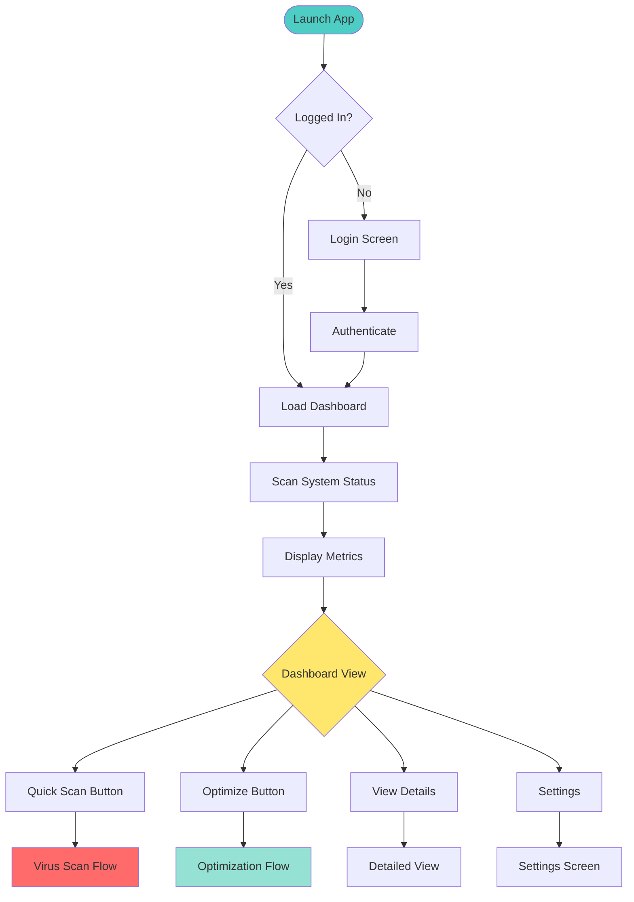
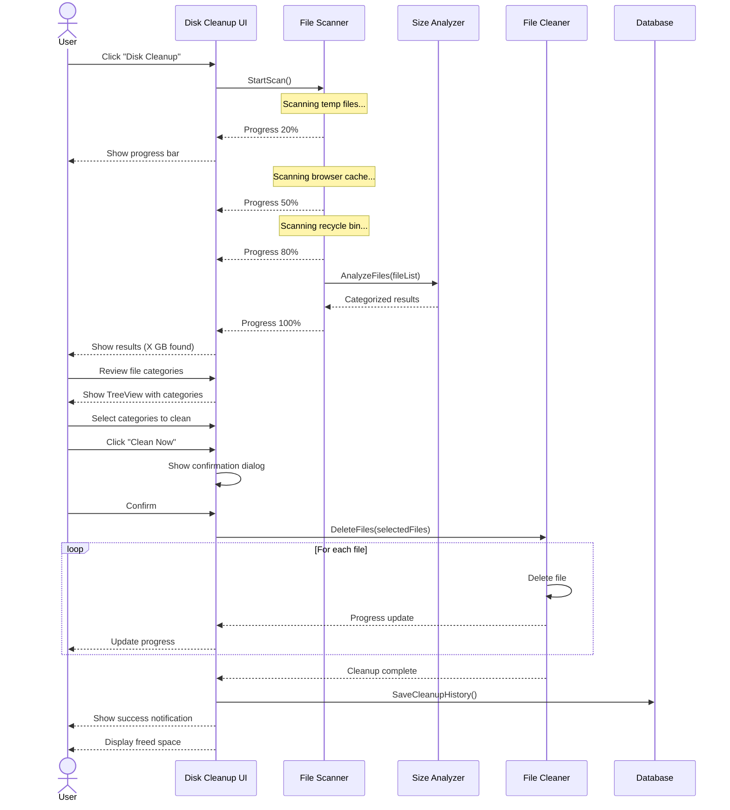
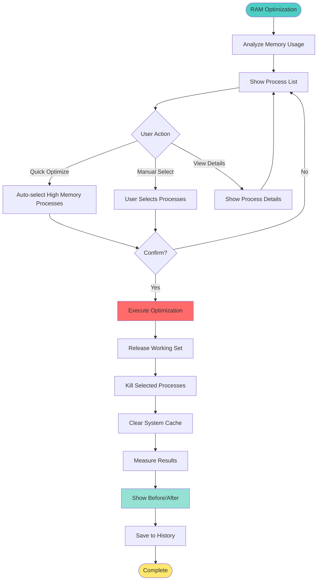
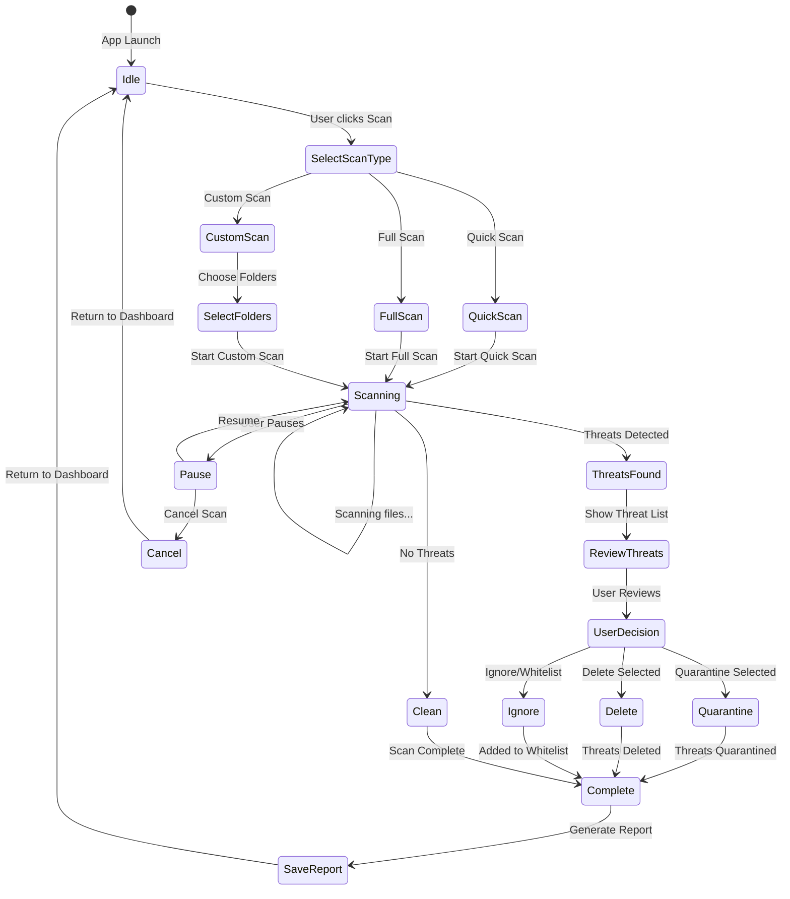
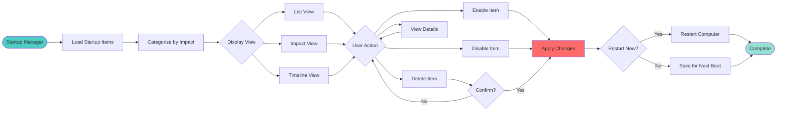

# 🎨 SysAnti - UI/UX Design & User Flow Analysis

# Phân Tích Thiết Kế Giao Diện & Luồng Người Dùng

> **Document Created / Tài liệu tạo:** 2026-02-06 10:01:30  
> **Version / Phiên bản:** 1.0  
> **Target Platform / Nền tảng Mục tiêu:** Windows Desktop (Primary) + Cross-Platform Monitoring

---

## 📋 Executive Summary / Tóm tắt Điều hành

### Design Philosophy / Triết lý Thiết kế

**Core Principles / Nguyên tắc Cốt lõi:**

- ✨ **Modern & Clean** - Giao diện hiện đại, sạch sẽ
- 🎯 **User-Centric** - Tập trung vào người dùng
- ⚡ **Performance First** - Hiệu suất là ưu tiên
- 🔒 **Security Visible** - Bảo mật rõ ràng
- 📊 **Data-Driven** - Dựa trên dữ liệu

**Target Users / Người dùng Mục tiêu:**

1. **Home Users** (70%) - Người dùng gia đình
2. **Small Business** (20%) - Doanh nghiệp nhỏ
3. **Power Users** (10%) - Người dùng chuyên nghiệp

---

## 🎯 Core Features & User Flows / Tính năng Cốt lõi & Luồng Người dùng

### 1. Dashboard / Bảng điều khiển

#### Purpose / Mục đích

- Hiển thị tổng quan trạng thái hệ thống
- Cảnh báo nhanh về vấn đề
- Truy cập nhanh các tính năng chính

#### User Flow / Luồng người dùng



#### UI Components / Thành phần Giao diện

**Layout Structure:**

```
┌─────────────────────────────────────────────────────────┐
│  [Logo] SysAnti          [User Avatar] [Settings] [?]   │
├─────────────────────────────────────────────────────────┤
│                                                          │
│  ┌──────────────────────────────────────────────────┐  │
│  │  🛡️ System Health: GOOD                          │  │
│  │  Last Scan: 2 hours ago                          │  │
│  └──────────────────────────────────────────────────┘  │
│                                                          │
│  ┌──────────┐  ┌──────────┐  ┌──────────┐  ┌────────┐ │
│  │   CPU    │  │   RAM    │  │   DISK   │  │ THREATS│ │
│  │   45%    │  │   60%    │  │   75%    │  │    0   │ │
│  │ [Chart]  │  │ [Chart]  │  │ [Chart]  │  │  [✓]   │ │
│  └──────────┘  └──────────┘  └──────────┘  └────────┘ │
│                                                          │
│  ┌──────────────────────────────────────────────────┐  │
│  │  Quick Actions / Hành động Nhanh                 │  │
│  │                                                   │  │
│  │  [🧹 Disk Cleanup]  [⚡ RAM Optimize]            │  │
│  │  [🛡️ Quick Scan]    [🚀 Startup Manager]        │  │
│  └──────────────────────────────────────────────────┘  │
│                                                          │
│  ┌──────────────────────────────────────────────────┐  │
│  │  Recent Activity / Hoạt động Gần đây             │  │
│  │  • Disk cleanup: 2.3 GB freed (2 hours ago)     │  │
│  │  • Virus scan: 0 threats found (5 hours ago)    │  │
│  │  • RAM optimization: 1.2 GB freed (1 day ago)   │  │
│  └──────────────────────────────────────────────────┘  │
│                                                          │
└─────────────────────────────────────────────────────────┘
```

**Key Metrics Cards:**

- Real-time CPU usage với line chart
- RAM usage với progress bar và chart
- Disk usage với donut chart
- Threat count với status indicator

---

### 2. Disk Cleanup / Dọn dẹp Đĩa

#### User Flow / Luồng người dùng



#### UI Design / Thiết kế Giao diện

**Scan Results View:**

```
┌─────────────────────────────────────────────────────────┐
│  Disk Cleanup Results / Kết quả Dọn dẹp Đĩa             │
├─────────────────────────────────────────────────────────┤
│                                                          │
│  Total Space Found: 5.8 GB                              │
│  Estimated Time: 2 minutes                              │
│                                                          │
│  ┌──────────────────────────────────────────────────┐  │
│  │ ☑ Temporary Files (2.3 GB)                       │  │
│  │   ├─ Windows Temp (1.5 GB)                       │  │
│  │   ├─ User Temp (0.6 GB)                          │  │
│  │   └─ Download Cache (0.2 GB)                     │  │
│  │                                                   │  │
│  │ ☑ Browser Cache (1.8 GB)                         │  │
│  │   ├─ Chrome (1.2 GB)                             │  │
│  │   ├─ Firefox (0.4 GB)                            │  │
│  │   └─ Edge (0.2 GB)                               │  │
│  │                                                   │  │
│  │ ☑ Recycle Bin (1.2 GB)                           │  │
│  │   └─ 45 items                                    │  │
│  │                                                   │  │
│  │ ☐ Large Files (0.5 GB)                           │  │
│  │   ├─ old_backup.zip (300 MB)                     │  │
│  │   └─ movie.mp4 (200 MB)                          │  │
│  └──────────────────────────────────────────────────┘  │
│                                                          │
│  [Select All] [Deselect All]    [Cancel] [Clean Now]   │
│                                                          │
└─────────────────────────────────────────────────────────┘
```

**Features:**

- ✅ Expandable tree view với checkboxes
- ✅ Size visualization (progress bars)
- ✅ Safe/Unsafe indicators
- ✅ Estimated time to clean
- ✅ Undo capability (for safe items)

---

### 3. RAM Optimization / Tối ưu RAM

#### User Flow / Luồng người dùng



#### UI Design / Thiết kế Giao diện

**Process List View:**

```
┌─────────────────────────────────────────────────────────┐
│  RAM Optimization / Tối ưu RAM                          │
├─────────────────────────────────────────────────────────┤
│                                                          │
│  Current Usage: 12.5 GB / 16 GB (78%)                   │
│  [████████████████████░░░░░░░░]                         │
│                                                          │
│  Potential Savings: 3.2 GB                              │
│                                                          │
│  ┌──────────────────────────────────────────────────┐  │
│  │ Process Name          RAM Usage    Status    [ ] │  │
│  ├──────────────────────────────────────────────────┤  │
│  │ ☑ Chrome.exe         2.5 GB       Safe       [i] │  │
│  │ ☑ Firefox.exe        1.8 GB       Safe       [i] │  │
│  │ ☐ System             1.2 GB       Critical   [i] │  │
│  │ ☑ Slack.exe          850 MB       Safe       [i] │  │
│  │ ☑ Discord.exe        720 MB       Safe       [i] │  │
│  │ ☐ explorer.exe       450 MB       Critical   [i] │  │
│  │ ☑ Spotify.exe        380 MB       Safe       [i] │  │
│  └──────────────────────────────────────────────────┘  │
│                                                          │
│  [Quick Optimize] [Advanced]    [Cancel] [Optimize]    │
│                                                          │
└─────────────────────────────────────────────────────────┘
```

**Features:**

- ✅ Sortable columns (Name, RAM, CPU)
- ✅ Safety indicators (Safe/Warning/Critical)
- ✅ Process details on hover/click
- ✅ Quick optimize button (auto-select safe processes)
- ✅ Real-time RAM usage graph

---

### 4. Virus Scanner / Quét Virus

#### User Flow / Luồng người dùng



#### UI Design / Thiết kế Giao diện

**Scanning View:**

```
┌─────────────────────────────────────────────────────────┐
│  Virus Scanner / Quét Virus                             │
├─────────────────────────────────────────────────────────┤
│                                                          │
│  ┌──────────────────────────────────────────────────┐  │
│  │  🛡️ Full System Scan In Progress                 │  │
│  │                                                   │  │
│  │  Progress: 45% (12,450 / 27,000 files)           │  │
│  │  [████████████████░░░░░░░░░░░░░░░░░░░░░░]        │  │
│  │                                                   │  │
│  │  Current: C:\Users\Admin\Documents\file.pdf      │  │
│  │  Elapsed: 5m 23s | Remaining: ~6m 15s            │  │
│  │                                                   │  │
│  │  Threats Found: 2                                │  │
│  │  • Trojan.Generic.12345 (Quarantined)            │  │
│  │  • Adware.BrowserHelper (Quarantined)            │  │
│  └──────────────────────────────────────────────────┘  │
│                                                          │
│  ┌──────────────────────────────────────────────────┐  │
│  │  Scan Statistics / Thống kê Quét                 │  │
│  │  • Files Scanned: 12,450                         │  │
│  │  • Folders Scanned: 1,234                        │  │
│  │  • Scan Speed: 2,400 files/min                   │  │
│  └──────────────────────────────────────────────────┘  │
│                                                          │
│  [Pause] [Stop]                                         │
│                                                          │
└─────────────────────────────────────────────────────────┘
```

**Threat Detection View:**

```
┌─────────────────────────────────────────────────────────┐
│  Threats Detected / Phát hiện Mối đe dọa                │
├─────────────────────────────────────────────────────────┤
│                                                          │
│  ⚠️ 3 Threats Found - Action Required                   │
│                                                          │
│  ┌──────────────────────────────────────────────────┐  │
│  │ 🔴 CRITICAL: Trojan.Generic.12345                │  │
│  │ File: C:\Users\Admin\Downloads\setup.exe         │  │
│  │ Size: 2.5 MB | Detected: Just now                │  │
│  │ [Quarantine] [Delete] [Ignore] [Details]         │  │
│  ├──────────────────────────────────────────────────┤  │
│  │ 🟠 HIGH: Adware.BrowserHelper                    │  │
│  │ File: C:\Program Files\Extension\plugin.dll      │  │
│  │ Size: 450 KB | Detected: Just now                │  │
│  │ [Quarantine] [Delete] [Ignore] [Details]         │  │
│  ├──────────────────────────────────────────────────┤  │
│  │ 🟡 MEDIUM: PUP.Optional.Toolbar                  │  │
│  │ File: C:\Users\Admin\AppData\toolbar.exe         │  │
│  │ Size: 1.2 MB | Detected: Just now                │  │
│  │ [Quarantine] [Delete] [Ignore] [Details]         │  │
│  └──────────────────────────────────────────────────┘  │
│                                                          │
│  [Quarantine All] [Delete All]    [Cancel] [Apply]     │
│                                                          │
└─────────────────────────────────────────────────────────┘
```

**Features:**

- ✅ Real-time progress với file path
- ✅ Threat severity levels (Critical/High/Medium/Low)
- ✅ Individual threat actions
- ✅ Batch actions (Quarantine All, Delete All)
- ✅ Detailed threat information
- ✅ Scan history và reports

---

### 5. Startup Manager / Quản lý Khởi động

#### User Flow / Luồng người dùng



#### UI Design / Thiết kế Giao diện

**Startup Items View:**

```
┌─────────────────────────────────────────────────────────┐
│  Startup Manager / Quản lý Khởi động                    │
├─────────────────────────────────────────────────────────┤
│                                                          │
│  Boot Time: 45 seconds (Good)                           │
│  Startup Items: 18 enabled, 5 disabled                  │
│                                                          │
│  [List View] [Impact View] [Timeline View]              │
│                                                          │
│  ┌──────────────────────────────────────────────────┐  │
│  │ Program          Impact    Status      Action    │  │
│  ├──────────────────────────────────────────────────┤  │
│  │ 🔴 Chrome        High      Enabled     [Toggle]  │  │
│  │    Startup delay: +8.5s                          │  │
│  │    [Details] [Disable] [Delete]                  │  │
│  ├──────────────────────────────────────────────────┤  │
│  │ 🟠 Spotify       Medium    Enabled     [Toggle]  │  │
│  │    Startup delay: +3.2s                          │  │
│  │    [Details] [Disable] [Delete]                  │  │
│  ├──────────────────────────────────────────────────┤  │
│  │ 🟢 OneDrive      Low       Enabled     [Toggle]  │  │
│  │    Startup delay: +1.1s                          │  │
│  │    [Details] [Disable] [Delete]                  │  │
│  ├──────────────────────────────────────────────────┤  │
│  │ ⚪ Slack         None      Disabled    [Toggle]  │  │
│  │    [Details] [Enable] [Delete]                   │  │
│  └──────────────────────────────────────────────────┘  │
│                                                          │
│  💡 Tip: Disable high-impact programs to speed up boot │
│                                                          │
│  [Optimize Startup] [Refresh]    [Cancel] [Apply]      │
│                                                          │
└─────────────────────────────────────────────────────────┘
```

**Impact Visualization:**

```
┌─────────────────────────────────────────────────────────┐
│  Startup Impact Analysis / Phân tích Tác động Khởi động │
├─────────────────────────────────────────────────────────┤
│                                                          │
│  Current Boot Time: 45s                                 │
│  Potential Improvement: -15s (33% faster)               │
│                                                          │
│  ┌──────────────────────────────────────────────────┐  │
│  │                                                   │  │
│  │  Boot Timeline:                                   │  │
│  │                                                   │  │
│  │  0s ─────────────────────────────────── 45s      │  │
│  │  │                                          │     │  │
│  │  BIOS  Windows  Chrome  Spotify  OneDrive  Ready │  │
│  │  [5s]  [20s]    [8.5s]  [3.2s]   [1.1s]   [7.2s]│  │
│  │                                                   │  │
│  │  If you disable Chrome and Spotify:              │  │
│  │  0s ──────────────────── 30s                     │  │
│  │  │                   │                            │  │
│  │  BIOS  Windows  OneDrive  Ready                  │  │
│  │                                                   │  │
│  └──────────────────────────────────────────────────┘  │
│                                                          │
└─────────────────────────────────────────────────────────┘
```

**Features:**

- ✅ Impact indicators (High/Medium/Low)
- ✅ Boot time visualization
- ✅ Before/After comparison
- ✅ One-click optimization
- ✅ Safe mode detection
- ✅ Startup delay measurement

---

## 🎨 Design System / Hệ thống Thiết kế

### Color Palette / Bảng màu

```yaml
Primary Colors:
  - Primary: #4ecdc4 (Teal - Main brand color)
  - Primary Dark: #2ba39f
  - Primary Light: #7eddd8
  
Secondary Colors:
  - Secondary: #ff6b6b (Red - Alerts, threats)
  - Warning: #ffe66d (Yellow - Warnings)
  - Success: #95e1d3 (Green - Success states)
  - Info: #aa96da (Purple - Information)

Neutral Colors:
  - Background: #f7f7f7 (Light gray)
  - Surface: #ffffff (White)
  - Text Primary: #2d3436 (Dark gray)
  - Text Secondary: #636e72 (Medium gray)
  - Border: #dfe6e9 (Light border)

Status Colors:
  - Critical: #d63031 (Dark red)
  - High: #fd79a8 (Pink)
  - Medium: #fdcb6e (Orange)
  - Low: #74b9ff (Light blue)
  - Safe: #00b894 (Teal green)
```

### Typography / Kiểu chữ

```yaml
Font Family:
  - Primary: "Segoe UI", "Roboto", sans-serif
  - Monospace: "Consolas", "Courier New", monospace

Font Sizes:
  - Heading 1: 32px (Dashboard title)
  - Heading 2: 24px (Section headers)
  - Heading 3: 18px (Card titles)
  - Body: 14px (Regular text)
  - Small: 12px (Captions, hints)
  - Tiny: 10px (Labels)

Font Weights:
  - Light: 300
  - Regular: 400
  - Medium: 500
  - Semibold: 600
  - Bold: 700
```

### Spacing / Khoảng cách

```yaml
Spacing Scale (8px base):
  - xs: 4px
  - sm: 8px
  - md: 16px
  - lg: 24px
  - xl: 32px
  - xxl: 48px

Component Padding:
  - Card: 16px
  - Button: 12px 24px
  - Input: 10px 12px
  - Modal: 24px
```

### Components / Thành phần

#### Buttons / Nút bấm

```yaml
Primary Button:
  - Background: #4ecdc4
  - Text: #ffffff
  - Hover: #2ba39f
  - Active: #1a8884
  - Border Radius: 6px
  - Height: 40px

Secondary Button:
  - Background: transparent
  - Text: #4ecdc4
  - Border: 1px solid #4ecdc4
  - Hover: #f0fffe

Danger Button:
  - Background: #ff6b6b
  - Text: #ffffff
  - Hover: #ee5a52
```

#### Cards / Thẻ

```yaml
Card:
  - Background: #ffffff
  - Border: 1px solid #dfe6e9
  - Border Radius: 8px
  - Box Shadow: 0 2px 8px rgba(0,0,0,0.1)
  - Padding: 16px
  - Hover: Box Shadow: 0 4px 12px rgba(0,0,0,0.15)
```

#### Progress Bars / Thanh tiến trình

```yaml
Progress Bar:
  - Height: 8px
  - Border Radius: 4px
  - Background: #dfe6e9
  - Fill: Gradient (#4ecdc4 to #2ba39f)
  - Animation: Smooth transition 0.3s
```

---

## 📱 Responsive Design / Thiết kế Đáp ứng

### Window Sizes / Kích thước Cửa sổ

```yaml
Minimum Size:
  - Width: 1024px
  - Height: 768px

Optimal Size:
  - Width: 1280px
  - Height: 720px

Maximum Size:
  - Width: 1920px
  - Height: 1080px
```

### Layout Breakpoints / Điểm ngắt Bố cục

```yaml
Compact (< 1280px):
  - Single column dashboard
  - Collapsed sidebar
  - Stacked metric cards

Normal (1280px - 1600px):
  - Two column dashboard
  - Full sidebar
  - Grid metric cards (2x2)

Wide (> 1600px):
  - Three column dashboard
  - Full sidebar + detail panel
  - Grid metric cards (4x1)
```

---

## ⚡ Performance Considerations / Cân nhắc Hiệu suất

### UI Performance / Hiệu suất Giao diện

```yaml
Target Metrics:
  - First Paint: < 500ms
  - Time to Interactive: < 1000ms
  - Frame Rate: 60 FPS
  - Memory Usage: < 150 MB (idle)

Optimization Techniques:
  - Virtual scrolling for large lists
  - Lazy loading for heavy components
  - Debounced search inputs
  - Cached data with expiration
  - Progressive loading for charts
```

### Animation Guidelines / Hướng dẫn Hoạt ảnh

```yaml
Animation Durations:
  - Micro: 100ms (Hover effects)
  - Short: 200ms (Button clicks)
  - Medium: 300ms (Panel transitions)
  - Long: 500ms (Page transitions)

Easing Functions:
  - Ease-out: UI appearing
  - Ease-in: UI disappearing
  - Ease-in-out: Transitions
```

---

## 🔔 Notifications / Thông báo

### Notification Types / Loại Thông báo

```yaml
Toast Notifications:
  - Success: Green background, checkmark icon
  - Warning: Yellow background, warning icon
  - Error: Red background, error icon
  - Info: Blue background, info icon
  
  Duration:
    - Success: 3 seconds
    - Warning: 5 seconds
    - Error: Until dismissed
    - Info: 4 seconds

System Tray Notifications:
  - Virus detected: Critical priority
  - Scan complete: Normal priority
  - Optimization complete: Low priority
```

---

## 🌐 Cross-Platform Monitoring UI / Giao diện Giám sát Đa nền tảng

### Mobile App UI (Monitoring Only)

```
┌─────────────────────────────────┐
│  ☰  SysAnti          [Profile]  │
├─────────────────────────────────┤
│                                  │
│  My Devices / Thiết bị của tôi  │
│                                  │
│  ┌─────────────────────────────┐│
│  │ 💻 Windows PC (Home)        ││
│  │ Status: Online              ││
│  │ Last Scan: 2 hours ago      ││
│  │                             ││
│  │ CPU: 45%  RAM: 60%  [>]     ││
│  └─────────────────────────────┘│
│                                  │
│  ┌─────────────────────────────┐│
│  │ 💻 Windows PC (Office)      ││
│  │ Status: Offline             ││
│  │ Last Seen: 8 hours ago      ││
│  │                             ││
│  │ [View Details]              ││
│  └─────────────────────────────┘│
│                                  │
│  Recent Alerts / Cảnh báo       │
│  • Virus detected on Home PC    │
│  • Disk cleanup needed (Office) │
│                                  │
└─────────────────────────────────┘
```

### Device Detail View (Mobile)

```
┌─────────────────────────────────┐
│  ← Windows PC (Home)            │
├─────────────────────────────────┤
│                                  │
│  Status: 🟢 Online              │
│  Last Updated: Just now         │
│                                  │
│  System Metrics                 │
│  ┌─────────────────────────────┐│
│  │ CPU Usage                   ││
│  │ [████████░░] 45%            ││
│  │                             ││
│  │ RAM Usage                   ││
│  │ [████████████░] 60%         ││
│  │                             ││
│  │ Disk Usage                  ││
│  │ [███████████████░] 75%      ││
│  └─────────────────────────────┘│
│                                  │
│  Recent Activity                │
│  • Disk cleanup: 2.3 GB freed   │
│  • Virus scan: 0 threats        │
│  • RAM optimization: 1.2 GB     │
│                                  │
│  [View Full History]            │
│                                  │
└─────────────────────────────────┘
```

---

## 📊 Data Visualization / Trực quan hóa Dữ liệu

### Chart Types / Loại Biểu đồ

```yaml
Dashboard Charts:
  - Line Chart: CPU/RAM usage over time
  - Donut Chart: Disk space distribution
  - Bar Chart: Startup impact comparison
  - Area Chart: Memory usage trends

Chart Library:
  - LiveCharts2 (WPF/MAUI)
  - Chart.js (Web)
  - MPAndroidChart (Android)
  - Charts (iOS)

Update Frequency:
  - Real-time: Every 1 second (CPU, RAM)
  - Periodic: Every 30 seconds (Disk)
  - On-demand: User refresh (History)
```

---

## ✅ Accessibility / Khả năng Tiếp cận

### WCAG 2.1 Compliance / Tuân thủ WCAG 2.1

```yaml
Color Contrast:
  - Normal text: 4.5:1 minimum
  - Large text: 3:1 minimum
  - UI components: 3:1 minimum

Keyboard Navigation:
  - Tab order: Logical flow
  - Shortcuts: Alt+Key combinations
  - Focus indicators: Visible outline

Screen Reader Support:
  - ARIA labels: All interactive elements
  - Alt text: All images and icons
  - Live regions: Dynamic content updates

Text Scaling:
  - Support: 100% - 200%
  - Layout: Responsive to text size
```

---

## 🎯 Key User Scenarios / Kịch bản Người dùng Chính

### Scenario 1: First-Time User

**Goal:** Understand app capabilities and perform first optimization

**Steps:**

1. Launch app → See welcome screen
2. Quick tutorial (3 slides)
3. Dashboard with "Quick Start" guide
4. Click "Quick Scan" button
5. Review results
6. Click "Optimize" button
7. See success notification

**Success Metrics:**

- Time to first optimization: < 5 minutes
- User understands main features: 80%+
- Completes first scan: 90%+

---

### Scenario 2: Daily Power User

**Goal:** Quick system check and optimization

**Steps:**

1. Launch app → Dashboard loads
2. Glance at metrics (< 5 seconds)
3. If issues detected → Click relevant card
4. Perform targeted optimization
5. Return to dashboard

**Success Metrics:**

- Time to dashboard: < 2 seconds
- Time to complete task: < 1 minute
- User satisfaction: 85%+

---

### Scenario 3: Remote Monitoring (Mobile)

**Goal:** Check home PC status while away

**Steps:**

1. Open mobile app
2. View device list
3. Tap on device
4. View real-time metrics
5. Check recent activity
6. Receive push notification if threat detected

**Success Metrics:**

- App load time: < 3 seconds
- Data refresh: < 5 seconds
- Notification delivery: < 30 seconds

---

## 🚀 Future Enhancements / Cải tiến Tương lai

### Phase 2 Features

```yaml
AI-Powered Insights:
  - Predictive maintenance alerts
  - Automatic optimization scheduling
  - Threat pattern recognition

Advanced Visualizations:
  - 3D system resource maps
  - Interactive timeline views
  - Heatmaps for file access patterns

Gamification:
  - Achievement badges
  - Optimization streaks
  - Leaderboards (optional)

Voice Control:
  - "Scan my computer"
  - "Optimize RAM"
  - "Show virus scan results"
```

---

## 📝 Implementation Checklist / Danh sách Triển khai

### Phase 1: Core UI (Weeks 1-4)

- [ ] Setup WPF/MAUI project structure
- [ ] Implement design system (colors, typography, spacing)
- [ ] Create reusable components (buttons, cards, inputs)
- [ ] Build dashboard layout
- [ ] Implement navigation system
- [ ] Add dark mode support

### Phase 2: Feature UIs (Weeks 5-8)

- [ ] Disk Cleanup UI
- [ ] RAM Optimization UI
- [ ] Virus Scanner UI
- [ ] Startup Manager UI
- [ ] Settings UI
- [ ] User profile UI

### Phase 3: Data Visualization (Weeks 9-10)

- [ ] Integrate LiveCharts2
- [ ] Create real-time CPU/RAM charts
- [ ] Build disk usage donut chart
- [ ] Implement history timeline
- [ ] Add export functionality

### Phase 4: Polish & Testing (Weeks 11-12)

- [ ] Animation polish
- [ ] Performance optimization
- [ ] Accessibility testing
- [ ] User testing sessions
- [ ] Bug fixes
- [ ] Documentation

---

**Document Status / Trạng thái:** ✅ Complete  
**Next Steps / Bước tiếp theo:** Begin UI implementation with design system setup

**Related Documents:**

- [MONITORING_ONLY_STRATEGY_2026_02_06_0927.md](file:///f:/VStudio/SysAnti/doc/MONITORING_ONLY_STRATEGY_2026_02_06_0927.md)
- [FLOW_ANALYSIS_TABLES_2026_02_06_0845.md](file:///f:/VStudio/SysAnti/doc/FLOW_ANALYSIS_TABLES_2026_02_06_0845.md)
