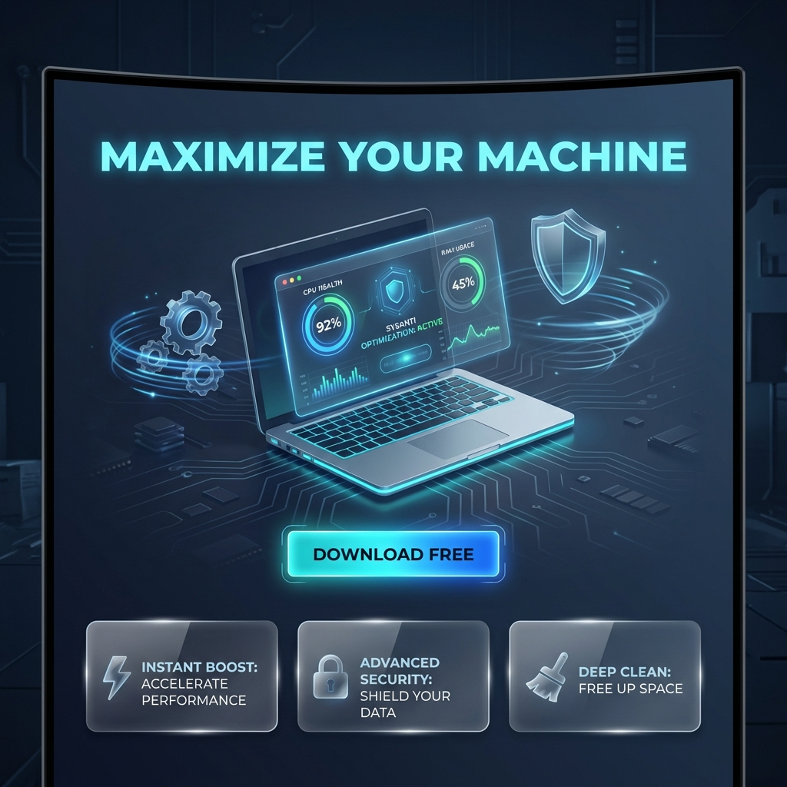
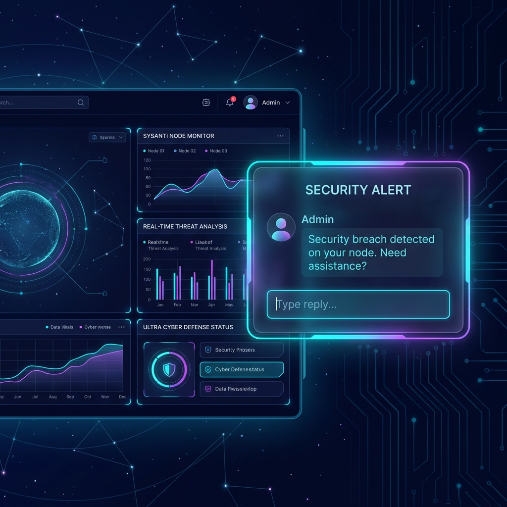

# 🎨 Concept Thiết kế Web: AVA Security Web Experience (2026)

**Tầm nhìn (Vision):** Website không chỉ là nơi tải xuống (Download) mà là một **trải nghiệm công nghệ (Tech Experience)**. Nó phải phản ánh sức mạnh, tốc độ và sự bảo mật của phần mềm SysAnti.

---

## 1. Phong cách Thiết kế (Visual Direction)

Chúng ta sẽ sử dụng phong cách **"Cyber-Professional"** - sự kết hợp giữa tính chuyên nghiệp của doanh nghiệp và vẻ đẹp hiện đại của Cyberpunk/Sci-Fi.

- **Màu chủ đạo (Primary Colors):**
  - `Deep Space Blue` (#0F172A) - Nền chính, tạo cảm giác sâu thẳm, cao cấp.
  - `Neon Cyan` (#06B6D4) - Màu nhấn chính (Buttons, Links, Glow effects).
  - `Electric Purple` (#8B5CF6) - Màu nhấn phụ (Gradients, secondary actions).
- **Chất liệu (Materials):**
  - **Glassmorphism:** Các thẻ (Cards) trong suốt, mờ ảo trên nền tối.
  - **Neon Glow:** Hiệu ứng phát sáng nhẹ quanh các nút bấm và viền.
  - **3D Elements:** Laptop, điện thoại trôi nổi (floating) trong không gian 3D.
- **Typography:**
  - Tiêu đề: `Inter` hoặc `Outfit` (Bold, Modern).
  - Nội dung: `Roboto` hoặc `Open Sans` (Dễ đọc).

---

## 2. Cấu trúc Trang chủ (Landing Page Strategy)

### A. Hero Section (Màn hình đầu tiên - 3 Giây quyết định)

- **Hình ảnh:** Một chiếc Laptop 3D cực ngầu đang chạy SysAnti Dashboard, với các chỉ số CPU/RAM như "bay" ra khỏi màn hình (Holographic effect).
- **Headline (Tiêu đề lớn):** "Tối ưu hóa máy tính của bạn đến mức **ULTRA**."
- **Sub-headline:** "Không chỉ là diệt virus. Đây là trạm điều khiển sức mạnh cho PC của bạn."
- **Call-to-Action (CTA):**
  - Nút `Tải xuống Miễn phí` (Màu Cyan, hiệu ứng Pulse).
  - Nút `Xem Demo` (Outline trắng).

### B. Features Grid (Mạng lưới Tính năng)

*Sử dụng Bento Grid Layout (kiểu ô lưới Apple).*

- **Ô 1 (Lớn):** **AI Security**: Hình ảnh khiên chắn bảo vệ dữ liệu với các dòng mã chạy qua.
- **Ô 2:** **Speed Booster**: Biểu tượng tên lửa, so sánh FPS trước/sau khi bật.
- **Ô 3:** **Privacy Shield**: Webcam bị khóa, dữ liệu được mã hóa.
- **Ô 4:** **Cleaner**: Hình ảnh chổi quét file rác biến mất.

### C. Ecosystem Showcase (Hệ sinh thái)

- Hình ảnh diễn tả sự đồng bộ: Một đường dây năng lượng nối từ Laptop -> Điện thoại (SysAnti Mobile) -> Đám mây (SysAnti Cloud).
- Thông điệp: "Điều khiển mọi thiết bị từ một nơi duy nhất."

### D. Social Proof (Bằng chứng xã hội)

- Logo các đối tác công nghệ/báo chí (TechRadar, PCMag, v.v. - *giả định*).
- Trích dẫn từ người dùng: "Máy tôi chạy nhanh hơn 50% sau khi cài SysAnti."

### E. Pricing (Bảng giá)

- Thiết kế dạng thẻ bài (Cards).
- Gói `Ultra` (Giữa, Nổi bật, Có viền Neon) được highlight là "Best Value".

---

## 3. Công nghệ Web (Tech Stack Proposed)

Để đạt được hiệu ứng mượt mà (Smooth scrolling, Animations):

- **Framework:** Next.js 14 (React) - Tối ưu SEO và tốc độ tải.
- **Styling:** Tailwind CSS - Nhanh chóng, tùy biến cao.
- **Animations:** Framer Motion - Cho các hiệu ứng xuất hiện khi cuộn chuột.
- **3D:** Spline hoặc Three.js (cho model laptop 3D tương tác).

---

## 4. Hình ảnh Minh họa (Visual Concept)

*(Xem hình đính kèm bên dưới document này trong thư mục Artifacts)*
> `design/sysanti_web_hero_concept.png`

---

**Quy tắc:** "Nếu website trông chậm, người dùng sẽ nghĩ phần mềm cũng chậm." -> Website phải cực nhanh (Lighthouse Score 100)
---

## 5. Web Admin Chat Notification (New Feature)

Để tăng cường hỗ trợ kỹ thuật và phản ứng nhanh, phiên bản Web sẽ bao gồm hệ thống thông báo tích hợp Chat trực tiếp với Admin.

### Đặc điểm thiết kế (Design Features)

- **Glassmorphism Popup**: Thông báo trượt ra từ góc phải màn hình với hiệu ứng kính mờ đặc trưng.
- **Embedded Chat Input**: Người dùng có thể trả lời ngay lập tức trong widget thông báo mà không cần mở tab mới.
- **Admin Status**: Hiển thị avatar và trạng thái online của kỹ thuật viên.
- **Real-time syncing**: Tin nhắn đồng bộ tức thời giữa Web và Dashboard của Admin thông qua SignalR/Socket.

---

*(Bản cập nhật ngày 07/02/2026)*
