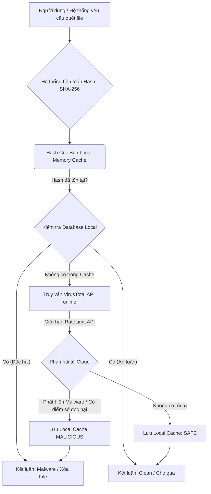

# Quy Trình Quét File Trên Đám Mây (Cloud Threat Scanner)

**Mục tiêu**:
Service `CloudThreatScanner` sẽ chịu trách nhiệm chính giao tiếp với API ngoài (VirusTotal).
Mọi file check thực tế đều do `MemoryCache` hoặc SQLite cache nội địa gánh tải để đảm bảo tránh tình trạng Rate-Limit của nhà cung cấp VirusTotal API.
Chỉ những mã Hash lạ (Unknown) mới phải gửi request HTTP đến Server Cloud.
